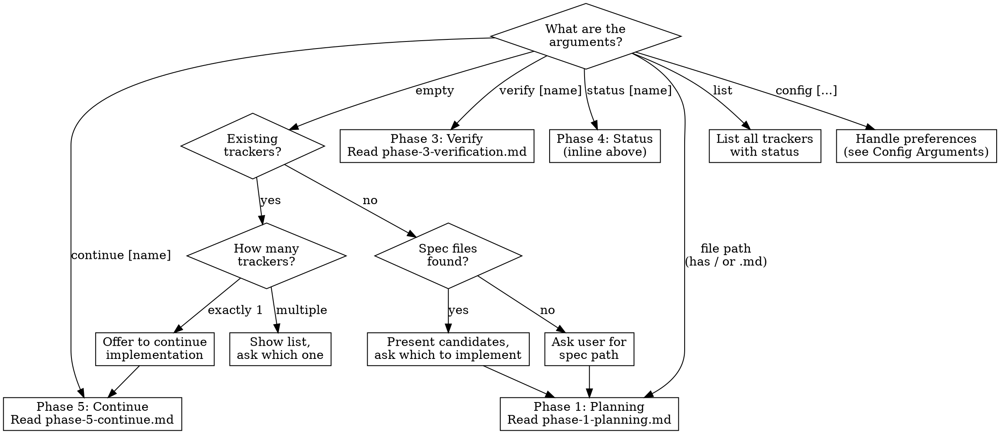

# Implementation Skill

This skill helps you implement features from specification documents while maintaining a persistent connection to the source requirements. It solves the problem of "drift" where Claude loses track of the original document as work progresses and context compacts.

**Announce at start:** When this skill activates, announce what you're doing:
- Explicit invocation: `"I'm using the implement skill to [plan/implement/verify/continue] from [spec name]."`
- Implicit activation: `"It looks like you're working with an implementation tracker. I'm using the implement skill to help with that."`

**Detailed workflows are in reference files — load them on demand per phase, not all at once.**

## Commands

| Command | Description |
|---------|-------------|
| `/implement <path-to-spec.md>` | Start planning implementation from a spec document |
| `/implement status [spec-name]` | Show current implementation progress |
| `/implement verify [spec-name]` | Run systematic verification against the spec |
| `/implement continue [spec-name]` | Resume implementation from where you left off |
| `/implement list` | List all active implementation trackers |
| `/implement config [setting] [value]` | View or update implementation preferences |

**Note**: `[spec-name]` is optional. If omitted and multiple trackers exist, you'll be prompted to choose. The spec-name is the basename without path or extension (e.g., for `docs/billing-spec.md`, use `billing-spec`).

## Preferences

Implementation preferences control workflow behavior across sessions and projects. Preferences are stored in simple markdown files.

| File | Scope |
|------|-------|
| `.impl-preferences.md` (project directory) | Project-level — overrides global |
| `~/.claude/.impl-preferences.md` | Global default — applies to all projects |

**Lookup order**: Project file → Global file → Built-in defaults

### Preference File Format

```markdown
# Implementation Preferences

## Workflow
- **tdd-mode**: on
```

### Available Preferences

| Preference | Values | Default | Description |
|------------|--------|---------|-------------|
| `tdd-mode` | `on`, `off`, `ask` | `on` | Controls whether Test-Driven Development workflow is used |

- `on` — Always use the TDD workflow (write tests first, then implement)
- `off` — Always use the standard workflow (implement first, then write tests)
- `ask` — Prompt during Phase 1 planning so the user can choose per-implementation

### `/implement config` Subcommand

| Command | Description |
|---------|-------------|
| `/implement config` | Show current effective preferences |
| `/implement config tdd on\|off\|ask` | Set TDD preference at project level |
| `/implement config --global tdd on\|off\|ask` | Set TDD preference as global default |

When setting a preference:
1. Read the existing preferences file (or create it if it doesn't exist)
2. Update the specified value
3. Write the file back
4. Confirm the change to the user

## Core Principle: Section References as Anchors

**Section references (e.g., §2.4, §9.1, Section 3.2) are stable anchors** that survive context compaction. Every task, every tracker entry, and every verification item should reference specific sections from the source document.

---

## File Layout

This skill's detailed content is split across reference files and prompt templates:

```
references/
  tracker-format.md           # Full tracker template + field explanations
  workflow-quick-ref.md        # Checklists for pre-task, post-task, verification
  sub-agent-strategy.md        # Model selection, size routing, DIGEST escalation
  phase-1-planning.md          # Full Phase 1 workflow
  phase-2-implementation.md    # Standard implementation workflow
  phase-2-tdd.md               # TDD test-first workflow
  phase-3-verification.md      # Full verification machinery
  phase-5-continue.md          # Resume work + spec evolution handling
prompts/
  implement-single-file.md     # Task() template for single-file spec
  implement-multi-file.md      # Task() template for multi-file spec
  write-tests.md               # Test writing prompt
  fix-issue.md                 # Fix sub-agent prompt
  tdd-write-tests.md           # TDD test-first prompt
  tdd-implement.md             # TDD implement-to-pass prompt
  verify-requirement.md        # Verification sub-agent prompt
  reverify-requirement.md      # Re-verification prompt
  fix-verification-gap.md      # Fix gap prompt
```

**Load only what you need for the current phase.** Do not read all files at once.

---

## Common Initialization

Before entering any phase, run this initialization step. It applies to **every** command — `/implement <spec-path>`, `/implement continue`, `/implement verify`, `/implement status`, `/implement list`, `/implement config`, etc.

### Resolve Tool Paths

Sub-agents and bash code blocks need to find the skill repo's tools and venv Python. Resolve these once at session start and use them in all subsequent bash commands:

```bash
IMPL_REPO_DIR="$(cd "$(dirname "$(realpath ~/.claude/skills/implement/SKILL.md)")/../.." && pwd)"
IMPL_TOOLS_DIR="$IMPL_REPO_DIR/tools"
IMPL_PYTHON="$IMPL_REPO_DIR/.venv/bin/python"
```

Run this in a Bash tool call to confirm the paths resolve correctly (check that `$IMPL_PYTHON` exists). These three variables are used throughout all phases — always use `$IMPL_REPO_DIR`, `$IMPL_TOOLS_DIR`, and `$IMPL_PYTHON` in bash blocks, never redefine them with different names.

### Ensure Sub-Agent Write Permissions

Sub-agents need scoped Write/Edit permissions to create files in implementation work directories. Without these, sub-agents fail silently when dispatched in the background (interactive permission approvals are session-scoped and do not propagate to background agents).

**Worktree detection**: Git worktrees (e.g., `.claude/worktrees/<name>/`) have their own project root but do **not** inherit the main tree's `.claude/settings.local.json`. Detect this early:

```bash
WORKTREE_ROOT="$(git rev-parse --show-toplevel)"
MAIN_ROOT="$(git rev-parse --git-common-dir | sed 's|/\.git$||')"
if [ "$WORKTREE_ROOT" != "$MAIN_ROOT" ]; then
  echo "WORKTREE: root=$WORKTREE_ROOT main=$MAIN_ROOT"
else
  echo "MAIN_TREE: root=$WORKTREE_ROOT"
fi
```

If in a worktree, ensure `.claude/settings.local.json` exists **in the worktree root** (not the main tree). The worktree needs its own copy because Claude Code resolves settings relative to `git rev-parse --show-toplevel`. If the main tree already has a `settings.local.json`, use it as a starting point (read it, then merge in the required permissions below).

1. Read `.claude/settings.local.json` (relative to the current project root — in a worktree, that's the worktree root, not the main tree)
2. Check whether the `permissions.allow` array already contains all six scoped entries:
   - `Edit(/.impl-work/**)`
   - `Write(/.impl-work/**)`
   - `Edit(/.impl-verification/**)`
   - `Write(/.impl-verification/**)`
   - `Edit(/.impl-tracker-*.md)`
   - `Write(/.impl-tracker-*.md)`
3. If all six are present → skip (no-op)
4. If any are missing, inform the user:
   > Sub-agents need scoped Write/Edit permissions for implementation work directories and tracker files. I'll add these to `.claude/settings.local.json` — this only allows writes under `.impl-work/`, `.impl-verification/`, and to `.impl-tracker-*.md`, nothing else in the project.
5. Write/merge the missing scoped permissions into `settings.local.json`, preserving all existing entries. If the file doesn't exist, create it with just the permissions block. **In a worktree**, create the `.claude/` directory first if needed (`mkdir -p .claude`).
6. **Do NOT add unscoped `Write` or `Edit`** — permissions MUST be limited to implementation output paths only.
7. If the user denies the settings write, log a warning and proceed — the canary pre-flight check will catch permission issues before sub-agents are dispatched.

This runs in the main conversation (where the user can approve the one-time settings write interactively), so all subsequent sub-agents benefit automatically.

---

## Phase 1: Planning (`/implement <spec-path>`)

Parse the spec, detect worktree context, create the implementation tracker, break requirements into tasks, determine TDD mode, and present the plan to the user for approval.

**Read `references/phase-1-planning.md` for the detailed workflow.**

Key steps:
1. **Offer to clear context** — especially useful when invoked after a pipeline of other work
2. **Worktree detection** — read the document for any indication of a worktree path or branch; validate and set as implementation directory
3. **Parse the specification** — single-file or multi-file (structural index for large specs)
4. **Create the tracker** — in the implementation directory (see `references/tracker-format.md` for the template)
5. **Create tasks** — with section references in subject and description
6. **Determine TDD mode** — from preferences
7. **Present the plan** — get user approval before proceeding

---

## Phase 2: Implementation

Implement requirements via sub-agents, run tests, update the tracker. Two workflows depending on TDD mode:

- **TDD Mode (default)**: Tests written first from spec, then implementation to make them pass. **Read `references/phase-2-tdd.md`.**
- **Standard Mode**: Implementation first, then tests. **Read `references/phase-2-implementation.md`.**

Both workflows follow the same pattern:
1. Prepare context from tracker + spec
2. Delegate to sub-agent (see `references/sub-agent-strategy.md` for model selection)
3. Review changes, run tests, check DIGEST for escalation
4. Update tracker only after tests pass

**Pre-implementation check**: A tracker must exist with a populated Requirements Matrix and tasks created via TaskCreate. If missing, complete Phase 1 first.

---

## Phase 3: Verification (`/implement verify [spec-name]`)

Systematic requirement-level verification using parallel sub-agents that write findings as JSON fragments, assembled into a report by deterministic tooling.

**Read `references/phase-3-verification.md` for the detailed workflow.**

Key steps:
1. **Run tests and validate code first** — verification is meaningless if the code doesn't work
2. **Extract individual requirements** — MUST/SHOULD/COULD level, not section headings
3. **Dispatch one sub-agent per requirement** (parallel, background) — see `prompts/verify-requirement.md`
4. **Assemble report** — using `tools/verify_report.py` (deterministic, not manual)
5. **Fix gaps** — always with Opus, see `prompts/fix-verification-gap.md`
6. **Re-verification mode** — when previous reports exist, offers incremental or full re-audit

---

## Phase 4: Status (`/implement status [spec-name]`)

### Finding the Right Tracker

1. If spec-name provided: Look for `.impl-tracker-<spec-name>.md`
2. If not provided: List all `.impl-tracker-*.md` files in the current directory and any known worktree paths
   - If exactly one: use it
   - If multiple: show list and ask which one
   - If none: inform user no active implementations found

### Show Status

1. Read the tracker file
2. Read the current task list
3. Present a summary:
   - Overall progress (X of Y requirements complete)
   - Current task being worked on
   - Blockers or gaps discovered
   - Sections not yet started

---

## Phase 5: Continue (`/implement continue [spec-name]`)

Resume implementation from where you left off, with worktree re-validation and spec freshness checking.

**Read `references/phase-5-continue.md` for the detailed workflow.**

Key steps:
1. Find and read the tracker
2. **Validate worktree** — if tracker has a worktree field, confirm it still exists and is on the right branch
3. **Spec freshness check** — detect if the spec has changed since last session
4. Resume implementation using the appropriate workflow (TDD or standard)

---

## Recovery After Compaction

Context compaction can cause Claude to lose detailed instructions.

### Signs That Compaction Has Occurred

- You don't remember the specific spec sections you were implementing
- You're unsure what `/implement` means or how to use it
- The conversation feels like it's starting fresh mid-task

### Recovery Steps

1. **Check for tracker files**: `Glob(".impl-tracker-*.md")` in current directory and any known worktree paths
2. **Read the tracker**: Contains recovery instructions and current state
3. **Check for worktree**: If the tracker's `**Worktree**` field is not `none`, validate it and set as implementation directory
4. **Read the spec**: The tracker's `**Specification**:` line points to the source document
5. **Check TaskList**: See what tasks exist and their status
6. **Resume work**: Use the tracker's Requirements Matrix to understand what's done and what's pending

**Key workflow after recovery**: Tracker → Spec sections → Sub-agent → **Run tests** → Verify → Update tracker

**CRITICAL**: Never claim completion without running tests.

---

## Best Practices

### Writing Specs for This Workflow

Specs work best with this skill when they:
- Use numbered sections (§1.1, §2.3, etc.)
- Have discrete, testable requirements
- Include expected inputs/outputs where applicable
- Separate "must have" from "nice to have"

### Handling Spec Ambiguity

1. Note the ambiguity in the tracker
2. Ask the user for clarification
3. Document the decision made

### Handling Implementation Drift

1. Stop and re-read the relevant section
2. Assess whether the deviation is intentional or accidental
3. Either correct the implementation or note the intentional deviation in the tracker

---

## Critical Rule: No Implementation Without a Tracker

**NEVER begin implementing code without first creating a tracker file.** This is the most important rule of this skill. If you find yourself about to write implementation code and no `.impl-tracker-*.md` file exists, STOP and go through Phase 1 first.

This is especially important when the spec content is already visible in conversation context. Having the spec in context makes it tempting to skip the tracker — but the tracker is what prevents gaps during context compaction.

## Implicit Activation

This skill may be activated when the user's message mentions tracker files, implementation gaps, or spec verification without explicitly invoking the command. In these cases:

1. **Do not silently take over.** Ask the user if they'd like to use the implementation skill.
2. If the user agrees, read the tracker to determine the appropriate phase.
3. If the user declines, assist normally.

## Arguments Handling

The `$ARGUMENTS` variable contains what the user passed after `/implement`.

### Routing Flowchart



Parse it as follows:
- If it's a file path (contains `/` or ends in `.md`): Start Phase 1 — read `references/phase-1-planning.md`
- If it starts with `status`: Show status (Phase 4, inline above)
- If it starts with `verify`: Run verification — read `references/phase-3-verification.md`
- If it starts with `continue`: Resume work — read `references/phase-5-continue.md`
- If it's `list`: List all `.impl-tracker-*.md` files with their spec paths and status summaries
- If it starts with `config`: Handle preferences (see Config Arguments below)
- If empty: Follow the **empty arguments procedure** below

### Config Arguments

When arguments start with `config`:
- `config` alone: Read and display current effective preferences
- `config <setting> <value>`: Update at **project-level** (`.impl-preferences.md`)
- `config --global <setting> <value>`: Update at **global** level (`~/.claude/.impl-preferences.md`)

Valid settings: `tdd` with values `on`, `off`, or `ask`.

### Empty Arguments Procedure

When `$ARGUMENTS` is empty:

1. Check for existing trackers (`.impl-tracker-*.md` in current directory and any known worktree paths)
   - If exactly one exists: offer to continue implementation
   - If multiple exist: show list and ask which to continue
2. If no trackers exist:
   - Search for spec documents: `Glob("**/*spec*.md")` and `Glob("**/*requirements*.md")`
   - If candidates found: present them and ask which to implement
   - If none found: ask the user for the path to their specification document
3. **Once a spec path is identified, ALWAYS go through Phase 1 (Planning) first.**

### Tracker Discovery

To find trackers, glob for `.impl-tracker-*.md` in the current directory. If a tracker's `**Worktree**` field points to a different directory, also search there. Each tracker contains a `**Specification**:` line that points back to the original spec file and a `**Worktree**:` line that identifies the implementation directory.

Arguments: $ARGUMENTS
