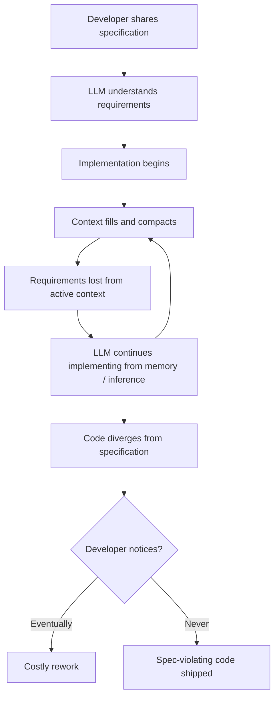
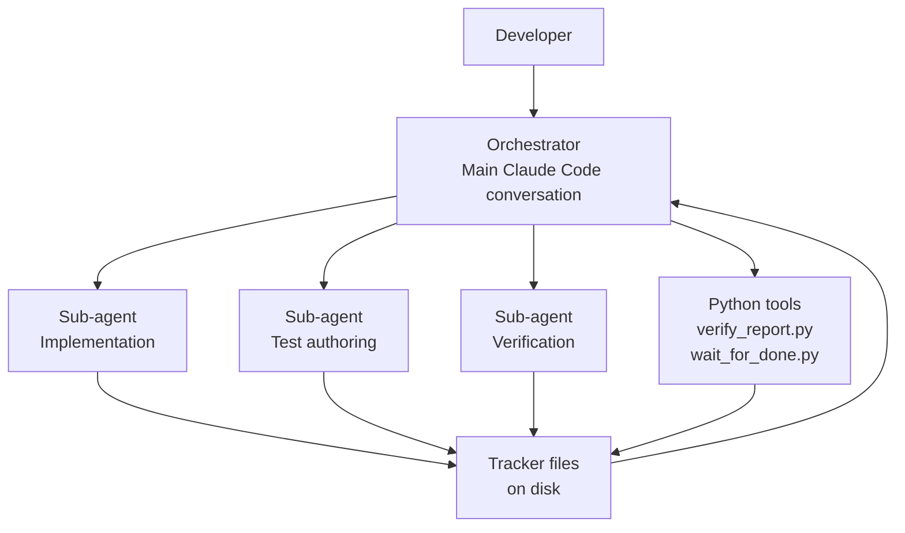

# §1 Overview

> Part of [Master Spec](../spec.md)

---

## §1.1 Problem Statement

Modern LLM-assisted development involves extended, multi-turn implementation sessions driven by specification documents. In practice, a systematic failure pattern emerges: the LLM begins with a clear understanding of the specification, but as implementation progresses and the conversation context fills and compacts, specific requirements and constraints are silently lost. The LLM continues producing code — confidently, fluently — while drifting away from the specification. Neither the developer nor the LLM is necessarily aware this is happening.

This failure mode is called **specification drift**.

Specification drift is not a failure of intent — it is a structural consequence of how LLMs process long-context inputs. Research demonstrates that:

- LLMs exhibit a **U-shaped attention curve**: performance is strongest at the beginning and end of the context window and degrades significantly in the middle.
- Performance on retrieval-dependent tasks degrades **13–85%** as input length increases, even when the required information is technically present.
- Multi-turn conversations show an average **39% performance drop** compared to single-turn equivalents, as earlier turns are compressed or evicted.

These effects compound over an implementation session. By the time 50 or 100 requirements have been worked through, the LLM's connection to requirements discussed early in the session may be negligible.

---

## §1.2 Goals

The `/implement` skill is designed to make specification drift structurally impossible, rather than relying on the LLM's in-context attention to maintain fidelity.

The skill aims to:

1. **Maintain a persistent connection** between specification documents and implementation work that survives context compaction events, session restarts, and model switches.
2. **Prevent specification drift** through structured requirement tracking, section reference anchoring, and mandatory spec re-reads at the start of each implementation unit.
3. **Enable systematic verification** of every individual requirement against the implementation, with clear pass/fail reporting and delta tracking between verification runs.
4. **Support both standard and TDD workflows**, exploiting the context isolation between sub-agents to cleanly separate test authoring from implementation.
5. **Scale to large projects** — the methodology must remain effective for specifications with hundreds or thousands of requirements, where manual tracking is not feasible.

---

## §1.3 Scope

### In Scope

- **Five-phase workflow**: Planning → Implementation → Verification → Status → Continue
- **Persistent tracker files** with embedded self-recovery instructions so the orchestrator can reconstruct context after compaction
- **Sub-agent orchestration** with model tiering (haiku for routine tasks, sonnet for implementation, opus for complex reasoning)
- **TDD mode** that exploits context isolation between agents to write tests before implementation
- **Per-requirement verification** with V-item tracking and delta reporting between runs
- **Git worktree support** for concurrent, isolated implementations of multiple features
- **Preferences system** with both project-scope and global-scope configuration
- **Commands**: `/implement`, `/implement verify`, `/implement continue`, `/implement status`, `/implement list`, `/implement config`

### Out of Scope

| Area | Rationale |
|------|-----------|
| Writing specifications | That is the responsibility of the `/spec` skill |
| Code deployment and CI/CD integration | Out of the implementation assistant's domain |
| Project management and issue tracker integration | Spec-to-code is the boundary; issue lifecycle is separate |
| Comprehensive code quality review | Limited quality checks exist, but spec verification is the primary purpose |
| Refactoring workflows | Possible in principle, but not the skill's strength or design target |

---

## §1.4 Key Actors

The skill involves four distinct actors that interact during an implementation session.

**Developer**
The human user who invokes the skill, provides or points to a specification document, and reviews implementation output. The developer is the final arbiter of correctness and makes decisions when the skill surfaces ambiguities or failures.

**Orchestrator**
The main Claude Code conversation that manages the overall workflow. The orchestrator reads tracker files, delegates tasks to sub-agents, interprets results, and presents status summaries to the developer. It does not perform implementation work directly; it coordinates.

**Sub-agents**
Fresh Claude instances spawned with isolated context windows. Each sub-agent receives a focused task brief that includes the relevant specification sections and implementation context. Context isolation is the key mechanism: because sub-agents start with a clean context, they cannot have drifted from the specification during prior turns. Sub-agents write their results as structured output to disk rather than returning conversational responses.

**Python tools**
Deterministic scripts (`verify_report.py`, `wait_for_done.py`) that perform assembly, polling, and coordination tasks that are better handled by code than by LLM inference. These tools process sub-agent output files and produce structured verification reports.

---

## §1.5 Design Origin

The `/implement` skill did not emerge from theory — it was built through direct observation of failure modes in LLM-assisted development.

The journey began with a straightforward approach: share a specification document with Claude, then ask it to implement the features. This worked well initially. For small specifications with a handful of requirements, the LLM maintained fidelity. But as projects grew — specifications running to dozens of sections, implementations spanning multiple sessions — a consistent pattern of silent failure emerged. Features would be implemented that seemed correct but violated specific constraints documented in the middle of a long spec. The LLM would not flag this. It would not ask for clarification. It would proceed with confidence.

Over the course of approximately ten documented iterations, the methodology evolved through a series of failure modes and their corresponding countermeasures:

- **Iteration 1–3**: Manual specification-driven implementation. Identified the core drift problem.
- **Iteration 4–5**: Mandatory test execution and hard enforcement gates added. Testing served as a synchronisation point catching both mechanical errors and spec misunderstandings. The discovery that LLMs skip optional steps under context pressure led to replacing guidelines with mandatory preconditions.
- **Iteration 6–7**: Context-aware activation and dedicated test-writing with quality controls. Separating test writing from implementation into its own sub-agent — working from the spec alone, never seeing implementation code — produced a significant quality improvement.
- **Iteration 8**: Per-requirement verification granularity. Counter-intuitively, spawning one sub-agent per requirement (20–40+ agents) proved both more thorough and faster than batching multiple requirements per agent.
- **Iteration 9**: TDD mode added, exploiting context isolation between agents — the test-writing agent and implementation agent independently interpret the specification, surfacing ambiguities.
- **Iteration 10**: Large specification handling with structural indexing, size-based model routing, and the full five-phase workflow formalised.

Each iteration was driven by a specific, observed failure. The design reflects accumulated empirical evidence about where LLM-assisted implementation breaks down and what structural interventions actually prevent it.

The result is a skill built around one core principle: **do not rely on the LLM's in-context attention to maintain specification fidelity**. Make the connection between specification and implementation structural, persistent, and verifiable.
