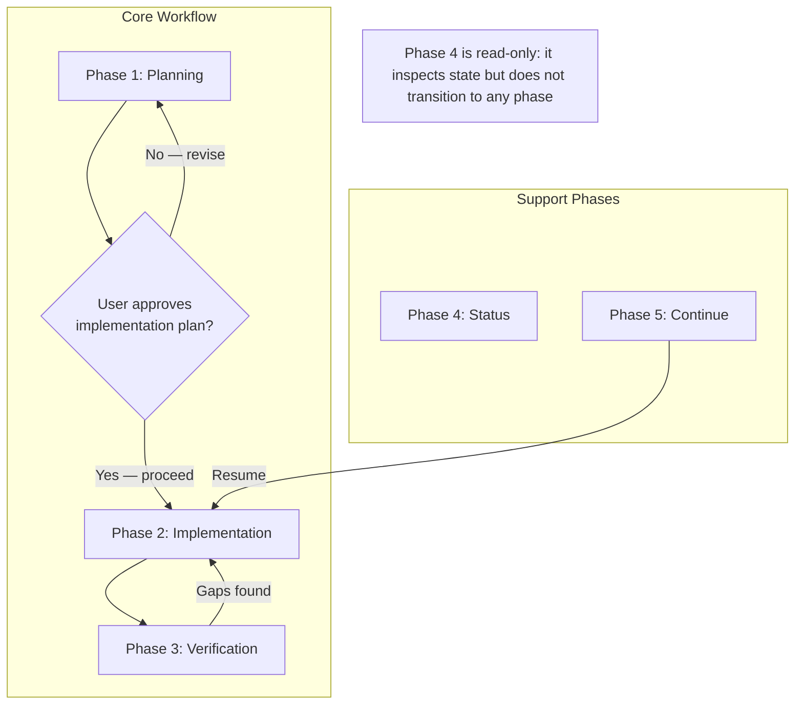
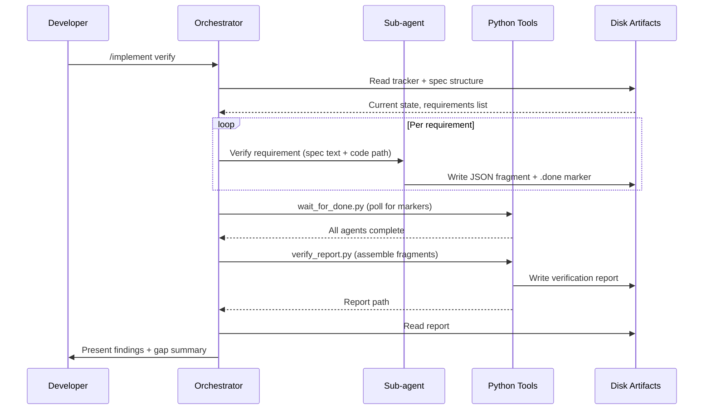
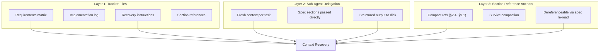

# §2 Architecture & Design Principles

> Part of [Master Spec](../spec.md)

---

This section documents the architectural decisions and design principles behind the `/implement` skill. Every principle described here originated from observed failure modes during iterative development — they are empirical findings, not theoretical preferences. This is the most critical section of the specification: it captures the **why** behind the skill's design, without which the functional requirements in later sections would appear arbitrary.

---

## §2.1 Architectural Overview

The skill operates as a five-phase workflow, orchestrated by the main Claude Code conversation (the orchestrator) and executed through delegated sub-agents (isolated Claude Code instances spawned via the Task tool, each with a fresh context window — see §2.2, Principle 3 and §2.3) and deterministic tooling.



| Phase | Command | Purpose |
|-------|---------|---------|
| Phase 1: Planning | `/implement <spec-path>` | Parse spec, create tracker, break into tasks, determine TDD mode (test-driven development — see §2.2, Principle 3) |
| Phase 2: Implementation | *(begins after user approves the implementation plan)* | Standard or TDD workflow via sub-agent delegation |
| Phase 3: Verification | `/implement verify` | Per-requirement verification with parallel sub-agents, deterministic report assembly |
| Phase 4: Status | `/implement status` | Read-only view of progress, blockers, and current state |
| Phase 5: Continue | `/implement continue` | Resume from previous session with worktree validation and spec freshness checks |

Phases 1 through 3 form the core workflow: plan, implement, verify. Phase 4 (Status) is a read-only inspection that can be invoked at any point. Phase 5 (Continue) is the session-recovery entry point that feeds back into Phase 2, re-establishing context from the persistent tracker before resuming implementation.

The verification phase loops back to implementation when gaps are found. This cycle — implement, verify, fix gaps, re-verify — continues until all requirements are satisfied or explicitly documented as out of scope.

### §2.1.1 Data Flow Through Phases

Within each phase, data flows through a consistent pattern involving three actors: the orchestrator, sub-agents, and deterministic tools.



This pattern — orchestrator prepares context, sub-agents produce structured fragments, tools assemble deterministically, orchestrator reasons over the result — recurs throughout the skill and is formalised in §2.4 as the Model-Tool-Model Pipeline.

---

## §2.2 Core Design Principles

The following eight principles govern the skill's architecture. Each originated from a specific, observed failure during iterative development (see §1.5 for the iteration history). They are presented in order of architectural significance.

### Principle 1: Context Window as the Fundamental Constraint

**Empirical origin**: Every failure mode observed during the skill's development traced back, directly or indirectly, to context window limitations — information loss during compaction, attention degradation over long inputs, or context exhaustion during complex tasks.

**Statement**: The context window MUST be treated as the fundamental design constraint. Every architectural decision — file structure, delegation strategy, artifact format, workflow sequencing — MUST be evaluated against its impact on context consumption and resilience to context loss.

**Implications**:

- The skill's own SKILL.md was restructured from a monolithic document (approximately 1400 lines at the time of restructure) to a slim routing document (approximately 296 lines at the time of restructure — actual current line count may vary; see §2.5) — a context optimisation applied to the skill itself.
- Reference files are loaded on demand per phase, never all at once.
- Sub-agents receive only the spec sections and code paths relevant to their specific task, not the full specification.
- Tracker files are designed for efficient re-reading: structured headers, consistent formatting, and embedded recovery instructions allow rapid context reconstruction.
- Verification dispatches one requirement per sub-agent rather than batching, because smaller focused contexts produce more thorough analysis than larger overloaded ones.

### Principle 2: Hard Enforcement Gates Over Soft Guidelines

**Empirical origin**: During iterations 4-5, it was observed that LLMs consistently skip optional steps when under context pressure. Instructions phrased as "consider doing X" or "you may want to check Y" are treated as suggestions — and suggestions are the first things dropped when context fills. This behaviour is consistent: across models, across prompt styles, across task types.

**Statement**: Requirements MUST be expressed as mandatory preconditions, not suggestions. The skill MUST use hard gates — conditions that block progress until satisfied — rather than soft guidelines that can be bypassed.

**Examples of hard gates in the skill**:

| Gate | Blocks | Rationale |
|------|--------|-----------|
| Tracker must exist before implementation begins | Phase 2 | Without a tracker, there is no recovery mechanism after compaction |
| Tests must pass before marking a task complete | Task completion | "Complete but tests failing" is a contradiction the LLM will not self-correct |
| Tests must pass before verification begins | Phase 3 | Verifying non-functional code produces meaningless results |
| Opus must be used for verification fixes | Gap fixing | Sonnet-class models miss subtle spec gaps that Opus catches |
| DIGEST escalation (see §5.4 for details) to Opus is mandatory, not discretionary | Post-task review | "Consider reviewing" means "don't review" under context pressure |

**Analogy**: Hard gates are the equivalent of compile-time errors; soft guidelines are runtime warnings. In safety-critical contexts, compile-time enforcement is always preferred.

### Principle 3: Context Isolation as a Verification Advantage

**Empirical origin**: During iteration 6-7, separating test writing into its own sub-agent — one that reads only the specification and never sees implementation code — produced a measurable quality improvement. Tests written by an agent that has seen the implementation tend to test what the code does rather than what the spec requires. The "fresh eyes" of an isolated context revealed ambiguities and gaps that were invisible to the implementing agent.

**Statement**: Sub-agent context isolation MUST be treated as a feature, not a limitation. Fresh context windows provide independent specification interpretation that is structurally incapable of implementation drift.

**Applications**:

- **TDD mode**: The test-writing agent reads only the spec. The implementing agent receives the test file path but writes code to satisfy the tests. The two agents independently interpret the specification, and disagreements surface as test failures — which are ambiguities that need human resolution.
- **Verification**: Each verification sub-agent starts fresh, reads the spec requirement and the implementation code, and produces an independent judgment. It cannot have been influenced by the implementing agent's reasoning or assumptions.
- **Fix agents**: When fixing verification gaps, the fix agent receives the spec quote, the current code, and the gap description. It does not inherit the original implementer's context or biases.

### Principle 4: Three Layers of Context Preservation

**Empirical origin**: No single recovery mechanism proved sufficient on its own. Tracker files could become stale. Sub-agent delegation could fail. Section references could be ambiguous. But the combination of all three provided resilient recovery — any single layer failing still allowed reconstruction via the others.

**Statement**: The skill MUST maintain three independent layers of context preservation. Any single layer failing MUST still allow recovery through the remaining two.

This principle is significant enough to warrant its own subsection — see §2.3 for the full treatment.

### Principle 5: The Model-Tool-Model Pipeline

**Empirical origin**: Early iterations had LLMs both generate verification findings and assemble them into reports. The assembly step — collecting fragments, computing statistics, formatting output — is a deterministic task that LLMs perform unreliably. They hallucinate counts, misformat tables, and silently drop items. Moving assembly to a Python script eliminated an entire class of errors.

**Statement**: The skill MUST separate LLM judgment from deterministic assembly. Models SHOULD produce structured data (JSON fragments). Deterministic tools MUST assemble that data. Models SHOULD then reason over the assembled results.

See §2.4 for the full treatment of this pattern.

### Principle 6: Self-Recovering Artifacts

**Empirical origin**: After total context loss (session restart, severe compaction), the orchestrator needs to reconstruct its understanding of the implementation state. If recovery depends on external documentation or human explanation, the skill fails its core purpose. The tracker must be self-explanatory.

**Statement**: The implementation tracker MUST embed its own recovery instructions. After total context loss, reading the tracker alone MUST provide sufficient information to understand the current state, determine the next action, and resume work without external assistance.

**Implementation**: Every tracker file contains a Recovery Instructions section at the top that tells the reader:

- What this file is and what it tracks
- Where the specification is located
- What phase the implementation is in
- How to read the requirements matrix
- What to do next

This creates zero dependency on external infrastructure for recovery. The tracker is a self-contained resumption artifact.

### Principle 7: Consent-Based Activation

**Empirical origin**: Early versions of the skill activated automatically when it detected spec-like documents or tracker files in the conversation. This frustrated users who were performing unrelated tasks near spec files. The skill was "helpful" in a way that disrupted the user's actual intent.

**Statement**: The skill MUST detect opportunities for activation but MUST ask before engaging. Implicit activation (detecting tracker files, spec references, or implementation-related language) MUST prompt the user for confirmation before proceeding.

**The rule**: The skill offers help; it does not hijack the conversation. User agency is preserved at every activation point.

### Principle 8: Section References as Stable Anchors

**Empirical origin**: During context compaction, prose descriptions of requirements are among the first things lost. A phrase like "the requirement about handling concurrent barcode scans in the quick capture module" is verbose, ambiguous, and fragile under compression. The compact reference "§2.1.3" survives compaction reliably and can be resolved by re-reading the spec.

**Statement**: Every task, tracker entry, and verification item MUST reference specific spec sections using compact section references (e.g., §2.4, §9.1). These references SHOULD survive context compaction where prose descriptions do not.

**Why this works**: Section references are short (4-6 characters), unambiguous, and semantically dense. They serve as pointers that can be dereferenced by reading the spec — the information itself does not need to survive in context, only the pointer to it. This is analogous to how memory addresses work: the address is small and stable; the data it points to can be arbitrarily large.

---

## §2.3 Three-Layer Context Preservation

Context preservation is the central challenge the skill addresses. Three independent mechanisms work together to ensure that specification fidelity survives context compaction, session restarts, and model switches.



### Layer 1: Persistent Tracker Files

The tracker file (`.impl-tracker-<name>.md`) is the primary persistence mechanism. It is a structured markdown file stored on disk that survives any context event — compaction, session restart, model switch, or complete conversation loss.

The tracker contains:

- **Metadata**: spec path, worktree path, TDD mode, creation date
- **Recovery instructions**: self-contained guidance for resuming after context loss
- **Requirements matrix**: every requirement with status, section reference, and implementation location (file:line)
- **Implementation log**: chronological record of work performed
- **Structural index**: for multi-file specs, a size-based index of section files

Because the tracker is on disk, it is immune to context window events. The cost is that it must be explicitly read — it does not "persist" in the LLM's attention automatically. This is why the pre-task checklist mandates reading the tracker before each implementation unit.

### Layer 2: Sub-Agent Delegation

Each sub-agent receives a fresh context window containing only the information relevant to its specific task: the spec sections being implemented, the target code paths, and the task brief. This fresh context is structurally incapable of drift — the sub-agent has no prior conversation history to have drifted from.

Sub-agents write their results as structured JSON to disk rather than returning conversational responses. This means the results persist independently of the sub-agent's context window and can be read by the orchestrator or by deterministic tools at any point.

The combination of fresh-context input and structured-output-to-disk means that sub-agent delegation is itself a context preservation mechanism: it converts ephemeral conversation context into persistent disk artifacts.

### Layer 3: Section Reference Anchors

Section references (§2.4, §9.1, Section 3.2) are compact identifiers that survive context compaction where prose descriptions do not. They appear in:

- Task descriptions and subjects
- Tracker requirements matrix entries
- Verification item identifiers
- Sub-agent task briefs
- Implementation log entries

After compaction, even if the orchestrator has lost the detailed understanding of what §4.2 requires, the reference itself survives. The orchestrator can dereference it by reading that section of the spec — reconstructing full understanding from a minimal surviving anchor.

### Recovery Scenarios

| Scenario | Layer 1 (Tracker) | Layer 2 (Sub-agents) | Layer 3 (References) | Recovery Path |
|----------|-------------------|----------------------|----------------------|---------------|
| Mid-session compaction | Available on disk | Current agent unaffected | Survive in tracker | Read tracker, continue |
| Session restart | Available on disk | N/A (new session) | Survive in tracker | Phase 5: Continue |
| Tracker accidentally deleted | Lost | Output files on disk | In task descriptions | Reconstruct from `.impl-work/` artifacts and task list |
| Context completely exhausted | Available on disk | Spawn fresh agent | Survive in tracker | Read tracker recovery instructions |
| Spec file relocated or renamed | Available on disk (old path recorded) | N/A | Section refs intact but path stale | Update spec path field in tracker header; verify section refs still resolve; use Phase 5 Continue to re-establish context |

The design intent is that no single point of failure can cause unrecoverable context loss. The three layers provide defence in depth.

---

## §2.4 The Model-Tool-Model Pipeline

The Model-Tool-Model pipeline is the skill's core execution pattern. It separates what LLMs are good at (judgment, analysis, interpretation) from what deterministic tools are good at (assembly, counting, formatting).


### The Pattern

1. **Model produces structured data**: A sub-agent (LLM) reads the specification and implementation code, exercises judgment about whether a requirement is satisfied, and writes its finding as a JSON fragment to disk. The model does what models are good at: interpreting natural language requirements, reading code, and making qualitative judgments.

2. **Tool assembles deterministically**: A Python script (`verify_report.py`) collects all JSON fragments, validates their structure, computes aggregate statistics, identifies priority gaps, and produces both machine-readable (JSON) and human-readable (Markdown) reports. The tool does what tools are good at: deterministic data processing with no hallucination, no miscounting, and no silent omissions.

3. **Model reasons over assembled results**: The orchestrator reads the assembled report and presents findings to the developer, identifies patterns across gaps, and plans remediation. The model does what models are good at: synthesis, prioritisation, and communication.

### Why Not Let the Model Do Everything?

Early iterations attempted to have LLMs perform the assembly step. The failure modes were consistent:

- **Miscounting**: An LLM summarising 40 verification results would report "38 of 40 passed" when the actual count was 35 of 40.
- **Silent omission**: Requirements whose findings were ambiguous or complex would be quietly dropped from the summary.
- **Format drift**: Report formatting degraded as context filled, with tables losing columns or entries being merged.
- **Non-reproducibility**: The same inputs could produce different assembly results across runs.

These are not edge cases — they are the expected behaviour when asking a probabilistic system to perform a deterministic task. The pipeline eliminates this class of errors by reserving deterministic work for deterministic tools.

### Where the Pipeline Appears

| Phase | Model Step (judgment) | Tool Step (assembly) | Model Step (reasoning) |
|-------|----------------------|----------------------|------------------------|
| Verification | Sub-agents write per-requirement JSON fragments | `verify_report.py` assembles report | Orchestrator interprets report, plans fixes |
| Sub-agent coordination | Orchestrator dispatches tasks and constructs prompts | `wait_for_done.py` polls `.done` markers | Orchestrator proceeds when all complete |
| Re-verification | Sub-agents write updated JSON fragments | `verify_report.py` with `--previous` flag computes deltas | Orchestrator presents delta summary |
| Planning (Phase 1) | Orchestrator parses spec sections and structures tasks | `parse_spec.py` extracts requirements and builds tracker | Orchestrator reviews tracker before seeking user approval |

---

## §2.5 Skill Structure: Routing Document and Reference Files

The skill's own file structure embodies the context management principles it teaches. In February 2026, the SKILL.md file was restructured from a monolithic document (approximately 1400 lines at that time) to a slim routing document (approximately 296 lines at that time; actual current counts may differ) that loads phase-specific reference files on demand.

### The Problem with Monolithic Skill Files

When SKILL.md contained the full workflow documentation — every phase's detailed steps, every prompt template reference, every edge case — it consumed a substantial portion of the context window at activation time. This meant that by the time the skill had loaded its own instructions, it had already reduced the available context for actual specification content and implementation work.

This is the same problem the skill solves for specifications: a large document loaded entirely into context leads to information loss through compaction pressure.

### The Routing Document Pattern

The restructured SKILL.md serves as a **routing document**: it contains just enough information to understand the skill's purpose, determine which phase to enter, and know which reference file to load for detailed instructions.

```
# Path shown relative to the Claude Code skills root (e.g. ~/.claude/skills/ or the project's .claude/skills/)
skills/implement/
  SKILL.md                          # ~296 lines — routing document
  references/
    tracker-format.md               # Full tracker template + field explanations
    workflow-quick-ref.md           # Checklists for pre-task, post-task, verification
    sub-agent-strategy.md           # Model selection, size routing, DIGEST escalation
    phase-1-planning.md             # Full Phase 1 workflow
    phase-2-implementation.md       # Standard implementation workflow
    phase-2-tdd.md                  # TDD test-first workflow
    phase-3-verification.md         # Full verification machinery
    phase-5-continue.md             # Resume work + spec evolution handling
  prompts/
    implement-single-file.md        # Sub-agent prompt templates
    implement-multi-file.md
    write-tests.md
    fix-issue.md
    tdd-write-tests.md
    tdd-implement.md
    verify-requirement.md
    reverify-requirement.md
    fix-verification-gap.md
    # Note: this list reflects the prompts directory as of the February 2026 restructure.
    # The actual directory is authoritative — new prompt files may have been added since.
```

**The routing document contains**:

- Command table and argument routing logic
- Preference system documentation
- Phase summaries with "read this reference file" pointers
- Recovery instructions
- Implicit activation rules
- Best practices (concise)

**The routing document does not contain**:

- Detailed step-by-step workflows (those are in `references/phase-*.md`)
- Prompt templates (those are in `prompts/`)
- Tracker format specification (that is in `references/tracker-format.md`)
- Model selection tables and escalation logic (that is in `references/sub-agent-strategy.md`)

### Load-on-Demand Principle

The instruction in SKILL.md is explicit: **"Load only what you need for the current phase. Do not read all files at once."**

When the orchestrator enters Phase 1, it reads `references/phase-1-planning.md`. When it enters Phase 3, it reads `references/phase-3-verification.md`. Reference files for other phases remain unloaded, preserving context for the work at hand.

This is the same principle as the tracker's section references: don't load information into context until it is needed. The reference file path serves as a pointer — small, stable, and dereferenceable on demand — just as a section reference like §4.2 serves as a pointer to a spec requirement.

### The Skill Eating Its Own Dogfood

The restructure of SKILL.md is a direct application of the skill's own design principles to itself:

| Principle | Application in Skill Structure |
|-----------|-------------------------------|
| Context window as fundamental constraint (§2.2, Principle 1) | Reduced from ~1400 lines (monolithic) to ~296 lines (routing document) at the time of restructure — substantially smaller activation footprint |
| Section references as stable anchors (§2.2, Principle 8) | Phase summaries point to reference files by path |
| Hard enforcement ("load only what you need") (§2.2, Principle 2) | Explicit instruction, not a suggestion |
| Self-recovering artifacts (§2.2, Principle 6) | Routing document contains enough to determine which reference to load |

This self-application demonstrates that the design principles are general — they apply to any situation where an LLM must work with more information than fits comfortably in a single context window.
