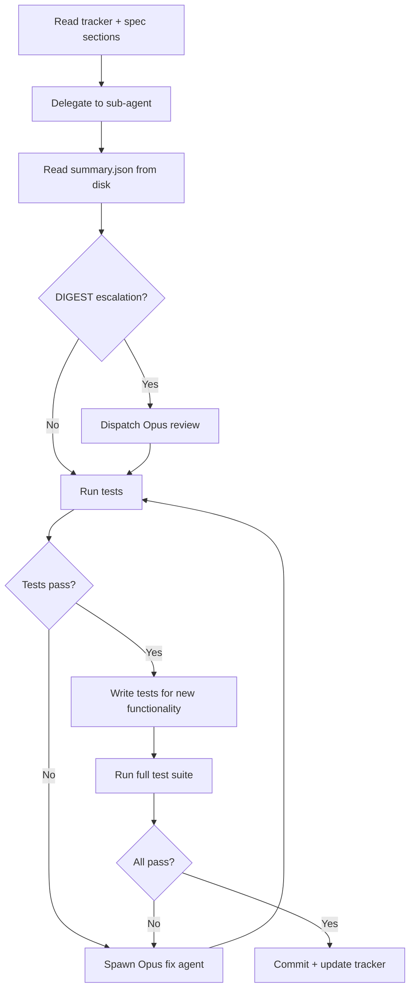
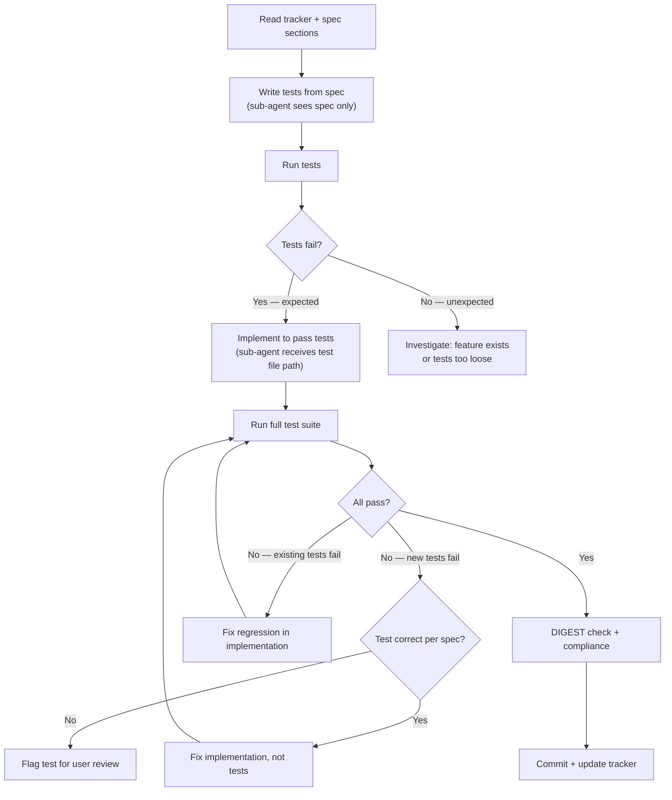
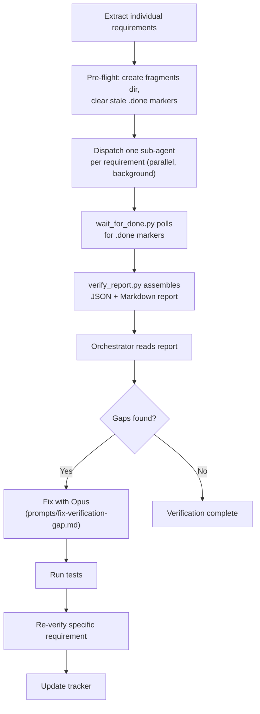

# §3 Functional Requirements

> Part of [Master Spec](../spec.md)

---

This section specifies the functional requirements for each phase, command, and activation mode of the `/implement` skill. Requirements use MoSCoW language (MUST, SHOULD, COULD, WON'T) throughout and are numbered for traceability during verification.

> **Requirement status values**: Throughout this section, requirement statuses use the canonical set defined in `references/tracker-format.md`: `pending`, `in_progress`, `partial`, `complete`, `blocked`, `n/a`. All requirements start as `pending` during Phase 1 planning. No other status values are valid.

---

## §3.1 Phase 1: Planning (`/implement <spec-path>`)

Phase 1 transforms a specification document into an actionable implementation plan: a persistent tracker file, a task breakdown, and a determined workflow mode. No implementation code is written during this phase.

> **Note on tracker-level status**: Tracker lifecycle status transitions (Planning → In Progress → Verification → Complete) are documented in §4.7.1 as an advisory lifecycle. §3 does not define FRs for tracker-level status because transitions are managed by the orchestrator implicitly, not enforced programmatically.

### §3.1.1 Context Clear Offer

- **FR-1.1** The skill MUST offer to clear conversation context before beginning planning work. The offer MUST explain the benefit (maximum context window for implementation).
- **FR-1.2** If the user declines, the skill MUST proceed without asking again.
- **FR-1.3** If the skill is re-invoked after a `/clear`, the skill MUST NOT repeat the context clear offer. Note: the skill intentionally loses all in-memory state after `/clear` — there is no persistent detection mechanism. This FR describes the behaviour when the skill detects an existing tracker on re-invocation (per Phase 5 / Continue flow), not a `/clear`-specific detection mechanism.

### §3.1.2 Worktree Detection and Validation

- **FR-1.4** After reading the specification document, the skill MUST scan for any indication of a worktree path, working directory, or branch designation for implementation work. This scan MUST be generic — not tied to specific field names or document formats. Minimum detection criteria: scan for mentions of absolute or relative directory paths, git branch names, or worktree-related keywords (e.g., "worktree", "working directory", "implementation directory") in the spec/brief document. This is intentionally heuristic, not a formal parser.
- **FR-1.5** If a worktree path is identified, the skill MUST validate that:
  1. The path exists on disk.
  2. The path appears in `git worktree list` output.
  3. If a branch was specified, the worktree is on that branch (verified via `git -C <path> branch --show-current`).
- **FR-1.6** If validation fails, the skill MUST warn the user and ask whether to proceed in the current directory or abort. The skill MUST NOT silently fall back.
- **FR-1.7** If a valid worktree is detected, it MUST become the **implementation directory** for all subsequent operations (tracker creation, file edits, test runs, verification artifacts).

### §3.1.3 STRUCT Awareness

- **FR-1.8** Before parsing the spec, the skill SHOULD check for `.spec-tracker-*.md` files in the specification's directory.
- **FR-1.9** If a spec tracker with a `## Pending Structural Changes` section is found, the skill MUST warn the user and ask whether to proceed or wait for resolution.
- **FR-1.10** If the user proceeds despite pending structural changes, the skill MUST note the pending issues in the tracker's Implementation Log.

### §3.1.4 Specification Parsing

- **FR-1.11** The skill MUST detect whether the specification is single-file or multi-file. Detection MUST check for `<!-- EXPANDED:` markers in the master document or a `sections/` directory alongside it.
- **FR-1.12** The detected spec type MUST be recorded in the tracker as `**Spec Type**: single-file` or `**Spec Type**: multi-file`.

#### Single-File Specs

- **FR-1.13** For single-file specs, the skill MUST read the entire specification document.
- **FR-1.14** The skill MUST identify the document's section structure (patterns such as `## Section N`, `### N.M`, `§N.M`, numbered headings).
- **FR-1.15** The skill MUST extract each discrete requirement with its section reference.

#### Multi-File Specs

- **FR-1.16** For multi-file specs, the skill MUST NOT read all section files into main context.
- **FR-1.17** The skill MUST build a structural index by:
  1. Reading the master spec's document map / table of contents only.
  2. Running `wc -c` on all section files to compute byte counts.
  3. Estimating tokens as `estimated_tokens = bytes / 4`.
- **FR-1.18** The skill MUST handle sub-file splitting (letter suffixes such as `02a-core-model.md`, `02b-core-relations.md`) by grouping sub-files under their parent section number.
- **FR-1.19** The skill MUST read only section headings and requirement identifiers (MUST/SHOULD/COULD statements) from each section file — not full prose.
- **FR-1.20** The structural index MUST be stored in the tracker for use as a spec baseline in future sessions.

### §3.1.5 Tracker Creation

- **FR-1.21** The skill MUST create a tracker file in the implementation directory (worktree or current working directory).
- **FR-1.22** The tracker MUST be named `.impl-tracker-<spec-basename>.md`, where `<spec-basename>` is the filename of the spec without its directory path or final `.md` extension. Only the final `.md` extension is stripped (e.g., `api.v2.spec.md` yields basename `api.v2.spec`).
- **FR-1.23** The tracker MUST conform to the template defined in `references/tracker-format.md`, including at minimum:
  - Metadata fields: spec path, creation date, TDD mode, spec type, spec baseline, worktree path, branch.
  - Recovery Instructions section with self-contained resumption guidance.
  - Requirements Matrix with columns: Section, Requirement, Priority, Status, Implementation, Tests.
  - Structural Index (multi-file specs only).
  - Known Gaps section.
  - Deviations from Spec section.
  - Implementation Log section.
- **FR-1.24** The tracker MUST include machine-readable comment fields (`<!-- SPEC_PATH: ... -->`, `<!-- TDD_MODE: ... -->`, etc.) for programmatic parsing.

### §3.1.6 Task Creation

- **FR-1.25** The skill MUST create tasks via `TaskCreate` for each major requirement or group of related requirements.
- **FR-1.26** Each task's subject MUST include section references (e.g., `Implement merge detection workflow (§2.4, §10.2)`).
- **FR-1.27** Each task's description MUST include:
  - The spec section references being addressed.
  - The specific requirements extracted from those sections.
  - A reminder to re-read the referenced sections before starting.

### §3.1.7 TDD Mode Determination

- **FR-1.28** The skill MUST determine TDD mode using the following preference lookup chain:
  1. Project-level: `.impl-preferences.md` in the project directory.
  2. Global: `~/.claude/.impl-preferences.md`.
  3. Built-in default: `on`.
- **FR-1.29** If the preference is `on` or `off`, the skill MUST record it without prompting the user.
- **FR-1.30** If the preference is `ask`, the skill MUST present the TDD/Standard workflow choice to the user as part of the plan presentation.
- **FR-1.31** The determined mode MUST be recorded in the tracker's `**TDD Mode**:` field as either `on` or `off`.

### §3.1.8 Plan Presentation and Approval

- **FR-1.32** Before proceeding to implementation, the skill MUST present the plan to the user, including:
  1. A summary of the specification structure.
  2. The requirements matrix from the tracker.
  3. The proposed task breakdown.
  4. The implementation workflow (TDD or Standard).
  5. Any questions about ambiguous requirements.
- **FR-1.33** The skill MUST NOT begin implementation until the user approves the plan.
- **FR-1.34** If TDD preference was `ask`, the user's workflow choice MUST be captured during plan approval and recorded in the tracker.

---

## §3.2 Phase 2: Implementation

Phase 2 executes the implementation plan created in Phase 1, delegating work to sub-agents while the orchestrator maintains tracker state and enforces quality gates. Two workflows exist depending on TDD mode.

> **Artifact directory rationale**: Implementation artifacts (`summary.json`, `compliance.json`, `fix-summary.json`) are stored in `.impl-work/<spec-name>/` because they are per-task working files produced during implementation. Verification artifacts (JSON fragments, assembled reports) are stored in `.impl-verification/<spec-name>/` because they are per-run diagnostic outputs produced during verification. This separation keeps working state distinct from audit outputs.

### §3.2.1 Pre-Implementation Checks

These checks apply to both Standard and TDD workflows.

- **FR-2.1** The skill MUST verify that a tracker file (`.impl-tracker-*.md`) exists in the implementation directory before writing any implementation code.
- **FR-2.2** The skill MUST verify that the tracker has a populated Requirements Matrix.
- **FR-2.3** The skill MUST verify that tasks have been created via `TaskCreate`.
- **FR-2.4** If any of FR-2.1 through FR-2.3 fail, the skill MUST stop and require completion of Phase 1 before proceeding. This is a hard gate.

### §3.2.2 Standard Workflow (TDD Off)

The Standard workflow implements code first, then writes tests afterward.



#### Step 1: Context Preparation

- **FR-2.5** Before delegating any task, the orchestrator MUST read the tracker file to obtain section references.
- **FR-2.6** The orchestrator MUST re-read the relevant spec sections from the original document (single-file) or confirm which section files the sub-agent will read (multi-file). This is mandatory, not optional.
- **FR-2.7** The orchestrator MUST identify relevant existing code files the sub-agent will need.

#### Step 2: Sub-Agent Delegation

- **FR-2.8** Before dispatching a sub-agent, the skill MUST clear previous completion markers:
  ```
  mkdir -p <impl-dir>/.impl-work/<spec-name>/ && rm -f <impl-dir>/.impl-work/<spec-name>/summary.done
  ```
- **FR-2.8a** Implementation sub-agents MUST write `summary.done` as a completion marker after writing `summary.json`, analogous to verification agents writing `.done` markers (FR-3.20). The orchestrator detects sub-agent completion by checking for this marker.
- **FR-2.9** The skill MUST delegate implementation to a sub-agent using the appropriate prompt template:
  - Single-file specs: `prompts/implement-single-file.md`.
  - Multi-file specs: `prompts/implement-multi-file.md`.
- **FR-2.10** Model selection MUST follow the routing rules in `references/sub-agent-strategy.md`:
  - Straightforward tasks: `haiku` or `sonnet`.
  - Moderate/complex tasks: `opus`.
  - For multi-file specs, size-based routing: <5k tokens per section to sonnet (group 2-3), 5k-20k to sonnet (1 each), >20k to opus (1 each).
  - Default: if no routing rule matches, use `sonnet`.

#### Step 3: Validation

- **FR-2.11** After the sub-agent completes, the orchestrator MUST read the structured summary from `<impl-dir>/.impl-work/<spec-name>/summary.json`. The orchestrator MUST NOT re-analyse the agent's conversational output.
- **FR-2.12** The orchestrator MUST check the `concerns` field — if non-empty, the orchestrator MUST investigate.
- **FR-2.13** The orchestrator MUST check the `status` field — if not `complete`, the orchestrator MUST investigate.
- **FR-2.14** For sonnet sub-agents on multi-file specs, the orchestrator MUST read the `digest` field and check signals against the complexity category table in `references/sub-agent-strategy.md` (categories: algorithms, state machines, permission/auth, complex business rules, cross-cutting).
- **FR-2.15** If a DIGEST signal matches any complexity category, Opus review of the sonnet's code changes MUST be dispatched. This escalation is mandatory, not discretionary.
- **FR-2.16** The orchestrator MUST run the test suite (full suite or at minimum the relevant test files) after sub-agent completion.
- **FR-2.17** If tests fail, the skill MUST spawn an Opus fix agent using `prompts/fix-issue.md`, then re-run tests. Note: the skill does not impose a hard iteration limit on test-fix cycles. In practice, Claude's natural behaviour acts as a circuit breaker — if a fix is not converging after 2-3 attempts, the orchestrator should escalate to the user rather than continuing to loop.

#### Step 4: Test Writing

- **FR-2.18** After implementation passes tests, the skill MUST delegate test writing for new functionality using the prompt template at `prompts/write-tests.md`.
- **FR-2.19** Previous completion markers MUST be cleared before dispatching the test-writing sub-agent.
- **FR-2.20** After the test sub-agent completes, the full test suite MUST be run to confirm both new and existing tests pass. A task MUST NOT be marked `complete` until both new and existing tests pass (equivalent to TDD FR-2.50).

#### Step 5: Commit

- **FR-2.21** If the project is a git repository, the skill SHOULD create an atomic commit for each task's changes (implementation + tests).
- **FR-2.22** The commit message SHOULD reference the spec section (e.g., `feat: implement merge detection (§2.4)`).
- **FR-2.23** Only files changed by the current task SHOULD be staged.

#### Step 6: Tracker Update

- **FR-2.24** The skill MUST update the tracker's Requirements Matrix with status, implementation file:line references, and test file references. Status values on task completion: `complete` on success, `partial` on partial success (some requirements met but gaps remain), `blocked` on failure or inability to proceed.
- **FR-2.25** The skill MUST add an entry to the Implementation Log.
- **FR-2.26** The skill MUST update the task status via `TaskUpdate`.
- **FR-2.27** A task MUST NOT be marked `complete` if any of the following are true:
  - Tests are failing.
  - Tests have not been run.
  - New functionality has no tests.
  - There are linting or type errors.

#### Step 7: Spec Compliance Check

- **FR-2.28** The skill SHOULD run an optional spec compliance check for non-trivial tasks using `prompts/spec-compliance-check.md`.
- **FR-2.29** The compliance check result MUST be read from `<impl-dir>/.impl-work/<spec-name>/compliance.json`, not from conversational output.

### §3.2.3 TDD Workflow (TDD On)

The TDD workflow writes tests first from the specification, then implements code to make them pass. This exploits context isolation between agents: the test-writing agent interprets the spec independently of any implementation.



#### Step 1: Context Preparation

- **FR-2.30** Context preparation for TDD follows the same requirements as Standard workflow (FR-2.5 through FR-2.7).
- **FR-2.31** The orchestrator MUST additionally identify existing test conventions and test file locations.

#### Step 2: Write Tests First

- **FR-2.32** Previous completion markers MUST be cleared before dispatching the test-writing sub-agent.
- **FR-2.33** The skill MUST delegate test writing using the prompt template at `prompts/tdd-write-tests.md`.
- **FR-2.34** The test-writing sub-agent MUST work purely from the specification. It MUST NOT see any implementation code. This is the critical context isolation that ensures tests verify spec requirements, not implementation behaviour.
- **FR-2.35** After the test-writing agent completes, the orchestrator MUST read the summary from `<impl-dir>/.impl-work/<spec-name>/summary.json`.

#### Step 3: Confirm Test Failures

- **FR-2.36** The skill MUST run the test suite after test writing. New tests SHOULD fail, confirming they check something real.
- **FR-2.37** If new tests pass unexpectedly, the skill MUST investigate — the feature may already exist or the tests may be too loose.
- **FR-2.38** If tests error due to import or syntax issues, the skill MUST fix the test setup (imports, fixtures, file paths) but MUST NOT modify test assertions.

#### Step 4: Implement to Pass

- **FR-2.39** Previous completion markers MUST be cleared before dispatching the implementation sub-agent.
- **FR-2.40** The skill MUST delegate implementation using `prompts/tdd-implement.md`.
- **FR-2.41** The implementation sub-agent MUST receive the test file path as acceptance criteria.

#### Step 5: Validate

- **FR-2.42** The orchestrator MUST read the structured summary from disk (FR-2.11 pattern).
- **FR-2.43** DIGEST escalation rules MUST apply (FR-2.14, FR-2.15). Note: DIGEST escalation applies to all sonnet sub-agents regardless of spec type, but single-file specs use the single-file prompt which does not include a DIGEST field, so in practice DIGEST escalation only triggers for multi-file specs.
- **FR-2.44** The full test suite MUST be run. Both new tests and existing tests MUST pass.
- **FR-2.45** If new tests still fail, the skill MUST fix the implementation, not the tests.
- **FR-2.46** If a test appears genuinely wrong (misinterprets the spec), the skill MUST flag it for user review rather than silently modifying it.
- **FR-2.47** If existing tests break, the skill MUST fix the regression in the implementation.

#### Step 6: Critical Rule — Test Integrity

- **FR-2.48** The skill MUST NEVER silently modify tests to match a wrong implementation. When tests disagree with implementation, the spec is the arbiter. If the test correctly reflects the spec, the implementation MUST be fixed. If the test misinterprets the spec, it MUST be flagged for user review.

#### Step 7: Commit and Tracker Update

- **FR-2.49** Commit and tracker update follow the same requirements as Standard workflow (FR-2.21 through FR-2.27).
- **FR-2.50** A task MUST NOT be marked `complete` until both new and existing tests pass.

### §3.2.4 Standard vs TDD Workflow Comparison

| Step | Standard Workflow | TDD Workflow | Notes |
|------|------------------|--------------|-------|
| Task start | Read tracker + spec sections (FR-2.5–2.7) | Same + identify test conventions (FR-2.30–2.31) | TDD adds test location discovery |
| Test writing | After implementation (FR-2.18) | Before implementation (FR-2.33–2.34) | TDD tests written from spec only — no implementation code visible |
| Implementation | Sub-agent implements from spec (FR-2.9) | Sub-agent implements to pass tests (FR-2.40–2.41) | TDD sub-agent receives test file path as acceptance criteria |
| Test running | Run after implementation + after test writing (FR-2.16, FR-2.20) | Run after test writing (expect failures), then after implementation (FR-2.36, FR-2.44) | TDD confirms tests fail first |
| Completion gate | All tests pass, new functionality has tests (FR-2.27) | Both new and existing tests pass (FR-2.50) | Equivalent gates, TDD makes it explicit |
| DIGEST check | Sonnet sub-agents on multi-file specs (FR-2.14) | Same rules apply (FR-2.43) | DIGEST only in multi-file prompts |

### §3.2.5 Sub-Agent Issue Handling

- **FR-2.51** If a sub-agent's implementation has gaps or errors in either workflow, the skill MUST use `prompts/fix-issue.md` to spawn an Opus fix agent.
- **FR-2.52** Fix agents MUST always use `model: "opus"`. This is non-negotiable.

---

## §3.3 Phase 3: Verification (`/implement verify`)

Phase 3 performs systematic, per-requirement verification using parallel sub-agents that produce structured JSON fragments, assembled into a report by deterministic Python tooling. Verification MUST always use Opus-class models for sub-agents.

### §3.3.1 Pre-Verification Gate

- **FR-3.1** Before any spec verification, the skill MUST run the test suite. If tests fail, the skill MUST fix them before proceeding. Verification of non-functional code is meaningless.
- **FR-3.2** The skill MUST run linting and type checking if configured (e.g., `mypy`, `flake8`, `eslint`, `tsc`). Errors MUST be fixed before proceeding.
- **FR-3.3** The skill MUST verify that the code compiles/runs (compiled languages build without errors; interpreted languages pass import/load checks; web apps can start the dev server).
- **FR-3.4** If any of FR-3.1 through FR-3.3 fail, the skill MUST NOT proceed with verification. This is a hard gate.

### §3.3.2 Tracker and Worktree Resolution

- **FR-3.5** If a spec-name is provided, the skill MUST look for `.impl-tracker-<spec-name>.md`.
- **FR-3.6** If no spec-name is provided and exactly one tracker exists, the skill MUST use it. If multiple exist, the skill MUST present the list and ask the user to choose. If none exist, the skill MUST inform the user.
- **FR-3.7** After finding the tracker, the skill MUST check its `**Worktree**` field. If not `none`, the worktree path MUST be validated and used as the implementation directory for all subsequent steps.

### §3.3.3 Verification Plan

- **FR-3.8** In the main conversation, the skill MUST read only the tracker and the spec's structure/table of contents. Full spec sections and implementation files MUST NOT be read into the main conversation context.
- **FR-3.9** The skill MUST check for previous verification reports at `<impl-dir>/.impl-verification/<spec-name>/verify-*.json`. If found, the most recent report MUST be read, triggering re-verification mode (see §3.3.7).

### §3.3.4 Requirement Extraction

- **FR-3.10** The skill MUST extract individual requirements from each spec section — the specific MUST/SHOULD/COULD statements or concrete behavioural expectations, not section headings.
- **FR-3.11** The extraction MUST distinguish between topic areas (e.g., "§2.1 Quick Capture") and individual requirements within those topics. A section with 15 subsections SHOULD produce 30-60+ individual requirements.
- **FR-3.12** For each requirement, the skill MUST record: the section reference (§N.M), a one-line summary, and any implementation hints from the tracker (file:line references).
- **FR-3.13** After extracting requirements from a section, the skill SHOULD release the section content from context, retaining only the flat requirement list.

### §3.3.5 Verification Dispatch



- **FR-3.14** Before dispatching sub-agents, the skill MUST create the fragments directory and clear any stale `.done` markers:
  ```
  mkdir -p <impl-dir>/.impl-verification/<spec-name>/fragments/ && rm -f <impl-dir>/.impl-verification/<spec-name>/fragments/*.done
  ```
- **FR-3.15** During initial verification, the skill MUST dispatch exactly one sub-agent per requirement. Requirements MUST NOT be batched during initial verification. Exception: re-verification spot-checks (FR-3.32) MAY batch 5-10 passed items into a single agent for efficiency.
- **FR-3.16** Verification sub-agents MUST use `model: "opus"`.
- **FR-3.17** Verification sub-agents MUST be dispatched with `run_in_background: true`. Note: the skill does not impose a concurrency cap on verification agents. For large specs (100+ requirements), all agents are dispatched in parallel with the expectation that API-level rate limiting provides backpressure. The `wait_for_done.py` timeout (600s default) acts as the only bound.
- **FR-3.18** Each sub-agent MUST use the prompt template at `prompts/verify-requirement.md`.
- **FR-3.19** Each sub-agent MUST write a JSON fragment and a `.done` marker to `<impl-dir>/.impl-verification/<spec-name>/fragments/`.
- **FR-3.20** The orchestrator MUST NOT call `TaskOutput` on verification agents. Completion MUST be detected via `.done` markers only.

### §3.3.6 Report Assembly

- **FR-3.21** The skill MUST wait for all sub-agents to complete by running:
  ```
  "$PYTHON" "$TOOLS_DIR/wait_for_done.py" --dir <fragments-dir> --count <N>
  ```
- **FR-3.22** The skill MUST assemble the report using the deterministic Python tool:
  ```
  "$PYTHON" "$TOOLS_DIR/verify_report.py" \
    --fragments-dir <fragments-dir> \
    --spec-path <spec-path> \
    --impl-path <impl-dir> \
    --project-name "<spec-name>" \
    --output <impl-dir>/.impl-verification/<spec-name>/verify-<date>.json
  ```
- **FR-3.23** The assembly tool MUST produce both a JSON report and a Markdown report. The Markdown format is defined by `tools/verification_schema.py:render_markdown()` — the orchestrator MUST NOT write report markdown manually.
- **FR-3.24** The skill MUST present a summary to the user including: requirements count (X of Y implemented), test coverage (A of B), implementation rate, and the top critical gaps.

### §3.3.7 Gap Fixing

- **FR-3.25** Gap fixes MUST always use `model: "opus"`. This is non-negotiable.
- **FR-3.26** Gap fixes MUST use the prompt template at `prompts/fix-verification-gap.md`.
- **FR-3.27** After each fix, the orchestrator MUST:
  1. Read the fix summary from `<impl-dir>/.impl-work/<spec-name>/fix-summary.json`.
  2. Run tests to confirm the fix works.
  3. Re-verify that specific requirement (single sub-agent, background, same pattern as initial dispatch).
  4. Wait for `.done`, then read the updated fragment.
  5. Update the tracker.
- **FR-3.28** The fix-verify cycle MUST repeat until all gaps are resolved or explicitly documented. Note: no hard iteration limit is imposed on fix-verify cycles. If gaps persist after 2-3 fix attempts, the orchestrator should document remaining gaps and escalate to the user.

### §3.3.8 Re-Verification Mode

- **FR-3.29** When a previous verification report exists, the skill MUST enter re-verification mode and ask the user to choose between:
  1. **Re-verify from where we left off** — check only open V-items plus spot-check for regressions.
  2. **Full re-verification from scratch** — re-audit all requirements, carrying forward V-item IDs.

#### Re-Verify From Where We Left Off

- **FR-3.30** The skill MUST read the most recent report and extract open V-items and the ID counter.
- **FR-3.31** Open items (Partial/Not Implemented, or test coverage Partial/None) MUST be re-verified using `prompts/reverify-requirement.md`.
- **FR-3.32** Passed items MUST receive a lightweight spot-check (cluster 5-10 into one agent).
- **FR-3.33** The skill SHOULD check for new requirements if the spec was updated since the last verification.

#### Full Re-Verification From Scratch

- **FR-3.34** The full initial verification flow MUST be executed.
- **FR-3.35** Findings MUST be matched to previous V-items by section reference. Fallback: when section references change between verification runs (e.g., spec restructuring), V-items are matched by requirement text similarity. Items that cannot be matched are treated as new.
- **FR-3.36** Existing V-item IDs MUST be reused.
- **FR-3.37** Resolution status MUST be included for previously flagged items.

#### V-Item Lifecycle

- **FR-3.38** V-item IDs MUST be permanent — once assigned, they persist across all re-verification runs.
- **FR-3.39** Resolution statuses MUST use the following values:
  - `fixed` — fully resolved.
  - `partially_fixed` — progress made, not fully resolved.
  - `not_fixed` — no meaningful progress.
  - `regressed` — previously fixed, now broken again.
  Human-readable display (e.g., in Markdown reports) MAY use title case (e.g., "Fixed", "Partially Fixed") but the canonical stored values MUST be lowercase underscore format.

### §3.3.9 Re-Verification Report Assembly

- **FR-3.40** For re-verification, the report assembly command MUST include the `--previous` flag pointing to the previous report JSON.
- **FR-3.41** The assembled report MUST include delta information showing how V-items changed between runs.

### §3.3.10 Context Efficiency Rules

- **FR-3.42** The main conversation MUST read only the tracker and spec structure during verification.
- **FR-3.43** Spec requirement text MUST be passed directly in sub-agent prompts, not loaded into main context.
- **FR-3.44** Sub-agents MUST read implementation files themselves.
- **FR-3.45** Sub-agent output MUST be limited to structured findings (JSON fragments).

---

## §3.4 Phase 4: Status (`/implement status`)

Phase 4 is a read-only inspection of implementation progress. It MUST NOT modify any files.

### §3.4.1 Tracker Discovery

- **FR-4.1** If a spec-name is provided, the skill MUST look for `.impl-tracker-<spec-name>.md`.
- **FR-4.2** If no spec-name is provided and exactly one tracker exists, the skill MUST use it. If multiple exist, the skill MUST present the list and ask. If none exist, the skill MUST inform the user.

### §3.4.2 Status Display

- **FR-4.3** The skill MUST read the tracker file and the current task list.
- **FR-4.4** The skill MUST present a summary containing:
  1. Overall progress — X of Y requirements complete.
  2. Current task being worked on.
  3. Blockers or gaps discovered.
  4. Sections not yet started.
- **FR-4.5** The status display MUST be read-only. The skill MUST NOT modify the tracker, tasks, or any implementation files.

---

## §3.5 Phase 5: Continue (`/implement continue`)

Phase 5 resumes implementation from a previous session, re-establishing context from the persistent tracker and validating that the environment is still consistent.

### §3.5.1 Tracker Discovery

- **FR-5.1** Tracker discovery follows the same rules as Phase 4 (FR-4.1, FR-4.2).

### §3.5.2 Worktree Re-Validation

- **FR-5.2** If the tracker's `**Worktree**` field is not `none`, the skill MUST:
  1. Verify the worktree path still exists on disk.
  2. Verify it still appears in `git worktree list`.
  3. If `**Branch**` is not `none`, verify the worktree is on the expected branch.
- **FR-5.3** If worktree validation fails, the skill MUST warn the user and offer three options: re-create the worktree, work in the current directory instead, or abort.
- **FR-5.4** If validation passes, the worktree path MUST be set as the implementation directory.

### §3.5.3 Spec Freshness Check

- **FR-5.5** For multi-file specs, the skill MUST re-run `wc -c` on section files and compare against the stored Structural Index. The skill MUST detect:
  - **New files**: files present on disk but not in the index.
  - **Removed files**: files in the index but no longer on disk.
  - **Size changes**: any file whose byte count changed by >20% from the stored value.
  - **Sub-split patterns**: a previously single file now has letter-suffix variants.
- **FR-5.6** For single-file specs, the skill MUST compare the file's modification time against the tracker's `**Spec Baseline**` date.
  > **Note (precision limitation):** The Spec Baseline field stores a date (YYYY-MM-DD), while file modification time has second-level precision. Same-day edits will not trigger the freshness warning. This is an accepted limitation — single-file freshness uses mtime-vs-date comparison, so changes made on the same calendar day as the baseline date are not detected.
- **FR-5.7** The skill SHOULD check for `.spec-tracker-*.md` files with `## Pending Structural Changes` (STRUCT check).
- **FR-5.8** When no changes are detected, the skill MUST proceed silently.
- **FR-5.9** When changes are detected, the skill MUST present three options:

#### Option 1: Re-Scan Affected Sections

- **FR-5.10** The skill MUST re-read only the changed/new section files and compare requirements against the existing Requirements Matrix.
- **FR-5.11** New requirements MUST be added as `pending` rows.
- **FR-5.12** Removed requirements MUST be marked `n/a` with a note.
- **FR-5.13** Changed requirements MUST be flagged as `pending` with a note indicating the requirement text changed since the last scan.
- **FR-5.14** The Structural Index and Spec Baseline date MUST be updated.
- **FR-5.15** New tasks MUST be created for added requirements.

#### Option 2: Proceed As-Is

- **FR-5.16** The skill MUST log the detected changes in the Implementation Log with details (new files, removed files, size changes) and note that the user chose to proceed without re-scanning.

#### Option 3: Full Re-Plan

- **FR-5.17** The skill MUST archive the current tracker with a date suffix.
- **FR-5.18** The skill MUST re-run Phase 1 from scratch, carrying forward completed work, known gaps, deviations, and Implementation Log entries from the archived tracker. The full Implementation Log history is carried forward — entries are NOT summarised (see §8.4.2).

### §3.5.4 Resuming Implementation

- **FR-5.19** The skill MUST read the tracker's `**TDD Mode**:` field and use the corresponding workflow (TDD or Standard).
- **FR-5.20** The skill MUST read the task list and identify the next pending task.
- **FR-5.21** The skill MUST re-read the relevant spec sections before continuing implementation.
- **FR-5.22** The skill MUST resume implementation using the appropriate Phase 2 workflow.

---

## §3.6 Configuration (`/implement config`)

The configuration subsystem manages workflow preferences at two scopes: project-level and global.

### §3.6.1 Preference Files

- **FR-6.1** Project-level preferences MUST be stored in `.impl-preferences.md` in the project directory.
- **FR-6.2** Global preferences MUST be stored in `~/.claude/.impl-preferences.md`.
- **FR-6.3** Preference lookup MUST follow the chain: project file, then global file, then built-in defaults.
- **FR-6.4** Project-level preferences MUST override global preferences.
- **FR-6.4a** The `.impl-preferences.md` file MUST use the following format: a markdown file with a `# Implementation Preferences` heading followed by a section heading per preference category (e.g., `## Workflow`) containing bullet list items in `**key**: value` format (e.g., `- **tdd-mode**: on`). The lookup chain is: project `.impl-preferences.md` → `~/.claude/.impl-preferences.md` → built-in default.

### §3.6.2 Config Commands

- **FR-6.5** `/implement config` (no arguments) MUST display the current effective preferences, showing the resolved value and its source (project, global, or default).
- **FR-6.6** `/implement config tdd on|off|ask` MUST update the TDD preference at project level (`.impl-preferences.md`).
- **FR-6.7** `/implement config --global tdd on|off|ask` MUST update the TDD preference at global level (`~/.claude/.impl-preferences.md`).
- **FR-6.8** When setting a preference, the skill MUST:
  1. Read the existing preferences file (or create it if it does not exist).
  2. Update the specified value.
  3. Write the file back.
  4. Confirm the change to the user.

### §3.6.3 Available Preferences

- **FR-6.9** The `tdd-mode` preference MUST accept three values: `on`, `off`, `ask`.
  - `on` — always use the TDD workflow.
  - `off` — always use the standard workflow.
  - `ask` — prompt during Phase 1 planning for user choice.
- **FR-6.10** The built-in default for `tdd-mode` MUST be `on`.

---

## §3.7 List (`/implement list`)

- **FR-7.1** The skill MUST find all `.impl-tracker-*.md` files in the current directory and any known worktree paths.
- **FR-7.2** The skill MUST present a summary table containing at minimum: tracker name, spec path, overall status, progress (X of Y requirements complete), and last updated date.
- **FR-7.3** If no trackers are found, the skill MUST inform the user that no active implementations exist.

---

## §3.8 Implicit Activation

The skill MAY be activated without an explicit `/implement` invocation when the user's message mentions tracker files, implementation gaps, or spec verification.

### §3.8.1 Detection

- **FR-8.1** The skill SHOULD detect when the user's message references `.impl-tracker` files, implementation gaps, gap-fixing, or spec verification.

### §3.8.2 Consent Requirement

- **FR-8.2** On implicit activation, the skill MUST NOT silently take over. The skill MUST ask the user if they would like to use the implementation skill.
- **FR-8.3** If the user agrees, the skill MUST read the tracker to determine the appropriate phase and proceed.
- **FR-8.4** If the user declines, the skill MUST assist normally without invoking skill-specific behaviour.

### §3.8.3 Announcement

- **FR-8.5** When implicitly activated (and the user consents), the skill MUST announce: `"It looks like you're working with an implementation tracker. I'm using the implement skill to help with that."`

---

## §3.9 Command Routing

This subsection specifies how the skill interprets arguments to determine which phase to enter.

- **FR-9.1** If arguments contain a file path, the skill MUST enter Phase 1 (Planning). A path argument is treated as a file path if: (a) it contains `/` AND the path exists on disk, OR (b) it ends in `.md` or `.txt` AND the file exists. Non-existent paths MUST NOT be routed as file paths — the skill SHOULD inform the user that the file was not found.
- **FR-9.2** If arguments start with `status`: the skill MUST enter Phase 4 (Status).
- **FR-9.3** If arguments start with `verify`: the skill MUST enter Phase 3 (Verification).
- **FR-9.4** If arguments start with `continue`: the skill MUST enter Phase 5 (Continue).
- **FR-9.5** If arguments are `list`: the skill MUST list all trackers (§3.7).
- **FR-9.6** If arguments start with `config`: the skill MUST handle preferences (§3.6).
- **FR-9.7** If arguments are empty, the skill MUST follow the empty arguments procedure:
  1. Check for existing trackers in the current directory and known worktree paths.
  2. If exactly one tracker exists: offer to continue implementation.
  3. If multiple trackers exist: show list and ask which to continue.
  4. If no trackers exist: search for spec documents (`**/*spec*.md`, `**/*requirements*.md`), present candidates, or ask for a path.
  5. Once a spec path is identified: always enter Phase 1 (Planning).

### §3.9.1 Announcement on Activation

- **FR-9.8** On explicit invocation, the skill MUST announce its action, e.g.: `"I'm using the implement skill to [plan/implement/verify/continue] from [spec name]."`
