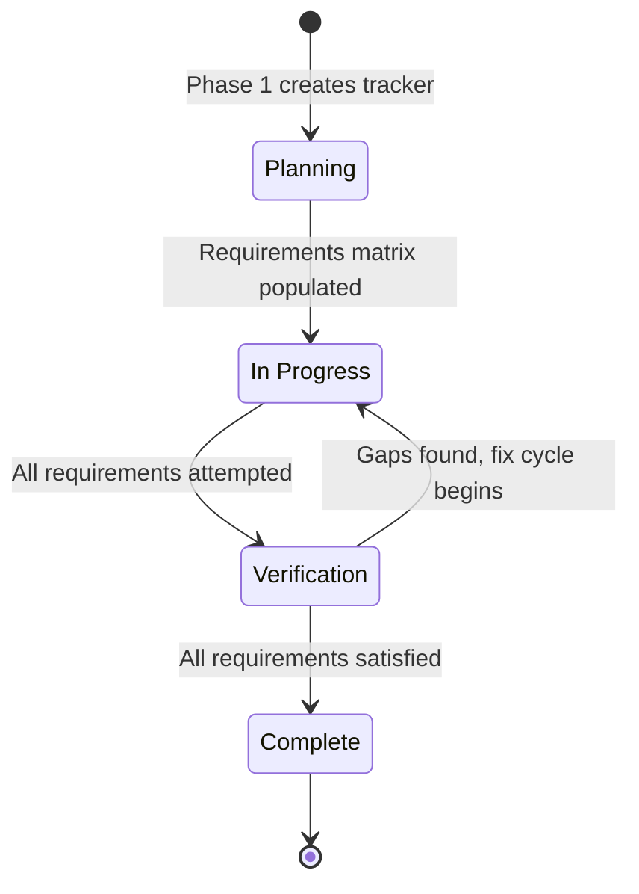
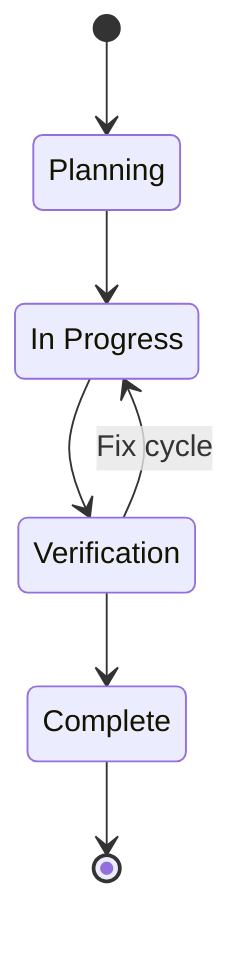
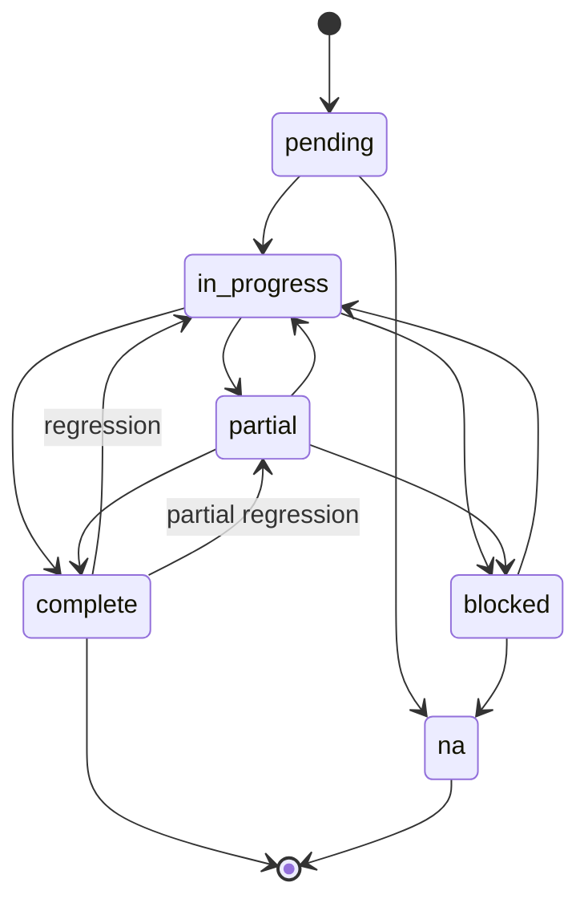
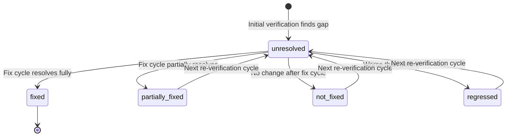

# §4 Data Model & Artifacts

> Part of [Master Spec](../spec.md)

---

This section specifies every file artifact that the `/implement` skill creates, reads, or manages. Together these artifacts form the persistent substrate that makes the skill resilient to context compaction, session restarts, and model switches. Understanding the data model is prerequisite to understanding the workflow: each phase reads from and writes to a specific set of these artifacts.

The section is organised in two logical parts:

- **Artifact Schemas** (§4.1–§4.6): File formats, naming conventions, field definitions, and validation rules for every persistent and transient artifact.
- **State Machines and Lifecycle** (§4.7–§4.8): Advisory lifecycle documentation describing how artifacts transition through states and how files are managed over time.

---

<!-- ═══════════════════════════════════════════════════════════════════ -->
<!-- Part I: Artifact Schemas (§4.1–§4.6)                              -->
<!-- ═══════════════════════════════════════════════════════════════════ -->

## §4.1 Implementation Tracker

**File pattern**: `.impl-tracker-<spec-name>.md`
**Location**: Project root (or worktree root, if a worktree is active)
**Created by**: Phase 1 (Planning)
**Read by**: All phases; self-recovering after context compaction
**Committed to git**: MUST be committed — it is the persistent bridge across sessions

The implementation tracker is the central persistent artifact of the skill. It encodes enough context about the specification and the current implementation state that a fresh Claude session can reconstruct its understanding and resume work accurately without access to any prior conversation history.

### §4.1.1 Naming Convention

The tracker filename is derived from the specification path by taking the file stem and appending it to the prefix `.impl-tracker-`. This scheme allows multiple trackers to coexist in a single project.

| Spec Path | Tracker Filename |
|-----------|-----------------|
| `docs/billing-spec.md` | `.impl-tracker-billing-spec.md` |
| `notification-system.md` | `.impl-tracker-notification-system.md` |
| `../specs/auth-flow.md` | `.impl-tracker-auth-flow.md` |

When working inside a git worktree, the tracker MUST be placed at the worktree root rather than the main repository root, so that each worktree maintains its own independent implementation state.

### §4.1.2 Header Fields

The tracker begins with a set of structured header fields. These fields MUST appear at the top of the file and MUST use **bold-label markdown format** so they are unambiguous after context compaction.

**Bold-label format syntax**: `**Field**: value` — a bold label (enclosed in `**`), followed by a colon, a space, and the value. Example: `**Status**: In Progress`.

| Field | Values | Description |
|-------|--------|-------------|
| `Specification` | File path (string) | Relative or absolute path to the source spec |
| `Created` | `YYYY-MM-DD` | Date the tracker was first created |
| `Last Updated` | `YYYY-MM-DD` | Date of the most recent update |
| `Status` | `Planning` / `In Progress` / `Verification` / `Complete` | Overall tracker lifecycle status |
| `TDD Mode` | `on` / `off` | Whether TDD workflow is active for this implementation |
| `Spec Type` | `single-file` / `multi-file` | Whether the spec uses breakout section files |
| `Spec Baseline` | `YYYY-MM-DD` | Date the structural index baseline was captured. Written once during Phase 1 planning; refreshed only during `/implement continue` when structural index changes are detected |
| `Worktree` | Absolute path or `none` | Active git worktree path, or `none` |
| `Branch` | Branch name or `none` | Active branch, or `none` |
| `Tracker Format` | Version string (e.g. `1.0`) | Format version of the tracker layout; increment when tracker format changes |

The header fields MUST also be encoded as HTML comments immediately after the markdown header for machine-readable access:

```markdown
<!-- SPEC_PATH: path/to/spec.md -->
<!-- TDD_MODE: on|off -->
<!-- SPEC_TYPE: single-file|multi-file -->
<!-- SPEC_BASELINE: YYYY-MM-DD -->
<!-- WORKTREE: /absolute/path/or/none -->
<!-- BRANCH: branch-name-or-none -->
<!-- LAST_SECTION: §4.7 -->
<!-- COMPLETE_COUNT: 18 -->
<!-- PARTIAL_COUNT: 4 -->
<!-- GAP_COUNT: 2 -->
<!-- PENDING_COUNT: 0 -->
```

The convenience fields `LAST_SECTION`, `COMPLETE_COUNT`, `PARTIAL_COUNT`, `GAP_COUNT`, and `PENDING_COUNT` are machine-readable summary counters maintained for use by scripts and tooling. They are updated whenever the tracker is refreshed (e.g. after a verification run or implementation batch). `LAST_SECTION` records the last spec section processed; the count fields track how many requirements are in each status category.

**Invariant**: The sum `COMPLETE_COUNT + PARTIAL_COUNT + PENDING_COUNT` plus any `blocked` and `n/a` items MUST equal the total number of rows in the Requirements Matrix. `GAP_COUNT` records the total number of open gap records in the Known Gaps section (i.e. gaps with status `Open`). **Refresh semantics**: these fields MUST be recomputed and rewritten whenever the Requirements Matrix or Known Gaps section is modified — they are never manually edited in isolation.

### §4.1.3 Recovery Instructions Section

The Recovery Instructions section MUST appear as the first substantive content after the header fields. It is written for a future Claude session that has no memory of the current conversation and must be actionable without any additional context.

Recovery instructions MUST include:

1. A statement that the reader is implementing a specification (not writing code freely)
2. Instructions to read the full tracker before taking any action
3. Worktree validation steps — check the `Worktree` field and verify the path exists
4. Spec type handling — single-file reads the full spec; multi-file reads the table of contents and rebuilds the structural index
5. Instructions to check the TaskList for pending tasks
6. Instructions to re-read relevant spec sections before any implementation work
7. Sub-agent delegation guidance, including model tier selection
8. A reminder that tests must be run after each sub-agent completes
9. A reminder that the tracker must be updated after each completed task

The recovery workflow is summarised as:

> **Tracker → Spec sections → Sub-agent → Run tests → Verify → Update tracker**

### §4.1.4 Specification Summary Section

A brief prose description of what the spec covers and a bulleted list of the major functional areas. This section allows a recovering session to orient quickly without re-reading the full specification.

### §4.1.5 Requirements Matrix

The core tracking table. MUST be kept current after every task completion. Format:

```markdown
| Section | Requirement | Priority | Status | Implementation | Tests |
|---------|-------------|----------|--------|----------------|-------|
| §2.1    | In-flight triggers | Must | complete | src/triggers.py:45 | test_triggers.py:12 |
| §2.4    | Merge detection    | Must | partial  | EdgeCaseHandler    | -                  |
| §9.1    | Follow-up extraction | Should | pending | - | - |
```

**Status values** (requirement-level):

| Value | Meaning |
|-------|---------|
| `pending` | Not started |
| `in_progress` | Currently being implemented |
| `partial` | Partially implemented; gaps identified |
| `complete` | Fully implemented and verified |
| `blocked` | Cannot proceed; see Known Gaps |
| `n/a` | Not applicable to this implementation |

**Priority values** (MoSCoW):

| Value | Meaning |
|-------|---------|
| `Must` | Required for spec compliance |
| `Should` | Expected but not blocking |
| `Could` | Nice to have |
| `Won't` | Explicitly out of scope |

**MoSCoW serialisation convention**: The tracker uses Title Case (`Must`, `Should`, `Could`, `Won't`) for human readability. Verification fragments use UPPER CASE (`MUST`, `SHOULD`, `COULD`, `WONT`) as enum values in JSON. The canonical mapping is:

| Tracker (Title Case) | Fragment JSON (UPPER CASE) |
|----------------------|---------------------------|
| `Must` | `MUST` |
| `Should` | `SHOULD` |
| `Could` | `COULD` |
| `Won't` | `WONT` |

The `Implementation` column MUST contain file and line references (`src/file.py:45`) once implementation work is complete. The `Tests` column MUST be populated before a requirement is marked `complete` — a requirement without passing tests is not considered done.

### §4.1.6 Structural Index (Multi-File Specs Only)

For multi-file specifications, the tracker MUST include a structural index recording the byte size, estimated token count, and model routing recommendation for each section file. This index serves as the spec baseline — it is used on session recovery to detect spec evolution (new files, removed files, significant size changes, or sub-split patterns).

The index MUST exist in two forms: a machine-readable HTML comment block and a human-readable markdown table.

```markdown
<!-- STRUCTURAL_INDEX
file: sections/01-overview.md | bytes: 3200 | tokens: 800 | route: sonnet | parent: §1
file: sections/04-auth.md | bytes: 88000 | tokens: 22000 | route: opus | parent: §4
-->

| File | Bytes | Est. Tokens | Model Route | Parent Section |
|------|-------|-------------|-------------|----------------|
| `sections/01-overview.md` | 3,200 | 800 | sonnet | §1 |
| `sections/04-auth.md` | 88,000 | 22,000 | opus | §4 |
```

Estimated tokens are computed as `bytes / 4`. Model routing thresholds: < 5,000 tokens → sonnet (group 2–3 together); 5,000–20,000 tokens → sonnet (one per agent); > 20,000 tokens → opus (one per agent).

### §4.1.7 Known Gaps Section

Named gap records for requirements that have been discovered to be incomplete or blocked. Each gap MUST include:

- A sequential identifier (`GAP-001`, `GAP-002`, …)
- Discovery date
- Severity (`High`, `Medium`, `Low`)
- Description
- The specific spec requirement reference
- Current observed behaviour
- Proposed fix
- Status (`Open` / `Resolved`)

### §4.1.8 Deviations from Spec Section

Named deviation records for intentional departures from the specification. Each deviation MUST be approved by the developer and MUST include: the spec requirement, the actual implementation, the rationale, the approver, and the date of approval.

### §4.1.9 Implementation Log Section

A chronological, session-by-session log of implementation work. Each entry MUST note the date, what was completed, any gaps discovered, and the test status at session end. This log is the primary audit trail for understanding what was done and in what order.

**Structured entry format**:

```markdown
### 2026-02-19

- **Completed**: §2.1 In-flight triggers (src/triggers.py), §2.4 Merge detection (src/merge.py)
- **Gaps discovered**: GAP-001 — webhook retry logic unspecified in spec
- **Test status**: 47/50 passing; 3 skipped (awaiting GAP-001 resolution)
- **Tracker updated**: Yes
```

Each entry MUST be a level-3 heading containing the ISO date, followed by a bulleted list with at least the `Completed`, `Gaps discovered`, and `Test status` fields.

---

## §4.2 Verification Fragments

**File pattern**: `.impl-verification/<spec-name>/fragments/<fragment-id>.json`
**Companion**: `.impl-verification/<spec-name>/fragments/<fragment-id>.done`
**Created by**: Verification sub-agents (one fragment per requirement)
**Read by**: `verify_report.py` during report assembly
**Committed to git**: Recommended to be gitignored (see §4.8)

A verification fragment is a single JSON file capturing the verification result for one requirement. One sub-agent is spawned per requirement, and each writes one fragment file to disk upon completion.

### §4.2.1 Fragment Schema

The fragment schema is defined in `tools/verification_schema.py`. All fields below are required unless marked optional.

```json
{
  "schema_version": "1.0.0",
  "fragment_id": "s02-1-in-flight-triggers",
  "section_ref": "§2.1",
  "title": "In-flight triggers",
  "requirement_text": "The system MUST detect webhook events for in-flight PRs...",
  "moscow": "MUST",
  "status": "implemented",
  "implementation": {
    "files": [
      {
        "path": "src/triggers.py",
        "lines": "45-78",
        "description": "InFlightTrigger class"
      }
    ],
    "notes": ""
  },
  "test_coverage": "full",
  "tests": [
    {
      "path": "tests/test_triggers.py",
      "lines": "12-34",
      "description": "test_in_flight_trigger_detected"
    }
  ],
  "missing_tests": [],
  "missing_implementation": [],
  "notes": "",
  "v_item_id": "",
  "previous_status": null,
  "resolution": null
}
```

**Field descriptions**:

| Field | Type | Description |
|-------|------|-------------|
| `schema_version` | string | Schema version; currently `"1.0.0"` |
| `fragment_id` | string | Unique identifier; MUST match the filename stem (e.g. `s02-1-in-flight-triggers` for file `s02-1-in-flight-triggers.json`). Section-number prefixes MUST use zero-padded numerics (e.g. `s01-`, `s02-`, `s10-`) so that lexicographic sort matches numeric order |
| `section_ref` | string | Specification section reference (e.g. `§2.1`). Best with structured §N.M format; degrades gracefully to prose labels |
| `title` | string | Short human-readable requirement title |
| `requirement_text` | string | The verbatim or paraphrased requirement from the specification |
| `moscow` | enum | MoSCoW priority: `"MUST"`, `"SHOULD"`, `"COULD"`, `"WONT"` |
| `status` | enum | Verification status: `"implemented"`, `"partial"`, `"not_implemented"`, `"na"`. Verification sub-agents MUST include this field with one of these four values; this is enforced by prompt templates and the validation schema |
| `implementation.files` | array of FileRef | Files implementing this requirement, with line ranges |
| `implementation.notes` | string | Free-form notes about the implementation |
| `test_coverage` | enum | Test coverage level: `"full"`, `"partial"`, `"none"` |
| `tests` | array of FileRef | Test files covering this requirement, with line ranges |
| `missing_tests` | array of string | Descriptions of test scenarios not yet covered |
| `missing_implementation` | array of string | Descriptions of implementation gaps |
| `notes` | string | Free-form verification notes |
| `v_item_id` | string | V-item identifier assigned during report assembly (e.g. `"V1"`); empty string (`""`) in raw fragments. Uses empty string, not null — this field is always a string type |
| `previous_status` | enum or null | Verification status from the previous verification run (re-verification only); null for initial runs. Note: this uses the *fragment* status enum (`implemented`, `partial`, `not_implemented`, `na`) — it records what the previous *verification* found, not the tracker requirement status |
| `resolution` | enum or null | Resolution of a prior V-item: `"fixed"`, `"partially_fixed"`, `"not_fixed"`, `"regressed"`; null for initial runs |

**FileRef sub-object**:

| Field | Type | Description |
|-------|------|-------------|
| `path` | string | Relative file path from the project root |
| `lines` | string | Line range (e.g. `"45-78"`) or empty string |
| `description` | string | Human-readable description of what this file/range implements |

### §4.2.2 Validation Rules

The `validate_fragment()` function in `verification_schema.py` enforces these hard constraints:

- All required fields must be present
- `implementation` must contain a `files` array
- `moscow`, `status`, and `test_coverage` must be valid enum values
- `fragment_id` must match the filename stem exactly
- `previous_status` and `resolution` (if present and non-null) must be valid enum values

Consistency warnings (non-fatal) are raised for:

- `status: "implemented"` with non-empty `missing_implementation`
- `status: "not_implemented"` with non-empty `implementation.files`
- `test_coverage: "full"` with non-empty `missing_tests`
- `test_coverage: "none"` with non-empty `tests`

### §4.2.3 The `.done` Companion File

Each fragment MUST have a companion `.done` marker file with the same stem:

```
.impl-verification/<spec-name>/fragments/s02-1-in-flight-triggers.json
.impl-verification/<spec-name>/fragments/s02-1-in-flight-triggers.done
```

The `.done` file contents are simply the word `done`. The orchestrator's `wait_for_done.py` tool polls for these markers to detect sub-agent completion without consuming the orchestrator's context window on polling loops.

---

## §4.3 Verification Reports

**JSON**: `.impl-verification/<spec-name>/verify-<date>.json`
**Markdown**: `.impl-verification/<spec-name>/verify-<date>.md`
**Created by**: `verify_report.py` (assembles from fragments after all `.done` markers appear)
**Read by**: Orchestrator for presenting results; passed as `--previous` for re-verification
**Committed to git**: Recommended to be gitignored, but has audit trail value (see §4.8)

A verification report is the assembled, authoritative record of a verification run. It is produced deterministically by `verify_report.py` from the fragment files and is the output that the orchestrator presents to the developer.

### §4.3.1 JSON Report Structure

The JSON report is the machine-readable primary artifact. Its structure mirrors the `VerificationReport` dataclass in `verification_schema.py`:

```json
{
  "schema_version": "1.0.0",
  "report_type": "initial",
  "metadata": {
    "project_name": "billing-system",
    "spec_path": "docs/billing-spec.md",
    "implementation_path": "src/",
    "date": "2026-02-19",
    "run": 1,
    "previous_report": null,
    "spec_version": "",
    "mode": ""
  },
  "findings": [ ... ],
  "statistics": {
    "total_requirements": 24,
    "by_status": { "implemented": 18, "partial": 4, "not_implemented": 2 },
    "by_moscow": { ... },
    "test_coverage": { "full": 15, "partial": 5, "none": 4 },
    "implementation_rate": 0.792,
    "test_rate": 0.729,
    "must_implementation_rate": 0.867
  },
  "priority_gaps": [ ... ],
  "resolution_summary": null
}
```

**`resolution_summary` structure** (present only in re-verification reports, null otherwise):

```json
{
  "resolution_summary": {
    "total_resolved": 5,
    "by_status": {
      "fixed": 3,
      "partially_fixed": 1,
      "not_fixed": 1,
      "regressed": 0
    },
    "unresolved_items": ["V4", "V12"]
  }
}
```

`report_type` is `"initial"` for the first run and `"reverify_delta"` for subsequent runs. When `--previous` is supplied to `verify_report.py`, the report enters re-verification mode: V-item IDs are carried forward from the previous run, and a `resolution_summary` is added showing how many items were fixed, partially fixed, not fixed, or regressed.

**Terminology note — `report_type` vs `mode`**: These two fields encode the same concept using different vocabularies. `report_type` uses a compact machine-readable enum (`"reverify_delta"`) intended for programmatic comparison and branching. `mode` uses a human-readable label (`"re-verification"`) intended for display in the markdown report header. They are always consistent: when `report_type == "reverify_delta"`, `mode == "re-verification"`; when `report_type == "initial"`, `mode == "initial"`.

**Metadata fields**:

- `spec_version`: Captures the spec version (date or identifier) at the time of this verification run, for audit traceability. Empty string if unknown.
- `mode`: `"initial"` for the first verification run, or `"re-verification"` for subsequent runs against a previous report. Empty string if unset. See terminology note above for the relationship to `report_type`.

### §4.3.2 Markdown Report

The markdown report is rendered by `render_markdown()` in `verification_schema.py`. It is intended for human reading and contains:

- Report header (spec path, date, run number, previous report link)
- Overall summary (implementation rate, test coverage rate)
- Requirement-by-requirement verification listing (each V-item with status, implementation files, test files)
- Previous V-item resolution table (re-verification only)
- Test coverage summary table
- Priority gaps list (high / medium / low)
- Scorecard table (implemented count, test coverage counts, critical gaps)
- Still-open items (re-verification only)
- Recommendations

### §4.3.3 V-Item Identifiers

V-item IDs (`V1`, `V2`, …) are assigned by `assign_v_items()` during initial report assembly. Findings are sorted by `fragment_id` (lexicographic) for deterministic ordering — this is why zero-padded section prefixes (§4.2.1) are required, so that `s02-*` sorts before `s10-*`. On re-verification, `map_v_items_from_previous()` carries forward V-item IDs from the previous run by matching on `section_ref`, and assigns new sequential IDs to any requirements that were not present in the prior run. This ensures that V-item IDs remain stable across runs, making the audit trail traceable.

### §4.3.4 Priority Gap Classification

`classify_priority_gaps()` identifies requirements that are not fully implemented with full test coverage and classifies them by priority. This function operates on **fragment status values** (`implemented`, `partial`, `not_implemented`, `na`) — not on tracker requirement status values (`complete`, `in_progress`, etc.). The fragment status reflects what the verification sub-agent observed at verification time.

| Priority | Condition |
|----------|-----------|
| High | MUST + `not_implemented`, or MUST + `partial` + no test coverage, or MUST + `blocked` |
| Medium | MUST + `partial` (with some tests), or MUST + `implemented` (test gap only), or SHOULD + `not_implemented` |
| Low | SHOULD + `partial`, or COULD + any gap |

NA-status items are excluded from gap analysis. `blocked` requirements at MUST priority are classified as High because they represent unresolvable compliance risks.

> **Note**: `blocked` is not a native fragment status value — it is a tracker-level status. When a tracker requirement is `blocked`, its corresponding verification fragment will typically carry `not_implemented` as the fragment status (since the requirement was never successfully implemented). The High-priority classification for MUST + `blocked` is applied by the report assembler based on the tracker state at the time of verification, not from the fragment alone.

---

## §4.4 Implementation Work Directory

**Location**: `.impl-work/<spec-name>/`
**Created by**: Orchestrator before dispatching sub-agents
**Written by**: Implementation sub-agents (structured JSON output)
**Read by**: Orchestrator after sub-agents complete
**Committed to git**: MUST be gitignored (build artifacts)

The implementation work directory is a scratch space for structured output from sub-agents during Phase 2 (Implementation) and fix cycles. Sub-agents write structured JSON files here rather than returning conversational responses, keeping the orchestrator's context window clean.

### §4.4.1 Files in the Work Directory

| File | Written by | Contents |
|------|------------|----------|
| `summary.json` | Implementation sub-agent | Status (`done`/`partial`/`failed`), concerns, digest, list of files changed |
| `compliance.json` | Spec compliance check agent | Compliance findings, issues, recommendations |
| `fix-summary.json` | Fix agent | What was fixed, what remains, test results |

Each of these files MUST have a companion `.done` marker (e.g. `summary.done`) that signals completion to the orchestrator's polling loop.

> **Note**: `compliance.json` and `fix-summary.json` are intentionally loosely structured. They are written by sub-agents for debugging and documentation purposes and are not validated by the orchestrator or used in control flow decisions. Their minimal expected shapes are documented below, but additional fields may be present.

**`compliance.json` expected shape**:

```json
{
  "issues": [ { "description": "...", "severity": "..." } ],
  "recommendations": [ "..." ],
  "overall": "pass | partial | fail"
}
```

**`fix-summary.json` expected shape**:

```json
{
  "fixed": [ "..." ],
  "remaining": [ "..." ],
  "test_results": "pass | partial | fail"
}
```

### §4.4.2 summary.json Structure

```json
{
  "status": "done",
  "concerns": [],
  "digest": "Implemented InFlightTrigger class in src/triggers.py. Added webhook...",
  "files_changed": [
    "src/triggers.py",
    "tests/test_triggers.py"
  ]
}
```

`status` values: `"done"` (fully complete), `"partial"` (incomplete with concerns noted), `"failed"` (could not complete).

**Advisory mapping to tracker requirement status**: `done` maps to `complete`, `partial` maps to `partial`, `failed` maps to `in_progress` (for tracker update purposes, since a failed attempt means the requirement is still being worked on). This mapping is advisory — the orchestrator and user interpret these values when updating the tracker, but it is not enforced programmatically.

`digest` is a concise summary of what was done, used by the orchestrator to decide whether to escalate to a higher-tier model review. Digest signals for mandatory escalation include: algorithms, state machines, permission/auth logic, complex business rules, and cross-cutting concerns. The full list of escalation signal keywords and the detection algorithm are specified in §5.4 (Digest-Based Escalation).

### §4.4.3 .done Markers in the Work Directory

`.done` markers MUST be cleared by the orchestrator before each sub-agent dispatch batch. This prevents stale markers from prior runs from falsely signalling completion. The clearing step is mandatory and is enforced by the workflow as a precondition.

---

## §4.5 Preferences Files

**Project scope**: `.impl-preferences.md` (at project root)
**Global scope**: `~/.claude/.impl-preferences.md`
**Created by**: Developer (manually) or `/implement config` command
**Read by**: Phase 1 (Planning), when determining default TDD mode and other settings
**Committed to git**: Project-scope file SHOULD be committed; global file is user-local

Preferences files are simple markdown documents with key-value pairs that configure default skill behaviour. When both files exist, the project-scope file takes precedence over the global file for any keys it defines.

### §4.5.1 Format

```markdown
# Implementation Preferences

tdd_mode: on
default_model: sonnet
worktree_prefix: feature/
```

All keys are optional. The skill reads only the keys it recognises and ignores unknown keys. Preferences are applied during Phase 1 planning and are recorded into the tracker header fields, where they take effect for the rest of the implementation lifecycle.

### §4.5.2 Recognised Keys

| Key | Values | Default | Description |
|-----|--------|---------|-------------|
| `tdd_mode` | `on` / `off` / `ask` | `on` | Whether to activate TDD workflow by default |
| `default_model` | `haiku` / `sonnet` / `opus` | `sonnet` | Default model tier for implementation sub-agents. See interaction note below. |
| `worktree_prefix` | string | *(none)* | Prefix to prepend to auto-generated worktree branch names |

**`default_model` and algorithmic routing**: The structural index (§4.1.6) records a per-section model routing recommendation derived from estimated token counts (< 5,000 tokens → sonnet; > 20,000 tokens → opus). `default_model` acts as a **user-supplied floor**: when set, no sub-agent is dispatched to a tier lower than `default_model`, but the algorithmic routing may still upgrade to a higher tier (e.g. if `default_model: sonnet` but a section exceeds 20,000 tokens, the section is still routed to opus). Setting `default_model: opus` effectively disables downgrade routing and sends all sub-agents to opus regardless of token count.

---

## §4.6 Completion Markers

**Pattern**: `<path>/<name>.done`
**Created by**: Sub-agents (upon task completion)
**Read by**: `wait_for_done.py` (polling tool)
**Contents**: The single word `done`

Completion markers are sentinel files that signal a sub-agent has finished its task and written its output to disk. The orchestrator uses `wait_for_done.py` to block on these markers rather than polling with repeated `ls` calls, which would waste context window on tool call noise.

### §4.6.1 wait_for_done.py Modes

The tool supports two invocation modes:

```bash
# Wait for N .done files in a directory
python wait_for_done.py --dir .impl-work/billing-spec/ --count 3

# Wait for specific named files
python wait_for_done.py \
  --files .impl-work/billing-spec/summary.done \
          .impl-work/billing-spec/compliance.done
```

Default timeout is 600 seconds (10 minutes). Exit code 0 on success, 1 on timeout.

### §4.6.2 Clearing Markers

Before dispatching a new batch of sub-agents, the orchestrator MUST delete any `.done` files from the previous batch for the same directory. This is a hard precondition — failure to clear markers will cause `wait_for_done.py` to return immediately with stale results.

---

<!-- ═══════════════════════════════════════════════════════════════════ -->
<!-- Part II: State Machines and Lifecycle (§4.7–§4.8)                 -->
<!-- ═══════════════════════════════════════════════════════════════════ -->

## §4.7 State Machines and Lifecycle

> **Advisory documentation**: The state machines in this section document the *intended* lifecycle of tracker, requirement, and V-item statuses. They are not programmatically enforced — the skill uses simple status tracking, and the orchestrator does not validate transitions against a formal state machine. These diagrams serve as reference documentation for implementors and reviewers.

### §4.7.1 Tracker Status Transitions

The overall tracker `Status` field follows a linear progression through four states.



**Transitions** (advisory):

| From | To | Trigger |
|------|----|---------|
| *(new)* | Planning | Phase 1 creates the tracker |
| Planning | In Progress | Implementation sub-agents begin first task. **Precondition**: the requirements matrix should be populated before implementation begins |
| In Progress | Verification | All requirements in the matrix have been attempted (see definition of "attempted" below) |
| Verification | In Progress | Verification report contains unresolved gaps; fix cycle begins |
| Verification | Complete | All requirements are `complete` or `n/a`; no high-priority gaps remain |

**Definition of "attempted"**: A requirement is considered "attempted" when it is in any status other than `pending` — i.e., `in_progress`, `partial`, `complete`, `blocked`, or `n/a`.

### §4.7.2 Requirement Status Transitions

Individual requirement rows in the Requirements Matrix transition through their own lifecycle.

```mermaid
stateDiagram-v2
    [*] --> pending : Requirement identified in planning
    pending --> in_progress : Sub-agent picks up the task
    in_progress --> partial : Agent completes with gaps noted
    in_progress --> complete : Agent completes; tests pass
    partial --> in_progress : Fix cycle begins
    partial --> complete : Gaps resolved; tests pass
    pending --> na : Requirement determined not applicable
    in_progress --> blocked : Cannot proceed; dependency or ambiguity
    partial --> blocked : Gap cannot be resolved without developer input
    blocked --> in_progress : Blocker resolved
    blocked --> na : Permanently unresolvable
    complete --> in_progress : Re-verification finds regression
    complete --> partial : Re-verification finds partial regression
    complete --> [*]
    na --> [*]
```



**Status value semantics**:

| Status | Meaning | Next Step |
|--------|---------|-----------|
| `pending` | Not yet started | Assign to next sub-agent batch |
| `in_progress` | Active in current session | Await sub-agent completion |
| `partial` | Implemented with identified gaps | Schedule fix cycle |
| `complete` | Implemented and tests passing | No action required (may regress on re-verification) |
| `blocked` | Cannot proceed | Escalate to developer; may transition to `n/a` if permanently unresolvable |
| `n/a` | Determined not applicable | Document rationale in tracker |

**Regression transitions** (advisory): When re-verification discovers that a previously `complete` requirement has regressed, it may be moved back to `in_progress` (triggered by a `regressed` resolution finding) or to `partial` (triggered by a `partially_fixed` finding on re-check). These transitions are advisory — the user updates the tracker based on the verification report.

### §4.7.3 V-Item Resolution Values (Re-Verification)

When a requirement appeared in a previous verification run and is being re-checked, the `resolution` field records the outcome of the intervening fix cycle:

| Value | Meaning |
|-------|---------|
| `fixed` | Was non-implemented or partial; now fully implemented with full test coverage |
| `partially_fixed` | Some progress made but requirement still not fully satisfied |
| `not_fixed` | No change from previous run |
| `regressed` | Was implemented (or partial) in previous run; now in a worse state |

### §4.7.4 Cross-Machine Synchronisation

> **Advisory**: The mappings below document how status values in different artifacts relate to each other. The skill does not enforce these mappings programmatically — the user reads verification reports and updates the tracker manually.

**(a) Fragment status to requirement status**:

| Fragment `status` | Tracker requirement status |
|-------------------|---------------------------|
| `implemented` | `complete` |
| `partial` | `partial` |
| `not_implemented` | `in_progress` if a sub-agent attempted implementation but produced no usable output; `pending` if the requirement was never dispatched to a sub-agent at all |
| `na` | `n/a` |

The distinction for `not_implemented`: check the Implementation Log (§4.1.9) and the `implementation.files` array in the fragment. If `implementation.files` is non-empty or the log shows a sub-agent was dispatched for this requirement, use `in_progress`. If neither is true, the requirement was never attempted and should remain `pending`.

**(b) summary.json status to requirement status**:

| `summary.json` `status` | Tracker requirement status |
|--------------------------|---------------------------|
| `done` | `complete` |
| `partial` | `partial` |
| `failed` | `in_progress` |

**(c) V-item resolution to requirement status**:

| V-item `resolution` | Tracker requirement status |
|----------------------|---------------------------|
| `fixed` | `complete` |
| `partially_fixed` | `partial` |
| `not_fixed` | *(unchanged)* |
| `regressed` | `in_progress` |

**(d) Aggregate conditions for tracker-level transitions**:

| Condition | Tracker status transition |
|-----------|--------------------------|
| All requirements in a status other than `pending` | In Progress to Verification |
| All requirements `complete` or `n/a`, no high-priority gaps | Verification to Complete |
| Any requirement not `complete` or `n/a` after verification | Verification to In Progress (fix cycle) |

### §4.7.5 State Machine Reference

This subsection collects all state machine diagrams in one place for quick reference.

> **Important**: These are advisory documentation of the intended lifecycle, not enforced contracts. The skill uses simple status tracking and does not validate transitions programmatically.

**Tracker lifecycle**:



**Requirement lifecycle**:



**V-item resolution lifecycle** (re-verification only):



---

## §4.8 File Lifecycle & Gitignore

### §4.8.1 What to Commit

| Artifact | Commit? | Rationale |
|----------|---------|-----------|
| `.impl-tracker-<spec-name>.md` | MUST | Persistent bridge across sessions; loss of this file means loss of all implementation state |
| `.impl-preferences.md` (project) | SHOULD | Encodes team-level defaults; useful for collaborators |
| `.impl-verification/<spec-name>/verify-<date>.json` | Optional | Has audit trail value; larger projects may prefer to gitignore |
| `.impl-verification/<spec-name>/verify-<date>.md` | Optional | Human-readable audit trail; same rationale as JSON |
| `.impl-verification/<spec-name>/fragments/` | SHOULD NOT | Build artifacts; regenerated on each verification run |
| `.impl-work/<spec-name>/` | MUST NOT | Transient scratch space; regenerated on each implementation batch |

### §4.8.2 Recommended .gitignore Entries

```text
# Implementation skill — transient build artifacts
.impl-work/
.impl-verification/
```

This is a recommendation, not a hard requirement. The developer MAY choose to commit verification reports if they want a persistent audit trail of verification history. This can be valuable for compliance-sensitive projects or for tracking specification fidelity over time.

Tracker files (`.impl-tracker-*.md`) are explicitly excluded from the gitignore recommendation. They MUST be committed because they are the only durable link between the specification and the ongoing implementation work.

### §4.8.3 Directory Layout Summary

A complete project using the skill will have the following artifact layout:

```
<project-root>/
├── .impl-tracker-my-spec.md          # COMMIT: persistent tracker
├── .impl-preferences.md               # COMMIT: project-level preferences
│
├── .impl-work/                        # GITIGNORE: transient sub-agent output
│   └── my-spec/
│       ├── summary.json
│       ├── summary.done
│       ├── compliance.json
│       └── compliance.done
│
└── .impl-verification/                # OPTIONAL: verification reports + fragments
    └── my-spec/
        ├── verify-2026-02-19.json     # Assembled report (JSON)
        ├── verify-2026-02-19.md       # Assembled report (Markdown)
        └── fragments/
            ├── s02-1-in-flight.json   # Per-requirement fragment
            ├── s02-1-in-flight.done   # Completion marker
            ├── s02-2-closure.json
            └── s02-2-closure.done
```

When a git worktree is active (see §6), each worktree maintains its own `.impl-tracker-*.md` at its own root. The `.impl-work/` and `.impl-verification/` directories may coexist in the main worktree root or within each worktree depending on how the orchestrator is invoked.
