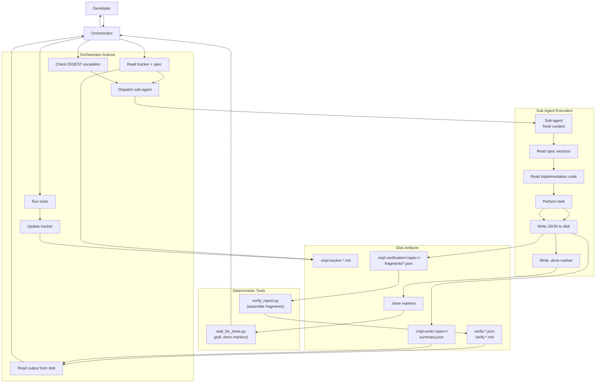
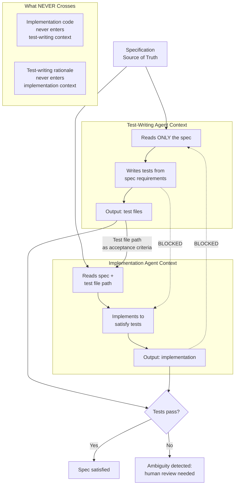
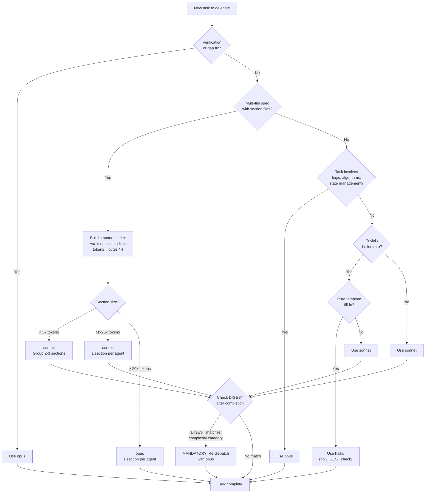

# §5 Sub-Agent Orchestration

> Part of [Master Spec](../spec.md)

---

Sub-agent orchestration is the execution engine of the `/implement` skill. The orchestrator — the main Claude Code conversation — never implements directly. It reads trackers, dispatches focused tasks to fresh sub-agents, interprets their structured output, and updates state. This division is not an implementation convenience; it is the primary mechanism by which specification drift is made structurally impossible.

This section specifies the orchestrator-agent architecture, the context isolation model that makes it work, the model selection strategy, the DIGEST-based escalation protocol, the output-to-disk pattern, parallel dispatch coordination, prompt templates, and the boundaries between orchestrator and sub-agent responsibilities.

---

## §5.1 Orchestrator-Agent Architecture

The skill operates as a hub-and-spoke system. The orchestrator occupies the hub: it holds the planning state, reads tracker files, makes delegation decisions, and communicates with the developer. Sub-agents occupy the spokes: each receives a focused task brief, performs a single unit of work, writes structured output to disk, and terminates.

### §5.1.1 Orchestrator Responsibilities

The orchestrator MUST:

- Read the implementation tracker before each delegation decision
- Re-read the relevant spec sections to prepare sub-agent task briefs
- Select the appropriate model tier for each task (see §5.3)
- Dispatch sub-agents with focused prompts containing only the information needed for that task
- Read sub-agent output from disk (never from conversational response)
- Check DIGEST fields against the complexity escalation table (see §5.4)
- Run tests after each sub-agent completes
- Update the tracker after validating sub-agent output
- Present status summaries and decisions to the developer

The orchestrator MUST NOT:

- Implement code directly
- Write tests directly
- Perform verification judgments in the main conversation
- Read full spec documents into the main context when delegating (pass section references or file paths instead)

### §5.1.2 Sub-Agent Responsibilities

Each sub-agent MUST:

- Read the spec sections and code files specified in its task brief
- Perform the assigned task (implement, test, verify, or fix)
- Write structured JSON output to its designated disk path
- Write a `.done` marker as the final file operation
- Respond with a minimal conversational acknowledgment (e.g., "Done.")

Each sub-agent MUST NOT:

- Read or modify the implementation tracker
- Make decisions about task ordering or priority
- Communicate with other sub-agents
- Return substantive findings in conversational output (all findings go to disk)

### §5.1.3 Data Flow

The following diagram shows the complete data flow between the orchestrator, sub-agents, deterministic tools, and disk artifacts.



---

## §5.2 Context Isolation

Context isolation is the key insight that makes the entire architecture work. It is not a side-effect of using sub-agents — it is the reason for using them. Every other architectural decision — the output-to-disk pattern, the prompt templates, the model selection strategy — exists to support and exploit context isolation.

### §5.2.1 The Core Mechanism

When the orchestrator spawns a sub-agent, that agent starts with a fresh context window. It has no memory of previous implementation turns, no accumulated assumptions, no residual biases from earlier tasks. It reads the specification text and the implementation code as if encountering them for the first time.

This is structurally incapable of drift. The sub-agent cannot have drifted from the specification because it has never seen the specification before this moment. It interprets the spec independently, and any divergence between its interpretation and the existing code surfaces as a concrete finding — a test failure, a verification gap, a compliance issue.

### §5.2.2 Context Isolation in TDD Mode

TDD mode exploits context isolation most aggressively. The test-writing agent and the implementation agent operate in completely separate context windows, each independently interpreting the specification. Their disagreements surface as test failures — which are, in fact, specification ambiguities that require human resolution.



The critical boundaries are:

- The test-writing agent MUST see ONLY the specification. It MUST NOT see any implementation code. This ensures tests verify what the spec requires, not what the code does.
- The implementation agent MUST receive the test file path as acceptance criteria. It sees the spec for context, but the tests define the concrete pass/fail signals.
- When tests fail, the failure is treated as a potential specification ambiguity first, not as an implementation bug first. The developer SHOULD review whether the test or the implementation more faithfully represents the spec's intent.

### §5.2.3 Context Isolation in Verification

Each verification sub-agent receives a single requirement and the relevant code paths. It MUST NOT receive the implementing agent's reasoning, assumptions, or summary. The verification agent reads the spec and the code independently, producing a judgment that is structurally independent of the implementer's perspective.

This independence is what makes verification meaningful. A verification agent that inherits the implementer's context would be biased toward confirming the implementation — it would check whether the code matches the implementer's understanding, not whether the code matches the specification.

### §5.2.4 Context Isolation in Fix Agents

When fixing verification gaps, the fix agent receives:

- The spec requirement (exact quote)
- The current code (file paths and relevant lines)
- The gap description (from the verification report)

It MUST NOT receive the original implementer's context or the original implementer's summary. The fix agent forms its own understanding of the requirement and the gap, avoiding the risk of inheriting the same misunderstanding that caused the gap.

---

## §5.3 Model Selection Strategy

Model selection is per-task, not per-session. Different tasks have different complexity profiles, and the skill MUST match the model tier to the task's reasoning requirements. This is a cost-effectiveness measure: using opus for boilerplate wastes resources; using haiku for verification misses subtle gaps.

### §5.3.1 Task-Based Model Selection

| Task Type | Model | Rationale |
|-----------|-------|-----------|
| Boilerplate, simple field additions, config changes | `sonnet` (default); `haiku` only for pure template fill-in (e.g., tracker initialization) | Mechanical tasks requiring minimal reasoning. Use haiku only when the task is a pure template fill-in with no context understanding required. When in doubt, default to sonnet. |
| Standard implementation, moderate complexity | `sonnet` | Good balance of capability and cost for most implementation work |
| Complex logic, algorithms, state management | `opus` | Requires deep reasoning about correctness |
| Verification (all) | `opus` | MUST always use opus — catches subtle gaps that smaller models miss |
| Gap fixing (all) | `opus` | MUST always use opus — requires understanding root cause |
| Spec compliance checks | `sonnet` (default), `opus` (complex tasks) | Most checks are straightforward; escalate for complex logic |
| TDD test writing | `sonnet` (default), `opus` (complex logic) | Most test writing is mechanical; escalate for algorithmic tests |
| TDD implementation | `sonnet` (default), `opus` (complex logic) | Same escalation pattern as test writing |

The general rule: if a task involves logic decisions, conditional behaviour, or algorithmic thinking, it SHOULD use `opus`. When in doubt, the orchestrator SHOULD prefer `opus` — the cost savings from using smaller models are not worth the risk of missing implementation details.

### §5.3.2 Size-Based Routing for Multi-File Specs

When a specification has breakout section files (as produced by `/spec`), the orchestrator MUST build a structural index before delegating work. The index determines model selection and task grouping.

**Step 1 — Build the index**: Run `wc -c` on each section file. Estimate tokens using: `estimated_tokens = file_size_bytes / 4`. This is an approximation — actual token counts vary by content. Files near the 5k/20k routing boundaries (within approximately 500 tokens) may be misrouted. This is accepted as low-impact: misrouting to a higher tier (more capable model) is safe but slightly more expensive, while misrouting to a lower tier triggers DIGEST escalation (§5.4) as a safety net.

**Step 2 — Route by section size**:

| Section Size | Model | Grouping Strategy |
|-------------|-------|-------------------|
| < 5k tokens | `sonnet` | Group 2-3 sections per agent |
| 5k-20k tokens | `sonnet` | 1 section per agent |
| > 20k tokens | `opus` | 1 section per agent |

**Step 3 — Handle sub-split sections**: When a section has been split into sub-files (e.g., `02a-`, `02b-`, `02c-`), each sub-file MUST route independently by its own size. Tasks referencing the parent section (e.g., §2) MUST include all sub-file paths in the sub-agent prompt.

### §5.3.3 Model Selection Decision Tree



---

## §5.4 DIGEST-Based Escalation

DIGEST-based escalation is the mechanism by which sonnet-class agents signal that their work may require opus-level review. This is not a suggestion system — it is a mandatory escalation protocol. When a DIGEST matches a complexity category, opus re-dispatch MUST occur.

### §5.4.1 How DIGEST Works

Every sonnet and opus sub-agent writes a `digest` field in its `summary.json` output. The digest contains three sub-fields:

```json
{
  "digest": {
    "entities": "key classes, models, services touched",
    "patterns": "design patterns used or encountered",
    "complexity": "any algorithmic, state machine, auth, or business rule complexity"
  }
}
```

After reading `summary.json` from disk, the orchestrator MUST check the `digest.complexity` sub-field — and only that sub-field — against the complexity category table (§5.4.2). The `entities` and `patterns` sub-fields are informational context for the orchestrator but are NOT inputs to the escalation matching logic.

### §5.4.2 Complexity Categories (Canonical Source)

> **This table is the single authoritative source for complexity categories and signal keywords.** Any reference to complexity categories elsewhere in this specification (including §6.5 and §7.2) is a convenience cross-reference and MUST defer to this table in cases of conflict.

| Category | DIGEST Signals | Why Opus Review is Required |
|----------|---------------|---------------------------|
| Algorithms | "algorithm", "calculation", "formula", "heuristic" | Subtle correctness issues in edge cases |
| State machines | "state machine", "state transition", "lifecycle" | Complex interaction patterns between states |
| Permission / auth | "permission", "role inheritance", "RBAC", "access control" | Security boundary correctness |
| Complex business rules | "conditional", "override", "exception", "cascading" | Edge case coverage |
| Cross-cutting concerns | "affects all", "global constraint", "system-wide" | Holistic view required |

**Matching mechanism**: The orchestrator performs simple substring matching of each signal keyword against the `digest.complexity` text. There is no stemming, fuzzy matching, or semantic analysis — only literal substring containment.

**Known limitation — negation false positives**: Because matching is substring-based without negation handling, phrases such as "No algorithmic complexity" will trigger the "algorithm" signal. This is accepted as a design trade-off: false-positive escalation (an unnecessary opus review) is low-cost, while false-negative escalation (missing genuine complexity) is high-cost. The system intentionally errs on the side of over-escalation.

### §5.4.3 Consolidated Escalation Procedure

The following numbered procedure is the authoritative description of the DIGEST escalation flow. The subsections that follow (§5.4.4, §5.4.5) provide supporting rationale and anti-patterns.

1. After a sonnet agent completes, read `summary.json` from disk. **Scope note**: DIGEST checking applies only to sonnet agents. Haiku agents do not produce a `digest` field and are never subject to escalation. Opus agents are never subject to escalation (see step 6).
2. Extract the `digest.complexity` field (a string). If the `digest` field is absent or malformed (not a JSON object, or `complexity` sub-field is not a string): log a warning and skip escalation (fail-open — do not block progress)
3. Check for substring matches of each signal keyword in the complexity category table (§5.4.2) against the `digest.complexity` text
4. If any signal keyword matches: MUST dispatch an opus review agent using the opus escalation template (§5.7.1). This is mandatory — see §5.4.4 for anti-patterns that must not be used to bypass escalation
5. If no signal keyword matches: proceed to the next task
6. If the agent was pre-dispatched as opus: skip the DIGEST check entirely (opus does not need self-review). This applies to opus agents dispatched via pre-dispatch routing (§5.3) as well as opus escalation review agents themselves.

### §5.4.4 Escalation is MANDATORY

When a DIGEST matches any complexity category, the orchestrator MUST dispatch an opus agent to review the sonnet's code changes. This is a hard gate (see §2.2, Principle 2). The escalation is not discretionary, not conditional on the orchestrator's assessment of severity, and not optional when time or context is short.

The opus agent receives the sonnet's work as a starting point and goes deeper on the flagged complexity area. It does not start from scratch — it reviews and improves what the sonnet produced.

### §5.4.5 Anti-Patterns: Invalid Reasons to Skip Escalation

The following rationalisations are NOT valid reasons to skip DIGEST escalation. The orchestrator MUST NOT use any of these to bypass the mandatory opus re-dispatch:

| Rationalisation | Why It Is Invalid |
|-----------------|-------------------|
| "The sonnet agent's work looks correct" | The orchestrator is not performing verification — it delegates that. Looking correct is not the same as being correct, especially for the complexity categories listed above. |
| "The DIGEST match is borderline" | There is no borderline. If the signal word appears in the digest, escalation is triggered. Ambiguity is resolved in favour of escalation, not in favour of skipping. |
| "We're running low on context / time" | Context pressure is exactly the condition under which the orchestrator is most likely to make poor judgment calls. Escalation exists to compensate for this. |
| "The task was simple despite the DIGEST signal" | The agent that performed the task flagged complexity. Overriding that assessment from the orchestrator's more distant vantage point is not valid. |
| "We can catch it during verification" | Verification is a separate phase with a separate purpose. DIGEST escalation catches implementation-time issues that may be harder to diagnose at verification time. |
| "The tests pass" | Passing tests demonstrate that the implementation satisfies the test suite, not that it satisfies the specification. The complexity categories above specifically concern areas where the gap between "tests pass" and "spec satisfied" is widest. |

The purpose of documenting these anti-patterns explicitly is that LLMs under context pressure tend toward exactly these rationalisations. By naming them in advance, the skill makes it harder for the orchestrator to convince itself that skipping is acceptable.

### §5.4.6 Escalation Workflow (Detailed)

> **Note**: The consolidated escalation procedure (§5.4.3) is the authoritative reference for the matching and dispatch logic. This subsection describes the full end-to-end workflow including the opus agent's responsibilities.

1. Sub-agent (sonnet) completes task and writes `summary.json` with `digest` field
2. Orchestrator reads `summary.json` from disk
3. Orchestrator checks `digest.complexity` against the category table (§5.4.2, canonical) using substring matching (see §5.4.3 steps 2-5)
4. If any signal matches: MUST dispatch opus agent with the sonnet's changed files and the flagged complexity area, using the opus escalation template (§5.7.1)
5. Opus agent reviews and, if needed, improves the sonnet's work
6. Opus agent writes its own `summary.json` (overwriting the sonnet's) and MUST write a `.done` marker, same as all other sub-agents. When writing `summary.json`, the opus agent SHOULD preserve the sonnet's `files_changed` list as a baseline and extend it with any additional file changes made during review. If the opus agent makes no additional file changes, it MUST still include the sonnet's `files_changed` list verbatim so that downstream tools retain the full file-change manifest.
7. Orchestrator reads the updated summary and proceeds with tests

**Pre-dispatch vs post-dispatch escalation**: Pre-dispatch complexity assessment is the primary routing mechanism — the orchestrator uses judgment plus section size (§5.3.2) to select the initial model tier. Post-dispatch DIGEST escalation is the safety net — it catches complexity that was not apparent before the agent began working. Both mechanisms may fire for the same task; this is intentional (belt and suspenders). If a task was pre-dispatched to opus, the DIGEST check is skipped because opus does not need self-review.

---

## §5.5 Output-to-Disk Pattern

All sub-agents write structured output to disk rather than returning findings in conversational responses. This is a hard requirement — the orchestrator MUST read sub-agent results from disk files, never from `TaskOutput`.

### §5.5.1 Rationale

Conversational output from sub-agents has three problems:

1. **It consumes orchestrator context.** Reading a sub-agent's conversational response loads that content into the main conversation's context window — exactly the resource the skill is designed to protect.
2. **It is unstructured.** Conversational responses are prose that the orchestrator must parse, introducing opportunities for misinterpretation.
3. **It is ephemeral.** Once the conversation moves on, the sub-agent's response is subject to compaction. Disk artifacts persist indefinitely.

Writing to disk solves all three: the orchestrator reads a compact JSON file (structured, parseable, persistent) instead of a verbose conversational response.

### §5.5.2 Output Paths by Agent Type

| Agent Type | Output Path | Format |
|-----------|------------|--------|
| Implementation agent | `.impl-work/<spec-name>/summary.json` | Task summary with files changed, concerns, digest |
| Compliance check agent | `.impl-work/<spec-name>/compliance.json` | Verdict with issues list |
| TDD test-writing agent | `.impl-work/<spec-name>/tdd-tests-summary.json` | Test file paths written, spec requirements covered, digest |
| TDD implementation agent | `.impl-work/<spec-name>/tdd-impl-summary.json` | Files changed, test results summary, digest |
| Verification agent | `.impl-verification/<spec-name>/fragments/<id>.json` | Per-requirement finding |
| Fix agent | `.impl-work/<spec-name>/fix-summary-<gap-id>.json` | Fix description with files changed (one file per gap, keyed by gap ID to avoid overwrite when fix agents run concurrently) |

Each output file is accompanied by a `.done` marker at a predictable path:

| Agent Type | Marker Path |
|-----------|------------|
| Implementation / compliance agent | `.impl-work/<spec-name>/summary.done` or `compliance.done` |
| TDD test-writing agent | `.impl-work/<spec-name>/tdd-tests-summary.done` |
| TDD implementation agent | `.impl-work/<spec-name>/tdd-impl-summary.done` |
| Verification agent | `.impl-verification/<spec-name>/fragments/<id>.done` |
| Fix agent | `.impl-work/<spec-name>/fix-summary-<gap-id>.done` |

### §5.5.3 The .done Marker Protocol

The `.done` marker MUST be the last file a sub-agent writes. Its presence signals that the JSON output file is complete and safe to read. The marker contains only the word "done" — its content is irrelevant; its existence is the signal.

The protocol:

1. Sub-agent performs its task
2. Sub-agent writes the structured JSON output file
3. Sub-agent writes the `.done` marker as its final file operation
4. Orchestrator (or `wait_for_done.py`) detects the marker
5. Orchestrator reads the JSON output file

Without this protocol, the orchestrator could read a partially-written JSON file, producing parse errors or incomplete data.

### §5.5.4 Stale Marker Management

Before dispatching any sub-agent, the orchestrator MUST clear stale `.done` markers from the relevant output path. This prevents the orchestrator from reading output from a previous dispatch cycle.

```bash
# Before implementation dispatch
mkdir -p <impl-dir>/.impl-work/<spec-name>/ && rm -f <impl-dir>/.impl-work/<spec-name>/summary.done

# Before verification dispatch (clear all fragment markers)
mkdir -p <impl-dir>/.impl-verification/<spec-name>/fragments/ && rm -f <impl-dir>/.impl-verification/<spec-name>/fragments/*.done
```

Failure to clear stale markers can cause the orchestrator to read output from a previous agent, producing incorrect state updates. This is a silent failure — no error is raised; the data is simply wrong.

---

## §5.6 Parallel Dispatch and Coordination

The skill uses parallel dispatch in two contexts: verification (many agents, one per requirement) and implementation (limited parallelism to manage context load). Coordination relies on deterministic polling, not on conversational interaction with sub-agents.

### §5.6.1 Verification Dispatch (Fully Parallel)

During Phase 3, the orchestrator dispatches one verification sub-agent per requirement, all running in background. A medium-sized specification with 30-60 requirements produces 30-60 parallel agents. This is intended and correct — the per-requirement granularity is a hard rule (see §5.7.1).

All verification agents MUST be dispatched with `run_in_background: true`. The orchestrator MUST NOT call `TaskOutput` on any verification agent. Calling `TaskOutput` blocks the orchestrator and loads the agent's conversational response into the main context — violating both the parallelism model and the output-to-disk pattern.

### §5.6.2 Implementation Dispatch (Limited Parallelism)

During Phase 2, the orchestrator MUST limit concurrent heavy-context sub-agents to a maximum of 2 at a time. Implementation agents consume more resources than verification agents (they modify files, run tools, produce larger outputs), and exceeding this limit can degrade overall throughput and produce file-write conflicts. This is a hard limit, not a guideline.

The orchestrator MAY dispatch lightweight agents (haiku-class, boilerplate tasks) alongside a heavy-context agent without counting them against the limit.

### §5.6.3 Coordination via wait_for_done.py

The `wait_for_done.py` script provides deterministic polling for `.done` markers. It replaces the need to call `TaskOutput` on individual agents.

```bash
"$PYTHON" "$TOOLS_DIR/wait_for_done.py" \
  --dir <impl-dir>/.impl-verification/<spec-name>/fragments/ \
  --count <number of requirements dispatched>
```

The script polls the specified directory until the expected number of `.done` files appear. It returns when all agents have completed or after a timeout. This is a deterministic coordination mechanism — no LLM inference is involved in the waiting, counting, or completion detection.

**Timeout contract**: The default timeout is 600 seconds. Exit code 0 indicates all expected `.done` markers were found (success). Exit code 1 indicates timeout — stderr will list the missing markers. There is no dead-agent detection beyond the timeout; the orchestrator cannot distinguish between a slow agent and a crashed agent. This is a known limitation — the timeout serves as the only liveness boundary.

### §5.6.4 Coordination Rules

The orchestrator MUST follow these coordination rules:

1. Clear stale `.done` markers before each dispatch batch
2. Dispatch all agents in the batch with `run_in_background: true`
3. Use `wait_for_done.py` to wait for completion — never `TaskOutput`
4. After `wait_for_done.py` returns, read output JSON files from disk
5. For verification: pass fragments to `verify_report.py` for deterministic assembly
6. Never assume an agent has completed based on elapsed time — always check `.done` markers

---

## §5.7 Prompt Templates

The skill provides prompt templates in the `prompts/` directory. Each template specifies the task, the expected input (spec sections, code paths), the output format (JSON schema), and the `.done` marker path. The orchestrator MUST use these templates when dispatching sub-agents — ad-hoc prompts are not permitted for standard operations.

### §5.7.1 Template Catalogue

| Template | File | Purpose | Model |
|----------|------|---------|-------|
| Single-file implementation | `prompts/implement-single-file.md` | Implement requirements from a single-file spec | Per task complexity |
| Multi-file implementation | `prompts/implement-multi-file.md` | Implement requirements from a multi-file spec with section files | Per size routing (§5.3.2) |
| Write tests | `prompts/write-tests.md` | Write tests after implementation (standard workflow) | `sonnet` default |
| TDD write tests | `prompts/tdd-write-tests.md` | Write tests before implementation (TDD workflow) | `sonnet` default |
| TDD implement | `prompts/tdd-implement.md` | Implement code to make failing TDD tests pass | `sonnet` default |
| Verify requirement | `prompts/verify-requirement.md` | Verify one requirement against the codebase | `opus` always |
| Re-verify requirement | `prompts/reverify-requirement.md` | Re-check a previously flagged V-item | `opus` always |
| Fix issue | `prompts/fix-issue.md` | Fix a problem found during implementation | `opus` always |
| Fix verification gap | `prompts/fix-verification-gap.md` | Fix a gap identified during verification | `opus` always |
| Spec compliance check | `prompts/spec-compliance-check.md` | Post-task lightweight compliance audit | `sonnet` default |
| Opus escalation review | `prompts/opus-escalation-review.md` | Review sonnet agent's work when DIGEST signals complexity | `opus` always |

**Required template — opus escalation review**: The opus escalation review template (`prompts/opus-escalation-review.md`) MUST exist. It is dispatched when a sonnet agent's DIGEST triggers complexity escalation (§5.4.3 step 4). The template MUST include the following inputs:

- The DIGEST category (from §5.4.2) that triggered escalation
- The sonnet agent's output: code changes and summary from `summary.json`
- The spec section(s) being reviewed (file paths or quoted text)
- Instructions to focus the review on the flagged complexity area
- Output format: `summary.json` with the same schema as other implementation agents, including a `digest` field, written to the same disk path (overwriting the sonnet's output)
- Completion marker: a `.done` marker, following the same protocol as all other sub-agents (§5.5.3)

> **Note**: This template does not yet exist in the implementation. It is a known action item that MUST be created before the opus escalation pathway is functional.

### §5.7.2 Template Structure

Every prompt template follows a consistent structure:

1. **Task description**: What the agent is being asked to do
2. **Input sections**: Spec text (quoted or via file path), implementation hints, context
3. **Instructions**: Specific guidance on how to perform the task
4. **Self-review section** (implementation templates): Pre-completion quality check
5. **Output specification**: Exact JSON schema and disk path for structured output
6. **Completion marker**: The `.done` marker path and instruction that it MUST be the last file written
7. **Conversational response**: Instruction to respond with a minimal acknowledgment (e.g., "Done.")

### §5.7.3 Template Usage Rules

- The orchestrator MUST fill in all template placeholders (spec sections, file paths, section references) before dispatch
- The orchestrator MUST NOT modify the JSON output schema — sub-agents produce output in the documented format, and downstream tools depend on that format
- For multi-file specs, the orchestrator SHOULD pass the section file path rather than quoting the full spec text in the prompt — this avoids duplicating large spec sections in the orchestrator's context
- Each template specifies its `.done` marker path — the orchestrator MUST clear stale markers at that path before dispatch (see §5.5.4)

---

## §5.8 Delegation Boundaries

The division between what the orchestrator keeps and what it delegates is not arbitrary. It follows directly from the skill's design principles: the orchestrator manages state and makes decisions; sub-agents perform focused work with fresh context.

### §5.8.1 What MUST Be Delegated

| Activity | Why It Must Be Delegated |
|----------|-------------------------|
| Implementation (writing code) | Fresh context ensures spec fidelity; prevents orchestrator context bloat |
| Test writing | Especially in TDD mode — isolation from implementation is the mechanism, not a side-effect |
| Requirement verification | Independent judgment requires independent context |
| Gap fixing | Fresh context avoids inheriting the original implementer's misunderstanding |
| Spec compliance checking | Independent review from a context that has not been influenced by the implementation process |

### §5.8.2 What MUST Stay in the Orchestrator

| Activity | Why It Must Stay in Main |
|----------|------------------------|
| Planning (Phase 1) | Requires developer interaction and global project understanding |
| Tracker reading and updating | Tracker is the orchestrator's state — sub-agents MUST NOT modify it |
| Task sequencing and prioritisation | Requires awareness of the full requirements matrix and dependencies |
| Model selection decisions | Requires the structural index and task complexity assessment |
| DIGEST escalation decisions | The orchestrator checks the digest; the sub-agent only produces it |
| Developer communication | Status updates, ambiguity resolution, decision requests |
| Test execution and result interpretation | The orchestrator runs tests and decides how to proceed based on results. Test runner output is captured to a file (e.g., `test-output.txt`) using shell redirection; the orchestrator reads only the exit code and the final summary lines, not the full output, to avoid loading verbose test output into the main context. |
| Verification report interpretation | The orchestrator reads the assembled report and plans remediation |

### §5.8.3 The Boundary Principle

The boundary can be stated simply: **the orchestrator reasons about what to do; sub-agents do it.** If a task requires judgment about which work to perform next, it belongs in the orchestrator. If a task requires reading specification text and producing code or findings, it belongs in a sub-agent.

This boundary is enforced by the output-to-disk pattern (§5.5). Because sub-agents write to disk and the orchestrator reads from disk, the communication channel between them is structured, auditable, and immune to the conversational drift that occurs when the orchestrator tries to both coordinate and implement in the same context window.
