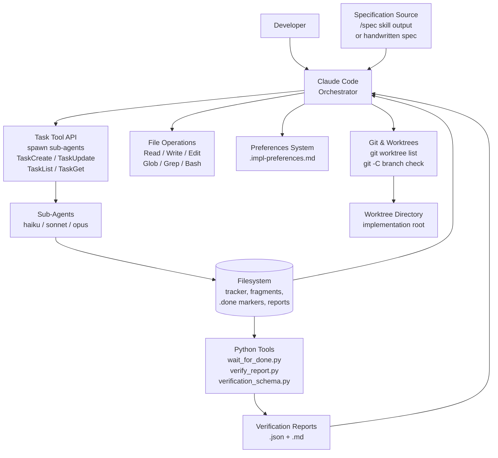
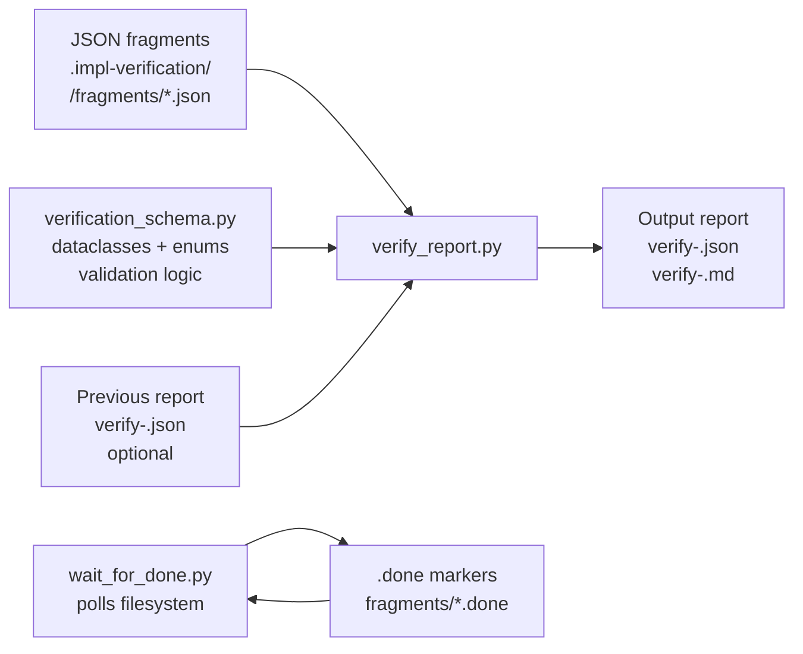
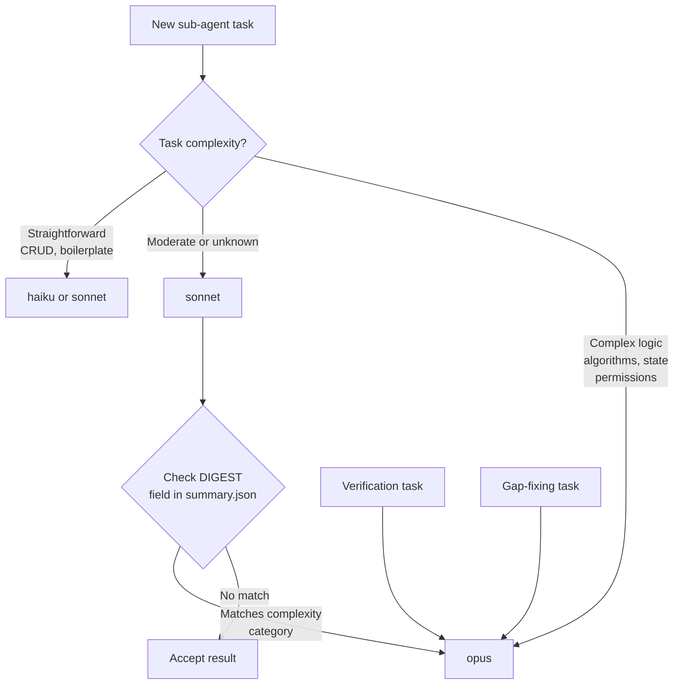
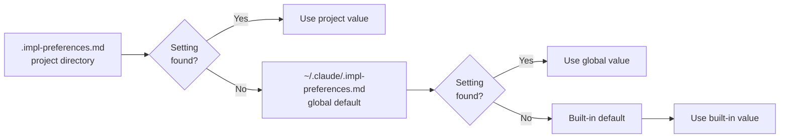

# §6 Integrations & Dependencies

> Part of [Master Spec](../spec.md)

---

## §6.0 Integration Architecture Overview

The `/implement` skill is not a standalone system. It coordinates a small set of tightly coupled integrations, each playing a distinct role in the implementation pipeline. The architecture separates LLM inference from deterministic assembly: Claude tools handle reasoning and delegation; Python tools handle aggregation and polling; the filesystem is the shared state bus.



The key data flows are:
- Sub-agents write structured JSON fragments to disk. They do not return results conversationally.
- The orchestrator never reads sub-agent conversational output. It reads files.
- Python tools perform all aggregation deterministically — no LLM inference in the assembly pipeline.
- The filesystem is the only channel between the orchestrator, sub-agents, and Python tools.

---

## §6.1 Claude Code Platform

### What It Provides

The Claude Code platform is the execution environment for the skill. All skill behaviour runs within Claude Code's tool API surface.

| Tool | Purpose in Skill |
|------|-----------------|
| `Task` | Spawn sub-agents with specific models, instructions, and `run_in_background` flag |
| `TaskCreate` | Create persistent task records that survive context compaction |
| `TaskUpdate` | Update task status as implementation progresses |
| `TaskList` | List all active tasks — used during recovery and status checks |
| `TaskGet` | Read a specific task's details |
| `Read` | Read spec sections, tracker files, summary JSON, verification fragments |
| `Write` | Write tracker files, preference files, completion markers |
| `Edit` | Update tracker fields in place |
| `Glob` | Discover tracker files, verification fragments, spec sections |
| `Grep` | Search implementation files for references and patterns |
| `Bash` | Run tests, linters, git commands, Python tools, `wc -c` for size routing |

### Required or Optional

MUST. The entire skill is a Claude Code skill and cannot function outside this platform.

### What Happens If Unavailable

The skill does not exist. There is no fallback environment.

### Version Pinning

There is no version pinning. The skill uses whatever tool API Claude Code provides at runtime. If a tool interface changes, the skill's behaviour may be affected — but no version constraint is declared.

### Sub-Agent Spawning

Sub-agents are spawned via the `Task` tool. Two flags are used:
- `model`: selects the Claude tier (see §6.5)
- `run_in_background`: set to `true` for verification agents to enable parallel dispatch

The orchestrator MUST NOT call `TaskOutput` on any sub-agent (verification, implementation, or otherwise). It waits for `.done` marker files on disk and reads structured JSON output files instead. This is intentional and applies to all agent types: calling `TaskOutput` consumes orchestrator context window, whereas reading a marker file and a compact JSON file costs far less. See §5.5 for the full output-to-disk pattern.

---

## §6.2 Git & Worktrees

### What It Provides

Git worktree support allows multiple concurrent implementations to proceed in isolation. Each implementation operates in its own working directory on its own branch, with its own tracker file. This enables a developer to implement two features from the same codebase simultaneously without branch conflicts.

### Integration Points

| Operation | Command | Phase |
|-----------|---------|-------|
| Detect worktree intent | Read spec/brief for path/branch mentions | Phase 1 |
| Validate worktree exists | `git worktree list` from project root (or from within a worktree) | Phase 1 |
| Confirm active branch | `git -C <worktree-path> branch --show-current` | Phase 1 |
| Re-validate on resume | Same as above | Phase 5 |
| Worktree-aware verification | Resolve all paths relative to worktree | Phase 3 |

The worktree path is stored in the tracker's `**Worktree**` field. All subsequent operations — tracker creation, file edits, test runs, verification artifacts — resolve relative to the worktree path, not the main conversation's working directory.

### Worktree Discovery in Phase 1

Worktree detection is intentionally flexible. The orchestrator reads the specification or brief document and extracts the implementation directory intent from natural language — it does not require a specific section name or field format. A spec might say "implement in `/path/to/worktree`" or "work on the `feature/billing` branch" and both would be detected.

Tracker files are named `.impl-tracker-<spec-basename>.md` and created in the implementation directory (the worktree, if one was detected). The `**Worktree**` field enables tracker discovery across multiple directories: when listing trackers, the skill checks both the current directory and any worktree paths recorded in existing trackers.

**Worktree path discovery**: To discover all known worktree paths, the orchestrator runs:

```bash
git worktree list --porcelain
```

from the project root. This produces a machine-readable list of all registered worktrees (main and linked). The orchestrator then scans each listed worktree directory for `.impl-tracker-*.md` files. This covers cases where an in-progress implementation exists in a worktree that is not the current working directory.

### Required or Optional

SHOULD. Git worktree support is optional — if no worktree is specified, the skill works in the current directory. However, for projects with concurrent feature work, worktrees are strongly recommended and the skill is designed to exploit them.

### What Happens If Git Is Unavailable

If `git worktree list` fails, the skill warns the user and falls back to using the current directory. Worktree validation is a pre-condition for worktree-aware operation, not for operation in general.

### What Happens If Worktree Validation Fails on Resume

If Phase 5 (`/implement continue`) detects that the worktree path recorded in the tracker no longer exists or is on the wrong branch, the orchestrator warns the user and asks whether to:
- Abort and resolve the worktree state
- Proceed using the current directory instead

---

## §6.3 Python Tooling

### What It Provides

Three Python scripts at `tools/` in the skill repository perform deterministic tasks that are better handled by code than by LLM inference.



### verify_report.py

**Purpose**: Assembles individual verification JSON fragments produced by sub-agents into a single structured report with statistics, MoSCoW breakdown, priority gaps, and markdown rendering.

**Invocation**:
```bash
"$IMPL_PYTHON" "$IMPL_TOOLS_DIR/verify_report.py" \
  --fragments-dir <impl-dir>/.impl-verification/<spec-name>/fragments/ \
  --spec-path <spec-path> \
  --impl-path <impl-dir> \
  --project-name "<spec-name>" \
  --output <impl-dir>/.impl-verification/<spec-name>/verify-<date>.json \
  [--previous <impl-dir>/.impl-verification/<spec-name>/verify-<prev-date>.json] \
  [--spec-version "1.0"] \
  [--verbose]
```

**Outputs** (always both):
- `verify-<date>.json` — machine-readable report, used as `--previous` in re-verification
- `verify-<date>.md` — human-readable report rendered by `render_markdown()`

**Re-verification mode**: When `--previous` is supplied, the tool maps V-item IDs from the previous report to new findings by `section_ref`, carries forward IDs for matched items, assigns fresh sequential IDs to new items, and computes a `ResolutionSummary` with fixed/partially_fixed/not_fixed/regressed counts.

**Error handling**: `verify_report.py` exits with code `0` on success and non-zero on failure. Common failure modes include: missing or empty fragments directory, invalid JSON in a fragment file, and missing output directory. On failure, the tool writes a partial or no report. The orchestrator MUST check the exit code after invocation and surface any non-zero exit to the user with the stderr output, rather than silently proceeding with a missing or incomplete report.

**Determinism guarantee**: Given the same set of fragments and the same previous report, the output is bit-identical. No LLM inference occurs in this tool.

**Output directory responsibility**: The orchestrator is responsible for creating both the fragments directory (`.impl-verification/<spec-name>/fragments/`) and the report output directory before invoking verification sub-agents or `verify_report.py` (e.g., via `mkdir -p`). Neither the sub-agents nor the Python tools create directories — they will fail if the target paths do not exist.

### wait_for_done.py

**Purpose**: Blocks until a specified number of `.done` marker files appear in a directory, or until specific named files appear. Replaces manual sleep/poll loops that would consume orchestrator context window.

**Invocation** (two modes):
```bash
# Wait for N .done files in a directory
"$IMPL_PYTHON" "$IMPL_TOOLS_DIR/wait_for_done.py" --dir <fragments-dir> --count <N> [--timeout 600] [--interval 2]

# Wait for specific named files
"$IMPL_PYTHON" "$IMPL_TOOLS_DIR/wait_for_done.py" --files path/a.done path/b.done [--timeout 600]
```

**Exit codes**: `0` if all markers found; `1` if timeout reached.

**Default timeout**: 600 seconds (10 minutes). For large verification runs (40+ agents), this may need adjustment.

**Timeout sizing guidance**: For a spec with N verification agents, a reasonable timeout is:

```
timeout = max(600, N * 30)   # 30 seconds per agent, minimum 600s
```

Pass a custom value with the `--timeout` flag:
```bash
"$IMPL_PYTHON" "$IMPL_TOOLS_DIR/wait_for_done.py" --dir <fragments-dir> --count <N> --timeout <seconds>
```

This is guidance, not an enforced constraint — the orchestrator may use any reasonable timeout based on observed agent latency or known task complexity.

**Why a Python script and not a Bash loop**: A bash poll loop would produce repeated tool call outputs that accumulate in the orchestrator's context window. The Python script blocks once, produces one line of output, and exits. This is a context efficiency design choice.

### verification_schema.py

**Purpose**: Defines the dataclasses, enums, validation logic, and rendering functions used by `verify_report.py`. Not invoked directly.

**Key types**:

| Type | Role |
|------|------|
| `Finding` | One verified requirement — the unit of verification |
| `Status` | `implemented`, `partial`, `not_implemented`, `na` |
| `MoSCoW` | `MUST`, `SHOULD`, `COULD`, `WONT` |
| `TestCoverage` | `full`, `partial`, `none` |
| `Resolution` | `fixed`, `partially_fixed`, `not_fixed`, `regressed` (re-verification only) |
| `VerificationReport` | The assembled report with metadata, findings, statistics, priority gaps |
| `PriorityGap` | A gap finding with computed priority: `high`, `medium`, `low` |
| `ResolutionSummary` | Delta between two verification runs |

**Fragment validation**: Each JSON fragment produced by a verification sub-agent is validated against required fields and enum values before loading. Hard errors raise `SchemaError` and abort assembly. Consistency warnings (e.g., status is `implemented` but `missing_implementation` is non-empty) are logged but do not abort.

**V-item ID assignment**: Initial verification assigns `V1`, `V2`, ... in `fragment_id` sort order (deterministic). Re-verification carries forward existing V-item IDs by matching `section_ref`. New items not in the previous report receive the next available sequential ID. V-item IDs are permanent — once assigned, they are never reused or changed across runs.

### Tool Discovery at Runtime

The orchestrator resolves the tools directory during Common Initialization (see §3.0), before entering any phase. Three variables are defined once and reused throughout all phases:

```bash
IMPL_REPO_DIR="$(cd "$(dirname "$(realpath ~/.claude/skills/implement/SKILL.md)")/../.." && pwd)"
IMPL_TOOLS_DIR="$IMPL_REPO_DIR/tools"
IMPL_PYTHON="$IMPL_REPO_DIR/.venv/bin/python"
```

**Key design decisions:**

- **Prefixed variable names** (`IMPL_` prefix): Prevents namespace collisions when multiple skills are loaded in the same session (e.g., `/spec` uses `SPEC_REPO_DIR`).
- **Venv Python** (`$IMPL_PYTHON`): Uses the skill repo's virtual environment Python rather than the system `python3`. This ensures a consistent Python version across environments. The tools currently use only the standard library; the venv provides a path for future pip dependencies if needed without changing invocation patterns.
- **Resolved once, used everywhere**: Previous versions resolved tool paths ad-hoc in individual phases (e.g., verification). Centralising resolution in Common Initialization eliminates inconsistent variable names and ensures all phases use the same paths.

**Platform note**: `realpath` is available on both macOS (BSD) and Linux without additional dependencies. The `cd ... && pwd` wrapper normalises the path, eliminating literal `/../..` segments from the resulting variable. The `dirname` traverses two parent directories because SKILL.md is installed at `<repo>/skills/implement/SKILL.md` — two levels below the repo root.

**Venv existence check**: After resolving `$IMPL_PYTHON`, the skill MUST verify the path exists (`test -x "$IMPL_PYTHON"`). If it does not exist, the skill MUST warn the user: "The implement skill's Python venv is missing. Run `python3 -m venv .venv` in the skill repository root." See FR-0.3.

The tools directory is resolved relative to the installed SKILL.md location, making it robust to different installation paths.

### Required or Optional

MUST for Phase 3 (Verification). The Python tools are hard dependencies for verification. There is no fallback — manual assembly of verification fragments by the LLM is explicitly prohibited because it would be non-deterministic and context-expensive.

SHOULD have Python 3 available in the execution environment. No version constraint is declared beyond Python 3. The tools currently use only the standard library (the venv ensures version consistency and provides a path for future dependencies).

### What Happens If Python Is Unavailable

Verification cannot proceed. The orchestrator should detect the failure from `bash` exit code and inform the user that Python 3 is required for verification.

---

## §6.4 Specification Sources

### What It Provides

The `/implement` skill consumes specification documents. It does not produce them. The primary intended source is the `/spec` skill, but any well-structured markdown document works.

### Integration with /spec Output

The `/spec` skill produces a master `spec.md` with a table of contents and a `sections/` directory containing one file per section. This structure triggers the multi-file parsing path in Phase 1:

1. The orchestrator reads only the master spec's table of contents — not all section files.
2. It runs `wc -c` on all section files to build a structural index with estimated token counts.
3. Sub-agents receive individual section files in their task prompts and read them independently.

This design prevents the orchestrator from loading a large specification into its own context window. Sub-agents read sections; the orchestrator indexes them.

The `/spec` skill also uses `<!-- EXPANDED: -->` markers in the master spec to indicate that a section has a breakout file. Phase 1 detects these markers as an alternative signal for multi-file specs.

**EXPANDED marker syntax**: The full form is:

```html
<!-- EXPANDED: sections/02-architecture.md -->
```

The path is relative to the spec directory. The marker replaces the section content inline in the master spec — the actual content lives in the referenced file. Readers (and Phase 1) should follow the path to retrieve the full section text.

### Section References

Specifications produced by `/spec` use `§N.M` section references (e.g., `§2.4`, `§9.1`). These references are:
- Used as keys in the tracker's Requirements Matrix
- Included in task subjects and descriptions
- Used by verification sub-agents to identify which requirement they are checking
- Used by `verification_schema.py` to match V-items across re-verification runs (via `section_ref` field)

Section references are described as **stable anchors** — they survive context compaction because they are short strings written to persistent files, not kept only in the LLM's context.

### Graceful Degradation Without /spec

The skill does not require `/spec`-style output. Any markdown specification document works, including:
- Hand-written documents with numbered headings
- Business process documents
- Requirements documents with `##` section structure

Without `§N.M` references, the skill extracts whatever section identifiers the document provides (numbered headings, section numbers, topic names). Verification still functions but V-item-to-section matching in re-verification is less precise.

### Section Identifier Extraction for Non-/spec Documents

When a document lacks `/spec`-style `§N.M` markers, the orchestrator uses the following heuristic extraction approach:

1. **Scan for heading patterns** in order of preference:
   - `## Section N` or `### Section N.M` (explicit "Section" keyword)
   - `§N.M` or `§N` anywhere in a heading
   - Numbered headings: `## 1.`, `## 2.3`, `### 4.2.1`
   - Bare headings: `## Introduction`, `## Architecture`

2. **Extract with hierarchy**: Identifiers carry their heading level context. A `###` under a `##` is treated as a child section.

3. **Fallback for unstructured documents**: If no numeric or `§`-prefixed identifiers are found, headings are assigned sequential labels: `H1`, `H2`, `H3`, ... in document order.

This extraction is heuristic. Hand-written specs with no consistent structure produce coarser-grained verification items — a single `H1`-level identifier may cover a large portion of the document, reducing the precision of per-requirement tracking.

### STRUCT Awareness

If a `.spec-tracker-*.md` file exists in the spec's directory (indicating the spec was produced by `/spec`), Phase 1 checks for a `## Pending Structural Changes` section. If pending structural issues are present, the user is warned before planning proceeds. This is a SHOULD-level integration — the skill can proceed without it.

### Required or Optional

MUST have some specification document as input. The `/spec` skill output is SHOULD — it provides the best experience (section references, structural index, multi-file parsing) but is not a hard dependency.

### What Happens If the Spec Is Missing or Unreadable

Phase 1 cannot proceed. The orchestrator will report the read failure and ask the user to provide a valid path.

---

## §6.5 Model Tier Requirements

### What It Provides

The skill uses three Claude model tiers with different capability/cost profiles. Model selection is per-task, not per-session.

| Tier | Tier Name | Used For |
|------|-----------|----------|
| Fast/cheap | `haiku` | Simple, boilerplate, or purely additive tasks (e.g., adding imports, creating stub files, boilerplate config) |
| Mid-tier | `sonnet` | Moderate implementation tasks; default for multi-file spec routing; any task with non-trivial logic |
| Capable | `opus` | Complex logic, algorithms, state management, all verification, all gap fixing |

**Haiku vs sonnet decision**: When in doubt, prefer `sonnet`. The `haiku` tier is reserved for tasks where the orchestrator has high confidence that no reasoning or judgment is required — pure boilerplate generation, file copying, or trivial additions. If a task involves any conditional logic, interpretation of requirements, or multi-step reasoning, use `sonnet` as the minimum tier.

**Note on tier names**: `haiku`, `sonnet`, and `opus` are abstract tier names used by the skill — they are not literal API model ID strings. The Claude Code `model` parameter in `Task()` calls maps these names to the current model versions at runtime. The skill does not pin specific model version strings and does not need to be updated when new model versions are released.

### Selection Rules



**DIGEST escalation** (for sonnet agents implementing multi-file specs): After a sonnet sub-agent completes, the orchestrator reads `summary.json` from `.impl-work/<spec-name>/summary.json` and extracts the `digest.complexity` sub-field (see §5.4.1 for the canonical `digest` schema, which is a structured JSON object with `entities`, `patterns`, and `complexity` sub-fields). If `digest.complexity` matches any of the complexity categories below, an opus review agent is dispatched. This escalation is MANDATORY — it is not discretionary.

**DIGEST error handling**: If the `digest` field is absent, malformed, or missing the `complexity` sub-field in `summary.json`, the orchestrator SHOULD log a warning and skip escalation for that agent (fail-open). A missing or unreadable digest does not block the workflow — the implementation result is accepted as-is without an opus review pass.

> **Convenience copy** of the canonical complexity category table in §5.4.2. See §5.4.2 for the authoritative source. In case of conflict, §5.4.2 takes precedence.

| Category | DIGEST signals |
|----------|---------------|
| Algorithms | "algorithm", "calculation", "formula", "heuristic" |
| State machines | "state machine", "state transition", "lifecycle" |
| Permission/auth | "permission", "role inheritance", "RBAC", "access control" |
| Complex business rules | "conditional", "override", "exception", "cascading" |
| Cross-cutting | "affects all", "global constraint", "system-wide" |

**Size-based routing** (multi-file specs only):

| Section estimated tokens | Model | Grouping |
|--------------------------|-------|---------|
| < 5k tokens | `sonnet` | Group small sections (see below) |
| 5k–20k tokens | `sonnet` | 1 section per agent |
| > 20k tokens | `opus` | 1 section per agent |

Estimated tokens are computed as `file_size_bytes / 4` using output from `wc -c`.

**Small section grouping algorithm**: Contiguous sections estimated at < 5k tokens each are grouped greedily — sections are accumulated in document order until adding the next section would push the group's total estimated token count over 5k, at which point a new group starts. A maximum of 3 sections per group is enforced regardless of token count. Each group is dispatched to a single sonnet agent.

### Required or Optional

MUST. All three model tiers (haiku, sonnet, opus) MUST be available. There is no fallback if a tier is unavailable — the skill will fail when it attempts to spawn an agent with that model.

This is a hard dependency by design: the cost-conscious tiering strategy only works if cheaper tiers are available for appropriate tasks, and verification correctness depends on opus being available for verification and gap-fixing.

### What Happens If a Tier Is Unavailable

If a requested model tier is unavailable, the `Task` tool call will fail. The orchestrator should surface the failure to the user. There is no automatic fallback to another tier — the user must resolve the availability issue.

---

## §6.6 Preferences System

### What It Provides

The preferences system allows users to configure skill behaviour across sessions and across projects without modifying skill files. It is a simple markdown-file-based configuration layer.

### File Locations and Lookup Order



Lookup order: project file → global file → built-in default. Project settings override global settings.

### File Format

```markdown
# Implementation Preferences

## Workflow
- **tdd-mode**: on
```

### Available Preferences

| Preference | Values | Built-in Default | Description |
|------------|--------|-----------------|-------------|
| `tdd-mode` | `on`, `off`, `ask` | `on` | Controls TDD workflow activation |

**`tdd-mode` behaviour**:
- `on` — Always use TDD (tests written by a dedicated sub-agent from the spec before implementation code is written)
- `off` — Always use standard mode (implementation first, tests after)
- `ask` — Prompt the user during Phase 1 planning to choose per-implementation

### /implement config Command

The `/implement config` command provides a read/write interface to the preferences system from within a Claude Code session. It does not require the user to manually edit markdown files.

| Command | Effect |
|---------|--------|
| `/implement config` | Read and display the current effective preferences from all three sources |
| `/implement config tdd on\|off\|ask` | Write the setting to `.impl-preferences.md` in the project directory |
| `/implement config --global tdd on\|off\|ask` | Write the setting to `~/.claude/.impl-preferences.md` |

When writing a preference:
1. Read the existing preferences file (create it if it does not exist)
2. Update the specified value in place
3. Write the file back
4. Confirm the change to the user

### Required or Optional

COULD. The preferences system is entirely optional. If no preference files exist, the skill operates using built-in defaults (`tdd-mode: on`). Deleting preference files restores default behaviour.

The preferences system MUST NOT block operation if files are missing, malformed, or unreadable. Any read failure falls through to the next level in the lookup chain. A malformed preferences file is treated as if it does not exist — the skill logs a warning and continues with the next level.

### What Happens If Preference Files Are Missing

The skill uses built-in defaults. This is the normal state for first-time users.

### What Happens If the Global Preferences File Is Inaccessible

The skill falls back to built-in defaults for any settings not found in the project-level file. Home directory access is assumed but not enforced as a hard dependency.
