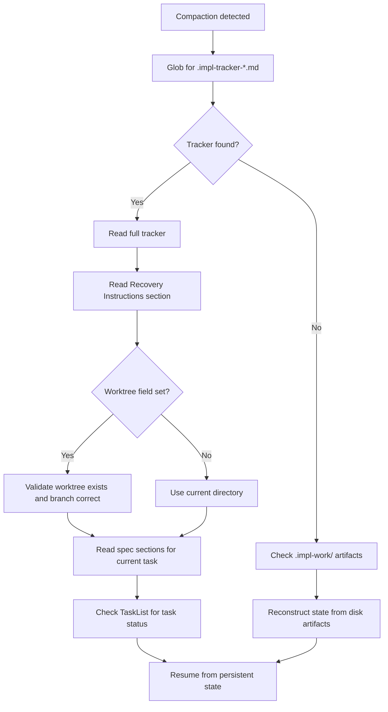

# §8 Edge Cases & Error Handling

> Part of [Master Spec](../spec.md)

---

This section documents the edge cases and error scenarios that the `/implement` skill encounters in practice. Every scenario described here has been observed during real usage — these are not theoretical failure modes. For each scenario, the section describes the conditions under which it occurs, how the skill detects it, and the recovery or mitigation path.

MoSCoW language is used throughout: MUST indicates mandatory behaviour, SHOULD indicates strong recommendation, COULD indicates optional enhancement, and WILL NOT indicates explicit exclusion.

---

## §8.1 Context Compaction Recovery

Context compaction is the most common failure mode in extended implementation sessions. When the context window fills and Claude compacts the conversation, the orchestrator loses detailed understanding of the current implementation state — specific section references, task progress, and phase awareness degrade or disappear entirely.

### §8.1.1 Detection

The orchestrator MUST self-monitor for the following signs of context compaction:

- A vague sense of "building something" without specific knowledge of which requirements or spec sections are being implemented
- Loss of phase awareness — uncertainty about whether the session is in Phase 2 (Implementation) or Phase 3 (Verification)
- An urge to implement directly without reading the tracker or spec sections first
- Inability to recall which sub-agents have been dispatched or what their status is
- Referring to requirements in vague prose rather than compact section references (e.g., "the authentication requirement" instead of "§4.2")

**Distinguishing compaction from drift**: Compaction and drift share some surface symptoms but require different responses. Compaction presents as *global* context loss — the orchestrator cannot recall any spec details, is uncertain which project it is working on, or has lost phase awareness entirely. Drift presents as *selective* context loss — the orchestrator still remembers the project and its overall state but refers to requirements in vague prose rather than section references, or begins implementing features that are not in the spec. When the loss is global, the recovery path is §8.1.2 (read tracker and spec to recover full context). When the loss is selective, the recovery path is §8.8.3 (re-read the specific spec section for the current task).

### §8.1.2 Recovery Flow

Upon detecting compaction, the orchestrator MUST follow this recovery sequence:

The recovery sequence in detail:

1. **Find the tracker**: The orchestrator MUST run `Glob(".impl-tracker-*.md")` in the current directory and any known worktree paths. The tracker is the primary recovery artifact.
2. **Read the tracker**: The tracker's Recovery Instructions section MUST contain sufficient information to resume without any external context. This includes the spec path, current phase, worktree location, and the requirements matrix.
3. **Validate the worktree**: If the tracker's `**Worktree**` field is set, the orchestrator MUST verify the worktree path exists and is on the expected branch before proceeding.
4. **Re-read spec sections**: The orchestrator MUST read the spec sections relevant to the current task. Section references in the tracker survive compaction where prose descriptions do not — this is by design (§2.2, Principle 8).
5. **Check TaskList**: Task objects persist across compaction events. The orchestrator SHOULD check the task list to determine which tasks are complete, in progress, or pending.
6. **Resume**: With tracker state, spec sections, and task status re-loaded, the orchestrator MUST resume work from the point captured in persistent state, not from memory.

### §8.1.3 Design Rationale

The three-layer context preservation architecture (§2.3) exists specifically to make compaction recovery possible. The tracker provides phase and requirement state. Sub-agent output files on disk provide implementation artifacts. Section references provide compact, compaction-resistant pointers to full spec content. Any single layer failing still allows recovery through the remaining two.

---

## §8.2 Context Exhaustion

Context exhaustion occurs when the context window is so full that `/compact` itself cannot succeed — the conversation is unrecoverable in its current session.

### §8.2.1 Detection

The orchestrator SHOULD monitor for these warning signs before exhaustion occurs:

- Responses becoming noticeably shorter or less detailed
- Tool calls failing due to output length constraints
- Sub-agent dispatches producing truncated task briefs
- More than two heavy sub-agents running in parallel (a known risk factor; see §8.2.2 for the definition of "heavy")

### §8.2.2 Prevention

The skill SHOULD employ these preventive measures:

- **Parallel agent limit**: The orchestrator SHOULD NOT dispatch more than two heavy sub-agents simultaneously. A **heavy** sub-agent is one using the sonnet or opus model tier. Haiku-tier agents are **lightweight** and do not count against this concurrent agent cap (NFR-CTX-03). Each heavy dispatch consumes significant context for the task brief and the completion notification.
- **Load-on-demand discipline**: Reference files and spec sections MUST be loaded only when needed for the current phase, never preemptively (§2.5).
- **Structured output to disk**: Sub-agents MUST write their results as structured JSON to disk files, not as conversational responses. This prevents sub-agent output from inflating the orchestrator's context.
- **Context budget awareness**: Before dispatching a large batch of verification agents, the orchestrator SHOULD assess whether sufficient context remains for the assembly and reporting steps that follow.

### §8.2.3 Recovery

When exhaustion does occur, the session is unrecoverable — but the implementation state is not lost:

1. All sub-agent output is safe on disk in `.impl-work/` and `.impl-verification/` directories, because sub-agents write to files rather than returning conversational output.
2. The tracker file on disk reflects the last successful state update.
3. Task objects persist independently of the conversation.

Recovery MUST proceed by starting a fresh session with `/implement continue <name>`. The Phase 5 workflow (§3.5) handles this case: it reads the tracker, validates the worktree, checks spec freshness, and resumes from persistent state.

The developer SHOULD NOT attempt to recover within the exhausted session. The correct action is to start a new conversation.

---

## §8.3 Sub-Agent Failure Modes

Sub-agents can fail in several ways. The skill does not implement an explicit retry mechanism — empirically, Claude tends to self-correct on subsequent attempts. However, the orchestrator MUST detect failures and respond appropriately.

### §8.3.1 Sub-Agent Produces No Output

**Scenario**: A sub-agent is dispatched but never writes its output file or `.done` marker to disk.

**Detection**: The `wait_for_done.py` tool polls for `.done` markers with a configurable timeout. The default timeout is `max(600, N × 30)` seconds, where N is the number of agents being waited on (per §6.3). If a marker does not appear within the timeout window, the tool reports a timeout.

**Recovery**: The orchestrator MUST treat a timeout as a failed dispatch. The orchestrator SHOULD re-dispatch the same task to a fresh sub-agent. If the second dispatch also times out, the orchestrator MUST report the failure to the developer and mark the task as `blocked` in the tracker. A `blocked` task remains in the tracker until the developer explicitly requests re-dispatch or marks it as `n/a` — there is no automatic unblock path.

### §8.3.2 Sub-Agent Writes Partial Output

**Scenario**: A sub-agent writes an output file but the content is incomplete — truncated JSON, missing required fields, or incomplete analysis.

**Detection**: The orchestrator reads the sub-agent's output file after the `.done` marker appears. For verification fragments, `verify_report.py` validates JSON structure via `verification_schema.py`. Malformed fragments produce validation errors during report assembly.

**Recovery**: The orchestrator SHOULD re-dispatch the task. If partial output contains useful information (e.g., a correct verdict with a missing justification), the orchestrator COULD use the partial result and dispatch a supplementary agent to fill the gap. The orchestrator MUST NOT silently accept malformed output.

### §8.3.3 Malformed JSON Fragments

**Scenario**: During verification, a sub-agent writes a JSON fragment that fails schema validation.

**Detection**: `verify_report.py` validates each fragment against the expected schema. Invalid fragments produce hard errors during assembly.

**Recovery**: Hard validation errors MUST abort report assembly. The orchestrator MUST re-dispatch the verification for the affected requirement(s). The orchestrator MUST NOT attempt to manually fix malformed JSON — the correct response is to re-dispatch with a fresh sub-agent that has a clean context.

### §8.3.4 Sub-Agent Implements Incorrectly

**Scenario**: A sub-agent completes its task and writes output, but the implementation is incorrect — tests fail, code does not compile, or the implementation does not match the spec.

**Detection**: The post-task checklist (§3.2) mandates running tests after every sub-agent completion. Test failures are the primary detection mechanism. Additionally, the DIGEST escalation pattern flags complex tasks completed by sonnet-class agents for mandatory opus review.

**Recovery**: The orchestrator MUST NOT mark the task as complete if tests fail. The orchestrator SHOULD dispatch a fix sub-agent (always using opus for verification fixes) with the test failure output, the spec quote, and the current code state. The orchestrator MUST NOT silently modify tests to match a wrong implementation.

---

## §8.4 Specification Evolution

Specifications can change between implementation sessions — requirements added, removed, or modified after implementation has already begun.

### §8.4.1 Detection

Phase 5 (Continue) MUST perform a spec freshness check when resuming work. The detection mechanisms differ by spec type:

**Multi-file specs**: The orchestrator MUST compare current file sizes (`wc -c`) against the structural index stored in the tracker. The following changes are flagged:

| Change Type | Detection Rule |
|-------------|---------------|
| New section files | Files present on disk but absent from the structural index |
| Removed section files | Files listed in the structural index but absent from disk |
| Modified sections | Byte count changed by more than 20% from the stored value |
| Sub-split patterns | A previously single file now has letter-suffix variants (e.g., `02a-`, `02b-`, `02c-`) |

**Single-file specs**: The orchestrator MUST compare the file's modification timestamp (mtime) against the tracker's `**Spec Baseline**` date. A newer mtime triggers the freshness warning. Note that mtime reflects the last write to the file, not necessarily a content change — a `touch` command or file copy will trigger a false positive. The orchestrator SHOULD inform the developer of this limitation when the freshness warning fires.

**STRUCT check**: The orchestrator SHOULD check for `.spec-tracker-*.md` files containing a `## Pending Structural Changes` section, which indicates the specification is mid-restructure.

### §8.4.2 Resolution Options

When specification changes are detected, the orchestrator MUST present the developer with three options:

1. **Re-scan affected sections**: Re-read only the changed files, extract new/modified/removed requirements, update the requirements matrix, create tasks for new requirements, and mark removed requirements as `n/a` with a note such as "requirement removed in spec update — [date]". Orphaned tasks — tasks in the tracker whose corresponding requirements no longer appear in the spec — MUST also be marked `n/a` with the same note. This is appropriate when changes are localised.

2. **Proceed as-is**: Acknowledge the changes without re-scanning. The orchestrator MUST log the detected changes in the Implementation Log with specific details (file names, size deltas). This is appropriate when the developer knows the changes do not affect in-progress work.

3. **Full re-plan**: Archive the current tracker with a date suffix, then re-run Phase 1 from scratch. Completed work, known gaps, and log history MUST be carried forward from the archived tracker using the following field-by-field rules. This is appropriate when changes are extensive or structural.

   | Tracker Field | Carry-Forward Rule |
   |---|---|
   | Requirements Matrix | Requirements with `complete` status retain their status and their Implementation/Tests references. Requirements that match changed spec sections reset to `pending`. New requirements discovered during re-scan are added as `pending`. Requirements whose spec sections were removed are marked `n/a` with note "removed in spec update." |
   | Implementation Log | All previous entries are preserved in full, preceded by a separator line noting the re-plan date and reason. Log entries are NOT summarised — the full history is kept. |
   | Known Gaps | Carried forward as-is. Gaps that are no longer relevant because the relevant spec section changed are marked "resolved by spec update" with the date. |
   | Structural Index | Rebuilt from scratch using current `wc -c` values from the updated spec. Previous values are discarded. |
   | Deviations | Carried forward as-is. The developer SHOULD review each deviation for continued relevance given the spec changes. |

The orchestrator MUST NOT silently proceed when specification changes are detected. The developer MUST be informed and MUST choose a resolution path.

---

## §8.5 Worktree Edge Cases

Git worktree support enables concurrent, isolated implementations. Several edge cases arise around worktree lifecycle.

### §8.5.1 Worktree Deleted Between Sessions

**Scenario**: The tracker references a worktree path that no longer exists on disk.

**Detection**: Phase 5 validation MUST verify that the worktree path exists and appears in `git worktree list` output.

**Recovery**: The orchestrator MUST warn the developer that the worktree has been removed. The orchestrator MUST present three options:
- Re-create the worktree at the same path and branch
- Switch to working in the current directory instead
- Abort and let the developer resolve manually

The orchestrator MUST NOT silently fall back to the current directory — the developer needs to know that the isolation boundary has changed.

### §8.5.2 Wrong Branch

**Scenario**: The worktree exists but is on a different branch than the tracker's `**Branch**` field specifies.

**Detection**: Phase 5 validation MUST check the current branch of the worktree against the expected branch stored in the tracker.

**Recovery**: The orchestrator MUST warn the developer about the branch mismatch. The developer decides whether to switch the worktree to the expected branch, update the tracker to reflect the current branch, or abort.

### §8.5.3 Git Not Available

**Scenario**: The tracker contains a worktree path but `git` is not available in the current environment (e.g., a container without git installed).

**Detection**: The orchestrator SHOULD check for git availability before attempting worktree validation.

**Recovery**: The orchestrator MUST fall back to the current directory with a warning explaining that worktree validation was skipped because git is unavailable. Work COULD proceed but the developer SHOULD be aware that branch isolation is not being enforced.

---

## §8.6 Concurrent Session Handling

Two simultaneous sessions attempting to work on the same implementation produce undefined behaviour. The skill does not implement file locking or coordination between sessions.

### §8.6.1 The Problem

If two sessions edit the same tracker file concurrently, one session's updates will overwrite the other's. There is no merge strategy — the last writer wins, and the other session's state becomes inconsistent with the tracker on disk.

Similarly, two sessions implementing different tasks from the same tracker could produce conflicting code changes (e.g., both modifying the same file).

### §8.6.2 Prevention via Worktrees

Git worktree support was added specifically to address concurrent work. Each worktree provides:

- An isolated file system working tree (no conflicting code edits)
- Its own tracker file (no shared tracker state)
- Its own `.impl-work/` and `.impl-verification/` directories

The orchestrator SHOULD recommend worktree isolation when the developer is working on multiple features from the same codebase. Each concurrent implementation SHOULD operate in its own worktree with its own tracker.

### §8.6.3 What the Skill Will Not Do

The skill WILL NOT implement:
- File locking on tracker files
- Session coordination or handoff protocols
- Conflict detection between concurrent sessions
- Automatic merge of concurrent tracker updates

These are outside the skill's scope. The worktree mechanism provides sufficient isolation for the expected use case (one developer, multiple features). Multi-developer coordination is a project management concern, not an implementation skill concern.

---

## §8.7 Stale Notifications

When resuming via `/implement continue`, delayed completion notifications from a previous session's sub-agents may arrive in the new session.

### §8.7.1 Scenario

A previous session dispatched sub-agents with `run_in_background: true`. The session ended (or the context was exhausted) before all agents completed. When a new session starts and the orchestrator begins dispatching new work, completion notifications from the old agents arrive unprompted.

### §8.7.2 Detection

The orchestrator MUST apply this rule: **if you did not dispatch the agent in the current conversation, the notification is stale.**

Stale notifications are identifiable because:
- The orchestrator has no record of dispatching the agent in its current conversation history
- The agent's task may have already been completed or superseded by the current session's work
- The output files on disk may already reflect the agent's work (it wrote to disk before the old session ended)

### §8.7.3 Handling

The orchestrator MUST silently ignore stale notifications. Specifically:

- The orchestrator MUST NOT read TaskOutput for agents it did not dispatch
- The orchestrator MUST NOT update the tracker based on stale notifications
- The orchestrator MUST NOT treat stale completions as progress on current-session work
- The orchestrator SHOULD continue with its current task without interruption

The sub-agent's actual output — the files it wrote to disk — is already available and was either picked up by the previous session or will be naturally discovered by the current session when it reaches that task.

---

## §8.8 Implementation Drift Detection

Implementation drift occurs when the orchestrator or a sub-agent diverges from the specification during implementation — building something different from what the spec requires, making assumptions instead of reading the spec, or skipping requirements.

### §8.8.1 Self-Evaluation Checklist

The orchestrator MUST periodically evaluate itself against the following checklist. Any checked item indicates active drift that requires immediate correction:

- [ ] Implementing something not mentioned in the specification
- [ ] Making assumptions about behaviour instead of reading the spec
- [ ] Using "I think" or "probably" instead of "the spec says" or "§N.M requires"
- [ ] Skipping a requirement because it seems hard or complex
- [ ] Combining multiple features or requirements into a single task when the plan separated them
- [ ] Modifying tests to match an incorrect implementation instead of fixing the implementation
- [ ] Proceeding without reading the relevant spec section before starting a task
- [ ] Marking a task as complete without running tests
- [ ] Referring to requirements in vague prose rather than by section reference
- [ ] Adding features or behaviours that the spec does not mention ("gold plating")

### §8.8.2 When to Self-Evaluate

The orchestrator MUST run the self-evaluation checklist:

- Before marking any task as complete
- After context compaction recovery (§8.1)
- When the developer questions whether the implementation matches the spec
- When the orchestrator catches itself using hedging language ("I think", "probably", "should be")

The orchestrator SHOULD also self-evaluate:

- At the start of each new task
- When switching between spec sections
- After a sub-agent returns with unexpected results

### §8.8.3 Correction

When drift is detected:

1. The orchestrator MUST stop current work immediately
2. The orchestrator MUST re-read the relevant spec section(s) — the actual text, not a memory of what it said
3. The orchestrator MUST assess whether work already completed is affected by the drift
4. If affected work exists, the orchestrator MUST either fix it or document the deviation in the tracker with the developer's consent
5. The orchestrator MUST NOT continue implementing until the drift is resolved

### §8.8.4 Sub-Agent Drift

Sub-agents are structurally resistant to drift because they start with fresh context windows containing only the relevant spec sections (§2.2, Principle 3). However, drift can still occur if:

- The task brief passed to the sub-agent is inaccurate or incomplete
- The sub-agent interprets an ambiguous spec requirement differently from the developer's intent
- The sub-agent makes assumptions about surrounding code that are incorrect

Detection relies on the post-task checklist: test execution, DIGEST escalation for sonnet agents, and optional spec compliance checks. The orchestrator MUST NOT assume sub-agent output is correct without running these checks.

---

## §8.9 Test Integrity Edge Cases

Tests serve as the primary mechanical check that implementation matches specification. Several edge cases threaten test integrity.

### §8.9.1 Tests Pass Unexpectedly (TDD Mode)

**Scenario**: In TDD mode, the test-writing agent produces tests that pass before any implementation work is done. This indicates either the feature already exists, or the tests are too loose to detect the absence of the feature.

**Detection**: TDD mode MUST run the newly written tests before implementation begins. If tests pass at this stage, the orchestrator MUST flag the situation.

**Recovery**: The orchestrator MUST NOT proceed with implementation without resolving this. Options:

1. **Feature already exists**: The orchestrator SHOULD verify that the existing implementation actually satisfies the spec requirement (not just that the tests pass). If it does, mark the requirement as `complete` with a note.
2. **Tests too loose**: The orchestrator MUST dispatch a new test-writing agent to produce more specific tests. The new tests MUST fail before implementation begins.
3. **Ambiguous**: Present the situation to the developer for resolution.

### §8.9.2 Tests Fail for Setup Reasons

**Scenario**: Tests fail not because the implementation is wrong, but because of import errors, missing fixtures, incorrect paths, missing dependencies, or environment configuration issues.

**Detection**: The nature of test failures reveals the cause. Import errors, `ModuleNotFoundError`, `FileNotFoundError`, and fixture-related exceptions indicate setup problems rather than spec violations.

**Recovery**: The orchestrator MUST fix the test setup without modifying test assertions or expected values. The distinction is critical:

- **Fix**: Import paths, fixture configuration, test data paths, dependency installation
- **Do not fix**: Assertion values, expected outputs, test logic, requirement coverage

If it is unclear whether a failure is a setup issue or a genuine spec violation, the orchestrator SHOULD treat it as a spec violation and fix the implementation, not the test.

### §8.9.3 Sub-Agent Modifies Tests to Match Wrong Implementation

**Scenario**: A sub-agent, when faced with test failures, modifies the tests to match its implementation rather than fixing the implementation to match the tests.

**Detection**: This is difficult to detect automatically. The post-task checklist, DIGEST escalation, and spec compliance checks provide partial coverage. Verification (Phase 3) provides the definitive check — verification sub-agents re-read the spec independently and will flag implementations that do not match.

**Mitigation**: The skill enforces a hard rule: sub-agents MUST NEVER modify test assertions to make a failing implementation pass. This rule MUST be included in sub-agent task briefs. Specifically:

- Implementation sub-agents MUST NOT edit test files
- TDD implementation sub-agents receive the test file path for reference but MUST NOT modify it
- Fix sub-agents MUST NOT alter test expectations unless explicitly instructed by the developer

If a sub-agent is found to have modified tests, the orchestrator MUST revert the test changes and re-dispatch the implementation task. Revert is performed via `git checkout -- <test-file-path>` on the affected test files to restore them to their pre-modification state. If the test files were newly written by the test-writing agent and have no prior git state to restore, the orchestrator MUST re-dispatch the test-writing agent with the original spec requirements to regenerate clean tests before re-dispatching the implementation task.

### §8.9.4 Test-Implementation Circular Dependency

**Scenario**: Tests require infrastructure (database, API, file system state) that only exists after implementation, but the TDD workflow requires tests to exist before implementation.

**Detection**: Test failures during the initial TDD "run tests to confirm they fail" step may reveal that tests cannot even execute without the implementation infrastructure.

**Recovery**: The orchestrator SHOULD structure tasks so that infrastructure setup is a separate, non-TDD task completed before TDD tasks that depend on it. When this is not possible, the test-writing agent SHOULD use appropriate mocking or fixtures to isolate the test from infrastructure dependencies. The orchestrator MUST NOT abandon TDD mode for the entire implementation because of infrastructure dependencies in a few tasks — the correct response is targeted task reordering.
