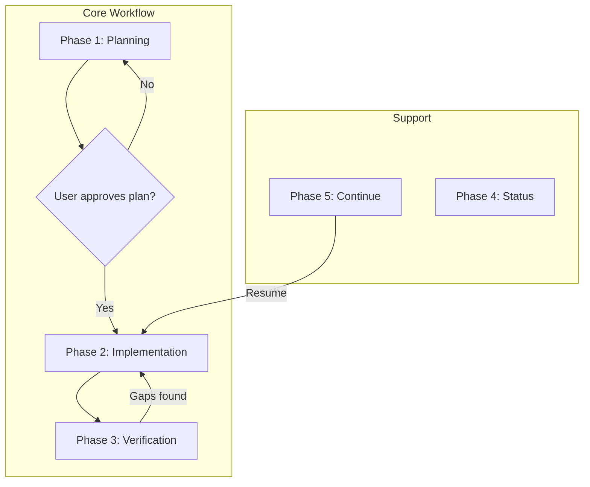
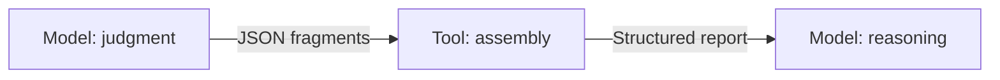
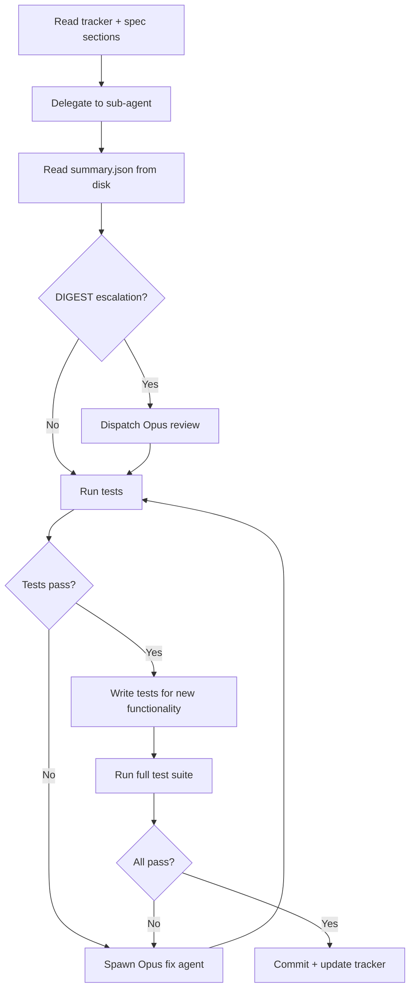
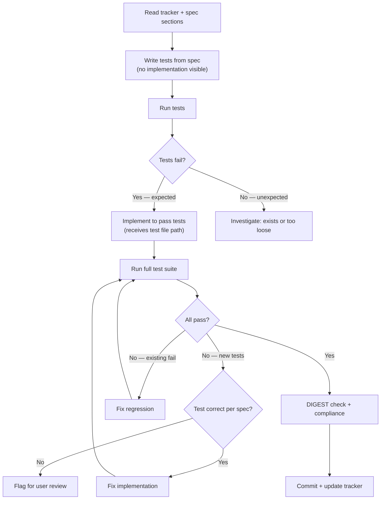

::: {.abstract}
The `/implement` skill is a Claude Code orchestration workflow that eliminates specification drift — the silent divergence between what a spec requires and what an LLM implements as context fills and compacts. It decomposes specifications into tracked requirements, delegates implementation to fresh sub-agents with isolated context windows, and verifies every requirement independently. All state persists on disk via structured tracker files, JSON fragments, and deterministic Python tooling, making the system resilient to context compaction, session restarts, and model switches.

The skill provides six commands governing a five-phase workflow (Planning, Implementation, Verification, Status, Continue) plus configuration. Its architecture embodies eight empirically derived design principles, each tracing to an observed failure mode: context isolation prevents drift, hard enforcement gates block progress until preconditions are met, and a model-tool-model pipeline separates LLM judgment from deterministic assembly.
:::

# §1 Overview

## The Problem: Specification Drift

Modern LLM-assisted development sessions follow a predictable failure pattern. A developer shares a specification and the model begins implementing with clear fidelity. As the conversation grows, context fills and compacts. Requirements discussed early in the session fade from the model's active attention. The LLM continues producing code — confidently, fluently — while silently diverging from the specification. Neither developer nor model is necessarily aware this is happening.

This failure mode is called **specification drift**.

Research quantifies the structural cause: LLMs exhibit a U-shaped attention curve, with retrieval-dependent task performance dropping 13–85% as input length increases and multi-turn conversations showing an average 39% performance drop compared to single-turn equivalents.

## The Solution: /implement

The `/implement` skill makes specification drift **structurally impossible** rather than relying on the LLM's in-context attention to maintain fidelity. Its core principle: make the connection between specification and implementation persistent, structural, and verifiable.

The skill provides six commands governing a five-phase workflow: Planning, Implementation, Verification, Status, and Continue — plus Config and List utilities.

## Key Actors

Four actors operate in every session. The **Developer** invokes the skill and reviews outputs. The **Orchestrator** (the main Claude Code conversation) manages workflow, reads tracker files, and delegates tasks — it does not implement directly. **Sub-agents** are fresh Claude instances with isolated context windows that write structured output to disk, not conversational responses. **Python tools** (`verify_report.py`, `wait_for_done.py`) handle deterministic assembly and polling.

\newpage

# §2 Architecture & Design Principles

## Five-Phase Workflow

Phases 1–3 are the core workflow; Phase 4 (Status) is read-only; Phase 5 (Continue) is the session-recovery entry point.

| Phase | Command | Purpose |
|-------|---------|---------|
| Planning | `/implement <spec-path>` | Parse spec, create tracker, break into tasks, determine TDD mode |
| Implementation | *(after user approval)* | Standard or TDD workflow via sub-agent delegation |
| Verification | `/implement verify` | Per-requirement verification with parallel sub-agents |
| Status | `/implement status` | Read-only progress inspection |
| Continue | `/implement continue` | Resume from previous session with worktree and spec freshness checks |

The verification loop repeats until all requirements are satisfied or explicitly documented as out of scope.

\newpage

## Eight Core Design Principles

1. **Context window as the fundamental constraint** — reference files load on demand; sub-agents receive only task-relevant spec sections; verification dispatches one requirement per agent.
2. **Hard enforcement gates** — tracker must exist before implementation; tests must pass before task completion and verification; Opus is mandatory for verification and gap fixes; DIGEST escalation is non-discretionary.
3. **Context isolation as a verification advantage** — fresh sub-agent windows cannot drift; TDD test-writers never see implementation; verification agents independently interpret requirements.
4. **Three layers of context preservation** — tracker files, sub-agent delegation to disk, and compact section references provide redundant recovery (detailed below).
5. **Model-tool-model pipeline** — LLMs produce structured data; deterministic tools assemble it; LLMs reason over the result (detailed below).
6. **Self-recovering artifacts** — the tracker embeds recovery instructions; after total context loss, reading the tracker alone provides the current state, spec location, and next action.
7. **Consent-based activation** — the skill detects activation opportunities but asks the user before engaging.
8. **Section references as stable anchors** — compact references (§2.4, §9.1) survive context compaction; only the pointer must persist, not the content.

\newpage

## Three-Layer Context Preservation

**Layer 1 — Tracker files**: Stored on disk, immune to context events. Contains metadata, recovery instructions, requirements matrix, and implementation log.

**Layer 2 — Sub-agent delegation**: Results are written as structured JSON to disk, converting ephemeral conversation context into persistent artifacts.

**Layer 3 — Section reference anchors**: Compact references (§2.4) survive compaction; full understanding is reconstructed by re-reading the spec section on demand.

The three layers provide defence in depth: any single layer failing still allows recovery through the others.

## The Model-Tool-Model Pipeline

The pipeline separates LLM strengths (interpret requirements, make qualitative judgments) from deterministic tool strengths (count, assemble, format without hallucination). Applied in verification (`verify_report.py` assembles sub-agent JSON), coordination (`wait_for_done.py` polls `.done` markers), and re-verification (`--previous` flag computes deltas).

## Skill File Structure

SKILL.md was restructured from ~1,400 lines to ~296 lines — a routing document that loads phase-specific reference files on demand. The instruction is explicit: **"Load only what you need for the current phase."**

\newpage

# §3 Functional Requirements

## Command Routing

The skill resolves its entry point from invocation arguments: a file path triggers Phase 1 (Plan); `status`, `verify`, `continue`, `list`, and `config` route to their respective phases. With no arguments, the skill checks for existing trackers and offers to continue or searches for specs. On implicit activation, the skill asks consent before proceeding.

\newpage

## Phase 1: Planning

Phase 1 turns a spec into a tracker, task list, and workflow mode. No implementation code is written.

Key steps: offer context clear (once only), detect and validate worktree path against `git worktree list`, detect spec type (single-file vs multi-file via `<!-- EXPANDED:` markers or `sections/` directory), create tracker (`.impl-tracker-<spec-basename>.md`), resolve TDD mode from preference lookup chain (project → global → built-in default `on`), create tasks, and present the plan for user approval. Implementation MUST NOT begin until the user approves.

For multi-file specs, only headings and requirement identifiers are read from each section file — not full prose — with a structural index stored in the tracker. Token estimates use `bytes / 4`.

\newpage

## Phase 2: Implementation

Phase 2 executes the approved plan. Before any code is written, the skill verifies that a tracker exists with a populated Requirements Matrix and that tasks have been created — if not, it stops and requires Phase 1.

Two workflows share common pre- and post-task steps but differ in when tests are written.

### Standard Workflow (TDD Off)

### TDD Workflow (TDD On)

**Key implementation rules (both workflows):**

- Sub-agents write `summary.json` + `.done` marker to `.impl-work/<spec-name>/`; the orchestrator reads from disk only.
- Model routing: haiku/sonnet for straightforward tasks; opus for complex tasks; size-based routing for multi-file specs. DIGEST escalation triggers mandatory Opus review (see §5).
- Fix agents always use opus; if fixes do not converge after 2–3 attempts, the skill escalates to the user.
- A task MUST NOT be marked `complete` if tests are failing, not run, missing for new functionality, or linting/type errors exist.
- Test integrity is non-negotiable in TDD mode: the spec is the arbiter. Tests are never silently modified to match a wrong implementation.

\newpage

## Phase 3: Verification

Verification audits every individual spec requirement using parallel Opus sub-agents and deterministic Python tooling.

**Pre-verification gate (hard):** Tests, linting/type checking, and compilation must all pass before verification begins.

**Requirement extraction:** Each section yields individual MUST/SHOULD/COULD statements — not just headings. A section with 15 subsections should produce 30–60+ individual requirements, each carrying a section reference and implementation hints.

**Dispatch:** One sub-agent per requirement (no batching), all running in background. The orchestrator detects completion via `.done` markers only — never `TaskOutput`. `wait_for_done.py` (600s default) is the sole timeout bound. Full spec sections and implementation files are read by sub-agents, not loaded into main context.

**Re-verification** is triggered when a previous report exists: either re-verify open items only (with spot-checks on passed items) or full re-verification reusing V-item IDs matched by `section_ref`. Resolution statuses: `fixed`, `partially_fixed`, `not_fixed`, `regressed`.

\newpage

## Phases 4–7: Status, Continue, Config, List

**Status** (read-only): presents progress (X of Y requirements complete), current task, blockers, and sections not yet started. No file modifications.

**Continue**: re-validates the worktree (path exists, correct branch), checks spec freshness (multi-file: `wc -c` vs stored index, >20% threshold; single-file: mtime vs baseline). If changes are detected, three options: re-scan affected sections, proceed as-is with changes logged, or full re-plan carrying forward completed work. Resumes Phase 2 from the next pending task.

**Config**: preferences stored in `.impl-preferences.md` (project, takes precedence) or `~/.claude/.impl-preferences.md` (global). Currently one preference: `tdd-mode` (`on`/`off`/`ask`, default `on`).

**List**: finds all `.impl-tracker-*.md` files across current directory and worktree paths; presents a summary table.

\newpage

# §4 Data Model & Artifacts

Six artifact types persist state: the implementation tracker, verification fragments, verification reports, work directory output, preferences files, and completion markers.

## The Implementation Tracker (§4.1)

The tracker (`.impl-tracker-<spec-stem>.md`) is the central persistent artifact and MUST be committed to git. It contains bold-label markdown fields with machine-readable HTML comment equivalents.

**Header fields**: Specification path, Status (`Planning`/`In Progress`/`Verification`/`Complete`), TDD Mode, Spec Type, Spec Baseline date, Worktree path, and Tracker Format version. HTML comment counters (`COMPLETE_COUNT`, `PARTIAL_COUNT`, `GAP_COUNT`) stay in sync with the Requirements Matrix.

**Key sections**: Recovery Instructions (tells a fresh session how to resume), Requirements Matrix (one row per requirement with section, priority, status, implementation location, and tests), Structural Index (multi-file only — byte size, token estimate, model routing per section), Known Gaps (`GAP-NNN` records), and Implementation Log (chronological session entries).

Status values: `pending`, `in_progress`, `partial`, `complete`, `blocked`, `n/a`. The `Tests` column must be populated before marking `complete`.

\newpage

## Verification Fragments & Reports (§4.2–4.3)

Each verification sub-agent writes one JSON fragment per requirement to `.impl-verification/<spec-name>/fragments/<fragment-id>.json` plus a `.done` marker. Fragment IDs use zero-padded section prefixes for lexicographic ordering.

Key fragment fields: `section_ref`, `moscow` (MUST/SHOULD/COULD/WONT), `status` (implemented/partial/not_implemented/na), `test_coverage`, `implementation.files`, `missing_tests`, `missing_implementation`, and for re-verification: `previous_status` and `resolution`. Validation enforces required fields; consistency warnings flag contradictions.

`verify_report.py` assembles fragments into a dated JSON + Markdown report pair. V-item IDs (`V1`, `V2`, ...) are assigned in sorted order and carried forward by `section_ref` matching. Priority gap classification: High = MUST + not_implemented or partial without tests; Medium = MUST + partial with some tests, or SHOULD + not_implemented; Low = SHOULD + partial, or COULD + any gap.

\newpage

## Work Directory & Completion Markers (§4.4, §4.6)

Sub-agents write structured JSON (`summary.json`, `compliance.json`, `fix-summary.json`) to `.impl-work/<spec-name>/` — transient, MUST be gitignored. Each file has a `.done` marker; the orchestrator polls via `wait_for_done.py`. Markers MUST be cleared before each dispatch batch.

The `digest` field in `summary.json` drives DIGEST-based escalation (see §5).

## Preferences Files (§4.5)

Two-level lookup: `.impl-preferences.md` (project, takes precedence) → `~/.claude/.impl-preferences.md` (global). Keys: `tdd_mode` (`on`/`off`/`ask`, default `on`), `default_model` (`haiku`/`sonnet`/`opus`, default `sonnet`), `worktree_prefix` (string). `default_model` sets a floor; algorithmic routing may still upgrade.

\newpage

## State Machines (§4.7)

State transitions are advisory, not programmatically enforced. The tracker follows: Planning → In Progress → Verification → Complete (with Verification → In Progress for gap-fix cycles). Individual requirements follow: `pending` → `in_progress` → `partial`/`complete`/`blocked`, with regression paths from `complete` back to `in_progress`.

**Cross-artifact status mapping**: Fragment `implemented` → tracker `complete`; `partial` → `partial`; `not_implemented` → `in_progress`/`pending`; `na` → `n/a`. V-item `fixed` → `complete`; `partially_fixed` → `partial`; `regressed` → `in_progress`.

## File Lifecycle & Git Policy (§4.8)

| Artifact | Git Policy |
|----------|-----------|
| `.impl-tracker-<spec>.md` | MUST commit |
| `.impl-preferences.md` (project) | SHOULD commit |
| Verification reports (`verify-DATE.*`) | Optional (audit value) |
| Verification fragments | SHOULD NOT commit (build artifacts) |
| `.impl-work/` | MUST NOT commit (transient) |

Recommended `.gitignore`: `.impl-work/` and `.impl-verification/`.

\newpage

# §5 Sub-Agent Orchestration

The orchestrator delegates all code writing, testing, verification, and gap-fixing to sub-agents — it never implements directly. Sub-agents write structured JSON to disk and a `.done` marker; they never read/modify the tracker or communicate with each other.

## Context Isolation

Each sub-agent starts with a fresh context window, making drift structurally impossible. In TDD mode, the test-writing agent sees only the spec; the implementation agent sees the spec plus the test file path. Disagreements surface as test failures requiring human review. In verification, each agent receives a single requirement with no exposure to the implementer's reasoning. Fix agents receive the gap description but never the original implementer's context.

## Model Selection

| Task | Model |
|------|-------|
| Verification (all) | `opus` — mandatory |
| Gap fixing (all) | `opus` — mandatory |
| Complex logic, algorithms, state management | `opus` |
| Standard implementation | `sonnet` |
| Pure template fill-in | `haiku` |

For multi-file specs, size-based routing applies: <5k tokens → sonnet (grouped 2–3 per agent); 5k–20k → sonnet (one per agent); >20k → opus. When in doubt, `opus` is preferred.

## DIGEST-Based Escalation

Every `sonnet` sub-agent writes a `digest.complexity` field. The orchestrator checks for literal substring matches against five categories: algorithms, state machines, permission/auth, complex business rules, and cross-cutting concerns. Any match triggers a **mandatory** `opus` review — no discretionary override is permitted. The known false-positive risk is accepted: over-escalation is cheap; missed complexity is not. `haiku` agents never produce a digest; `opus` agents skip the check.

\newpage

## Parallel Dispatch and Coordination

**Verification**: one agent per requirement, all `run_in_background: true` — a 30–60 requirement spec produces 30–60 parallel agents. **Implementation**: maximum 2 concurrent heavy-context agents. `wait_for_done.py` polls for `.done` markers (default 600s timeout) with no LLM inference.

## Delegation Boundaries

**Must be delegated** (fresh context is the mechanism): writing code, tests, verification judgments, gap fixes. **Must stay in the orchestrator**: planning, tracker management, model selection, DIGEST escalation, test execution, developer communication. Test runner output is captured to a file; the orchestrator reads only exit code and final summary lines.

\newpage

# §6 Integrations & Dependencies

The skill coordinates five integration points: Claude Code platform, Git worktrees, Python tooling, specification sources, and preferences. The filesystem is the sole shared state channel.

## Claude Code Platform (MUST)

The skill requires Claude Code and cannot function outside it. Key tools: `Task` (sub-agent spawning with model tier and `run_in_background`), `TaskCreate`/`TaskUpdate`/`TaskList`/`TaskGet` (persistent task records surviving compaction), and standard file/shell operations. The orchestrator MUST NOT call `TaskOutput` — it reads `.done` markers and JSON from disk.

## Git Worktrees (SHOULD)

Worktree support enables concurrent implementations on separate branches. The path is stored in the tracker; detection is flexible (natural language in the spec or branch names). Discovery uses `git worktree list --porcelain`. If `git` is unavailable, the skill falls back to the current directory with a warning.

## Python Tooling (MUST for Verification)

Three standard-library-only Python 3 scripts: **verify_report.py** (assembles fragments into bit-identical reports; `--previous` carries forward V-item IDs), **wait_for_done.py** (blocks until N `.done` markers appear; timeout `max(600, N*30)` seconds), and **verification_schema.py** (shared dataclasses/enums; `SchemaError` on hard validation failures).

::: {.gap}
**Dependency note:** The orchestrator must `mkdir -p` all directories before invoking agents or tools — neither creates directories.
:::

## Specification Sources (MUST)

The skill consumes any structured markdown spec. With `/spec` output, it reads only the master TOC and dispatches section files individually. `§N.M` references serve as stable anchors for tracking and re-verification matching; without them, heuristic heading extraction produces coarser granularity.

## Model Tiers and Preferences

Model selection is per-task (see §5 for routing table and DIGEST escalation). A missing or malformed digest field is fail-open. Preferences are described in §4.5.

\newpage

# §7 Non-Functional Requirements

These are structural constraints that shaped the architecture, not aspirational goals.

## Context Window Efficiency

`SKILL.md` is capped at ~296 lines (~12,000–16,000 tokens); phase reference files load on demand. Sub-agents write to disk, not conversational output. Concurrent heavy-context agents capped at two during implementation (verification agents exempt). Tracker free-text fields are bounded: log entries ≤200 words, spec summaries ≤500 words.

## Cost Management

Model tier is assigned per-task by complexity and section size (see §5 for routing table). DIGEST escalation is non-discretionary (see §5).

## Scalability

The skill targets specifications with thousands of requirements. No single operation loads the full spec — structural indexing (`wc -c`) lets the orchestrator reason about shape without ingesting substance. Verification scales linearly: one sub-agent per requirement, 20–40+ concurrent agents. Batching was empirically found to produce less thorough results.

## Reliability and Recovery

Context compaction is an expected event. The tracker's Recovery Instructions block tells a fresh orchestrator what phase it is in, what to read, and what not to do. `TaskList` persists independently of conversation context; if it does not survive compaction, the tracker alone suffices. On timeout, the orchestrator logs the failure and continues with available results — no automatic retry.

## Deterministic Processing

The verification pipeline is a strict three-step sequence: (1) sub-agents produce structured data on disk; (2) deterministic tools assemble it (no LLM inference); (3) the orchestrator reasons over the result. This makes the pipeline auditable — any discrepancy is traceable to a specific file.

## Security

Skill artifacts must not contain credentials. Sub-agent prompts are scoped to spec content and code structure, not live environment values.

\newpage

# §8 Edge Cases & Error Handling

## Context Compaction vs. Drift

**Compaction** is global context loss. Recovery: glob for the tracker, read Recovery Instructions, validate the worktree, re-read spec sections via compact references, and resume from persistent state.

**Drift** is selective divergence — hedging language, vague prose instead of section numbers, or unrequested features. Recovery: stop immediately, re-read the spec section, assess affected work, and fix deviations before continuing.

Three layers provide redundant recovery (see §2). **Context exhaustion** (where `/compact` cannot succeed) is unrecoverable within a session but not catastrophic — all work persists on disk. The developer starts a fresh session with `/implement continue`.

## Sub-Agent Failure Modes

Four failure modes: **No output** (timeout → re-dispatch once → mark `blocked`); **Partial output** (re-dispatch; silent acceptance prohibited); **Malformed JSON** (hard error aborts assembly → re-dispatch; MUST NOT manually fix JSON); **Incorrect implementation** (test failures trigger opus fix agent; MUST NOT modify tests to match wrong implementation).

## Specification Evolution

Spec freshness checks during Phase 5 Continue are described in §3. Additionally, `.spec-tracker-*.md` files with `## Pending Structural Changes` signal a mid-restructure state. The orchestrator MUST NOT silently proceed when changes are detected.

## Worktree Edge Cases

Phase 5 validates three conditions: path exists, correct branch, git available. The orchestrator MUST NOT silently fall back to the current directory — the developer must be informed when isolation boundaries change. **Concurrent sessions** are not supported (no file locking or conflict detection); worktrees provide sufficient isolation for one developer with multiple parallel implementations.

\newpage

## Stale Notifications and Drift Self-Evaluation

**Stale notifications** from previous-session sub-agents MUST be silently ignored — disk artifacts are already present.

**Drift self-evaluation** is mandatory before marking any task complete, after compaction recovery, and when the developer questions spec alignment. Key indicators: hedging language instead of section references, unrequested features, skipping tests, modifying test assertions, or combining tasks the plan separated. The orchestrator MUST NOT assume sub-agent output is correct without running post-task checks.

## Test Integrity

Four edge cases: **Tests pass before implementation** (TDD) — verify the feature exists or re-dispatch for tighter tests. **Setup failures** — fix imports/fixtures, never assertion values. **Sub-agent modifies tests** — revert via `git checkout` and re-dispatch; sub-agents MUST NOT edit test files. **Circular dependency** — make infrastructure setup a separate non-TDD task or use mocking; TDD mode MUST NOT be abandoned wholesale.

\newpage

# §9 Constraints, Assumptions & Out of Scope

## Platform Constraints

**Hard dependencies**: Claude Code CLI (Task tool, TaskCreate/TaskUpdate/TaskList/TaskGet, background execution) and three model tiers (all must be available). If Opus is unavailable for verification, the skill requires an explicit user decision — no silent fallback.

**Soft dependencies**: Python 3 (verification assembly and polling; orchestrator handles manually if absent) and Git (worktree support; users manage directories manually if absent).

## Design Constraints

All architectural decisions are shaped by context window limitations: disk-based state over conversation memory, structured output over conversational answers, file-based interchange (markdown + JSON) for human readability and git-friendly diffs. The skill parses markdown only — other formats must be converted first. No built-in retry for sub-agent failures (explicit retry logic omitted to keep complexity low).

## Key Assumptions

Specs are pre-written (authored by `/spec`), contain discrete MUST/SHOULD/COULD requirements, and ideally use §N.M section references (graceful degradation without them). Python 3 and Git are assumed available with fallbacks. Users read the tracker for recovery. The Phase 1 plan gate must not be bypassed. Tests run after every implementation task.

## Out of Scope

The skill stops at "implementation complete with tests passing." Excluded: spec authoring (`/spec`), deployment/CI/CD, project management integration, deep code quality review (security scanning, performance profiling), infrastructure-as-code, and merge/conflict resolution.

::: {.gap}
**Boundary to note:** The skill does not push code to remote repositories, trigger pipelines, or update live services.
:::
